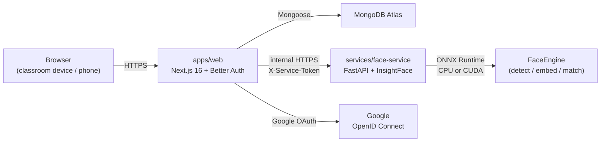
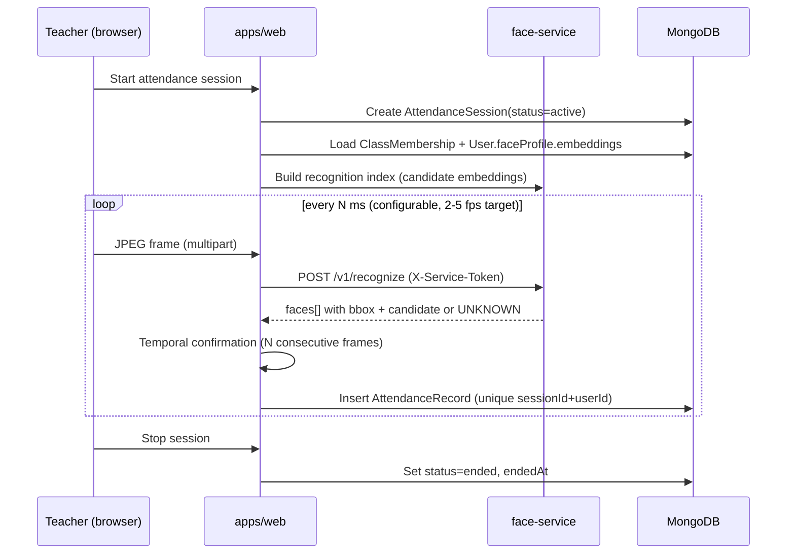

# Architecture

> Status: **Phase 0** — repo skeleton. No business logic implemented yet. This document describes the target architecture that subsequent phases will build toward.

## Goals

1. Keep facial recognition fully isolated from the web application.
2. Allow the recognition engine to be swapped without rewriting callers.
3. Avoid false-positive attendance: when uncertain, return `UNKNOWN`.
4. Minimize stored biometric data — embeddings only, never raw frames.
5. Phase-by-phase delivery: no premature InsightFace or MongoDB business code in early phases.

## High-level components



- **Browser** opens the camera locally for the teacher; only sampled JPEG frames are sent to the Face Service.
- **`apps/web`** owns authentication, RBAC, classes, attendance sessions, history, Excel export.
- **`services/face-service`** owns *all* face-related computation. It is the only component that imports InsightFace / ONNX Runtime.
- **MongoDB Atlas** stores users, classes, memberships, sessions, attendance records.
- **Google** is identity-only — no profile data is taken from Google beyond `sub`, `email`, `name`, `picture`.

## FaceEngine abstraction

Defined in [`services/face-service/app/engine/base.py`](../services/face-service/app/engine/base.py) as a `Protocol` with three responsibilities:

- `detect_faces(image)` — return bounding boxes + confidence for every face in the frame.
- `extract_embeddings(image, bboxes)` — return a normalized embedding per detected face.
- `recognize_faces(image, candidate_index)` — return per-face `{ bbox, candidate_id | null, similarity, status }`.

The web app and the rest of the Face Service depend on this `Protocol`, not on InsightFace. Phase 3 plugs in `InsightFaceEngine` as the first implementation; future engines (e.g. a different backbone) can be added without touching call sites.

## Authentication and authorization

- **End users** sign in with Google via Better Auth. The web app stores `googleId`, `email`, `name`, `avatar`, and an application-level `role` (`student` | `teacher`).
- **Server-to-server** auth between web and Face Service uses a shared secret in `FACE_SERVICE_SECRET`, sent as `X-Service-Token`. This is the MVP mechanism and is intended to be replaced later by a stronger identity (mTLS / signed JWT / workload identity).
- All authorization decisions (role checks, ownership checks, membership checks) are made server-side. UI-only hiding is **not** a security boundary.

## Data flow: an attendance session (target behaviour)



## Directory layout

```
face-attendance/
├── apps/
│   └── web/                 # Next.js 16 App Router
├── services/
│   └── face-service/        # FastAPI
├── docs/                    # This folder
├── package.json             # pnpm workspaces root
└── pnpm-workspace.yaml
```

## Phase plan (locked)

| Phase | Goal |
| --- | --- |
| **0** | Repo skeleton, docs, buildable foundations. **We are here.** |
| 1 | Google OAuth + Better Auth wiring, session management. |
| 2 | Profile onboarding (`/onboarding`). |
| 3 | FastAPI + InsightFace Face Service, model init, `/v1/recognize`. |
| 4 | Face enrollment (`/face-enrollment`). |
| 5 | Classroom creation and join-by-code+password. |
| 6 | Attendance session lifecycle. |
| 7 | Multi-face recognition + temporal confirmation. |
| 8 | Attendance history + Excel export. |
| 9 | Anti-spoofing / liveness (pluggable `LivenessProvider`). |
| 10 | Testing, calibration, deployment hardening. |

## Non-goals (for now)

- Employee / organization module. The recognition core uses generic user IDs so a future employee module can be added without touching `FaceEngine`.
- Mobile native apps. The web app must work in modern mobile browsers, but there is no React Native target in this MVP.
- Paid SaaS dependencies.