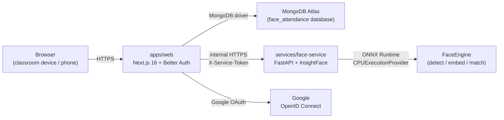
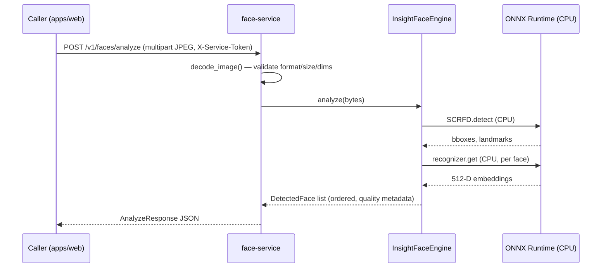

# Architecture

> Status: **Phase 4.4C** — PHASE 4.4A shipped the Next.js server-only
> `FaceServiceClient`. PHASE 4.4B1 shipped the first Next.js Face ID
> route — `POST /api/face-id/enrollment/start` — which safely starts
> a temporary enrollment session for the authenticated user.
> PHASE 4.4B2 added the read-only status route
> `GET /api/face-id/enrollment/status`, which reports the safe current
> state of the user's Face ID enrollment without exposing any
> biometric data. PHASE 4.4C adds the sample upload route
> `POST /api/face-id/enrollment/sample`, which accepts one image,
> forwards it to the Face Service, encrypts accepted embeddings,
> and stores them in the temporary enrollment session.
> Camera UI, finalization, and re-enrollment belong to later phases.

## Goals

1. Keep facial recognition fully isolated from the web application.
2. Allow the recognition engine to be swapped without rewriting callers.
3. Avoid false-positive attendance: when uncertain, return `UNKNOWN`.
4. Minimize stored biometric data — embeddings only, never raw frames.
5. Phase-by-phase delivery: no premature InsightFace or MongoDB business
   code in early phases.
6. Separate identity data from business data: Better Auth owns the auth
   collections; the application owns the `profiles` collection.

## High-level components



- **Browser** opens the camera locally for the teacher; only sampled JPEG
  frames are sent to the Face Service (PHASE 3 ships no browser sampling
  logic yet — the Face Service already accepts multipart uploads).
- **`apps/web`** owns authentication (Better Auth + Google OAuth), and will
  later own RBAC, classes, attendance sessions, history, Excel export.
- **`services/face-service`** owns *all* face-related computation. It is
  the only component that imports InsightFace / ONNX Runtime. The engine
  is loaded once at process start and reused for every request.
- **MongoDB Atlas** stores Better Auth collections (`user`, `session`,
  `account`, `verification`) in the `face_attendance` database. The
  application owns `profiles` (Phase 2), `face_profiles` and
  `face_enrollment_sessions` (Phase 4.2) via Mongoose, and will own
  future business collections (`classrooms`, `class_memberships`,
  `attendance_sessions`, `attendance_records`) in later phases.
- **Google** is identity-only — only `sub`, `email`, `name`, `picture` are
  requested via the `openid email profile` scopes.

## FaceEngine abstraction

Defined in [`services/face-service/app/engine/base.py`](../services/face-service/app/engine/base.py)
as a `Protocol` with three legacy responsibilities plus four PHASE 3
additions:

**Phase 0 surface (preserved):**

- `detect_faces(image)` — return bounding boxes + confidence for every
  face in the frame.
- `extract_embeddings(image, faces)` — return a normalized embedding per
  detected face.
- `recognize_faces(image, candidate_index)` — return per-face
  `{ bbox, candidate_id | null, similarity, status }`.

**Phase 3 additions:**

- `load()` — synchronous, idempotent model init (called once by the
  FastAPI lifespan).
- `status()` — readiness snapshot for `/health` (distinguishes "process
  up, model not loaded" from "model ready").
- `metadata()` — immutable identification (engine name, library version,
  model name, model identity, provider, embedding dimension) used to
  guarantee model compatibility in later phases.
- `analyze(image)` — convenience that returns full `DetectedFace`
  dataclasses (bbox + 5-point landmarks + quality).

The web app and the rest of the Face Service depend on this `Protocol`,
not on InsightFace. PHASE 3 ships `InsightFaceEngine` as the first
implementation; future engines (e.g. a different backbone) can be added
without touching call sites.

```
FastAPI Route
      │
      ▼
Face Service (recognition_service.py)
      │
      ▼
FaceEngine Protocol  (app.engine.base.FaceEngine)
      │
      ▼
InsightFaceEngine    (app.engine.insightface_engine)
      │
      ├── SCRFD / detection
      └── ArcFace recognition (ResNet50@WebFace600K)
              │
              ▼
       normalized 512-D embedding
```

### Quality heuristics (PHASE 3, informational only)

Per detected face the engine reports a `FaceQuality` block:

- `detection_score`
- `face_width` / `face_height` (pixels)
- `relative_face_area` (face area / image area)
- `blur_score` (variance of Laplacian — resolution-dependent)
- `brightness` (normalised mean luminance — exposure only)
- `near_edge`

**No hard rejection is enforced in PHASE 3.** Hard rejection policies
belong to PHASE 4 enrollment.

## Authentication and authorization

### End users (Google OAuth via Better Auth)

Unchanged from Phase 2. See "Authentication and authorization" below.

### Server-to-server (web ↔ Face Service)

- All Face Service endpoints **except** `GET /health` require the shared
  `FACE_SERVICE_SECRET` sent as `X-Service-Token`.
- The browser **never** calls the Face Service directly — the web app is
  the only client.
- When the secret is not configured on the server, every protected
  request is rejected with `FACE_SERVICE_UNAUTHORIZED` so the
  misconfiguration is loud rather than silent.

```
Browser
   ↓
Next.js Server (apps/web)
   ↓  FACE_SERVICE_SECRET in X-Service-Token
FastAPI Face Service (services/face-service)
   ↓
RecognitionService
   ↓
FaceEngine (InsightFaceEngine)
   ├── SCRFD detector
   └── ArcFace recognizer
        └── 512-D L2-normalised embedding
```

## Face Service API (PHASE 3 surface)

Base URL: `${FACE_SERVICE_URL}`.
Authentication: `X-Service-Token: ${FACE_SERVICE_SECRET}` on every
request **except `GET /health`**.

| Endpoint | Method | Auth | Purpose |
| --- | --- | --- | --- |
| `/health` | GET | public | Liveness + readiness (engine state, model, provider, embedding dimension). |
| `/v1/faces/analyze` | POST | service token | Detect 0 / 1 / many faces + quality. Returns no embeddings. |
| `/v1/faces/compare` | POST | service token | 1:1 verification between two single-face images. |
| `/docs` | GET | public | OpenAPI Swagger UI (development only). |

### Error contract

```json
{
  "error": {
    "code": "STRING_CODE",
    "message": "Human readable."
  }
}
```

Stable codes include: `INVALID_IMAGE`, `IMAGE_TOO_LARGE`, `NO_FACE`,
`MULTIPLE_FACES`, `ENGINE_NOT_READY`, `MODEL_LOAD_FAILED`,
`INVALID_EMBEDDING`, `FACE_SERVICE_UNAUTHORIZED`.

Stack traces are logged server-side and **never** returned to clients.

## Next.js Face ID route architecture (PHASE 4.4B1 + 4.4B2)

PHASE 4.4B1 ships the first Next.js Face ID route —
`POST /api/face-id/enrollment/start`. PHASE 4.4B2 adds a second
read-only route — `GET /api/face-id/enrollment/status`. Both are
deliberately thin Route Handlers that delegate all persistence to
the existing PHASE 4.2 service modules:

```
Route Handler (apps/web/src/app/api/face-id/enrollment/start/route.ts)
  │
  ├── getSession()                ── Better Auth server session
  ├── isOnboardingComplete()      ── profile-service
  ├── hasFaceProfile()            ── face-profile-service
  └── createOrResetEnrollmentSession()
                                   ── enrollment-session-service
                                       (upsert keyed on userId,
                                        unique-indexed Mongo doc,
                                        15-minute TTL via the
                                        existing PHASE 4.2 helper)

Route Handler (apps/web/src/app/api/face-id/enrollment/status/route.ts)
  │
  ├── getSession()                ── Better Auth server session
  ├── isOnboardingComplete()      ── profile-service
  ├── getFaceProfileByUserId()    ── face-profile-service (read)
  ├── getEnrollmentSessionByUserId()
                                 ── enrollment-session-service (read)
  ├── isEnrollmentSessionExpired()
                                 ── enrollment-session-service (helper)
  └── deleteEnrollmentSessionByUserId()
                                 ── enrollment-session-service
                                       (best-effort cleanup of an
                                        expired session; failure is
                                        internal-only)

Route Handler (apps/web/src/app/api/face-id/enrollment/sample/route.ts)
  │  (PHASE 4.4C)
  │
  ├── getSession()                ── Better Auth server session
  ├── isOnboardingComplete()      ── profile-service
  ├── getEnrollmentSessionByUserId()
  │                              ── enrollment-session-service (read)
  ├── isEnrollmentSessionExpired()
  │                              ── enrollment-session-service (helper)
  ├── analyzeEnrollmentSample()  ── face-service-client (server-only)
  │                                   forwards to Face Service
  │                                   POST /v1/faces/enrollment/sample
  ├── encryptBiometricVector()   ── biometric encryption (server-only)
  │                                   AES-256-GCM with AAD binding
  └── appendAcceptedEnrollmentSample()
                                 ── enrollment-session-service
                                       atomic findOneAndUpdate with
                                       filter conditions (user,
                                       expiration, sample limit,
                                       model compatibility)
```

Design rules that future Face ID routes should follow:

- The Route Handler is thin. It does **not** touch Mongoose / MongoDB
  directly — that lives in the service layer, which is unit-tested
  separately.
- Identity comes from `session.user.id` exclusively. The request body
  is **never** trusted for `userId` or `email`. The status route
  additionally ignores query parameters for identity.
- Application-level errors are wrapped in
  `EnrollmentRouteError` (in `apps/web/src/lib/biometrics/enrollment-route-errors.ts`).
  Mongoose / MongoDB / Better Auth internals never leave the route.
- The status route never calls the Face Service in PHASE 4.4B2 —
  status is purely a database read. The status route also never
  decrypts anything; `BIOMETRIC_ENCRYPTION_KEY` is not required to
  read status.
- Constants are centralized in
  `apps/web/src/lib/biometrics/biometric-constants.ts`
  (`DEFAULT_FACE_ENROLLMENT_REQUIRED_SAMPLES = 5`,
  `DEFAULT_FACE_ENROLLMENT_TEMPLATE_VERSION = 1`). Call sites must
  not hard-code literals.
- The routes return only safe, non-biometric fields. They never
  include `userId`, `email`, encrypted samples, ciphertext / IV /
  authTag, model metadata, or embeddings in the response.

The routes are fully server-only; no Client Component or fetch hook
is introduced in PHASE 4.4B1 or 4.4B2.

## Data flow: a recognition call (PHASE 3)



## Phase plan

| Phase | Goal |
| --- | --- |
| 0 | Repo skeleton, docs, buildable foundations. |
| 0.5 | Dependency modernization. |
| 0.6 | Vercel deployment readiness. |
| **1** | Better Auth + Google OAuth + MongoDB session. |
| **2** | Application profile + role + onboarding. |
| **3** | **FastAPI + InsightFace Face Service.** |
| 4 | Face enrollment (`/face-enrollment`). |
| 4.1 | AES-256-GCM biometric encryption foundation. |
| **4.2** | **FaceProfile + FaceEnrollmentSession Mongoose persistence (database-only).** |
| **4.3** | **Protected Face Service enrollment sample endpoint (`POST /v1/faces/enrollment/sample`).** |
| **4.4A** | **Next.js server-only FaceServiceClient (typed HTTP client).** |
| **4.4B1** | **`POST /api/face-id/enrollment/start` (start / reset temporary enrollment session, no biometric data).** |
| **4.4B2** | **`GET /api/face-id/enrollment/status` (read-only safe status of permanent Face ID + temporary enrollment, no biometric data, no Face Service call, no crypto).** |
| **4.4C** | **`POST /api/face-id/enrollment/sample` (single-image sample upload: server-only Face Service call, AES-256-GCM encryption, atomic append to temporary session, no finalization).** |
| 4.4B | Next.js Face ID API routes + enrollment session orchestration. |
| 5 | Classroom creation and join-by-code+password. |
| 6 | Attendance session lifecycle. |
| 7 | Multi-face recognition + temporal confirmation. |
| 8 | Attendance history + Excel export. |
| 9 | Anti-spoofing / liveness (pluggable `LivenessProvider`). |
| 10 | Testing, calibration, deployment hardening. |

## Non-goals (for now)

- Employee / organization module. The recognition core uses generic user
  IDs so a future employee module can be added without touching
  `FaceEngine`.
- Mobile native apps. The web app must work in modern mobile browsers,
  but there is no React Native target in this MVP.
- Paid SaaS dependencies.
- Liveness / anti-spoofing. Phase 3 does **not** perform any liveness
  check; see `docs/privacy-security.md` for the explicit warning.
