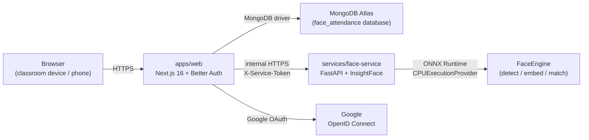
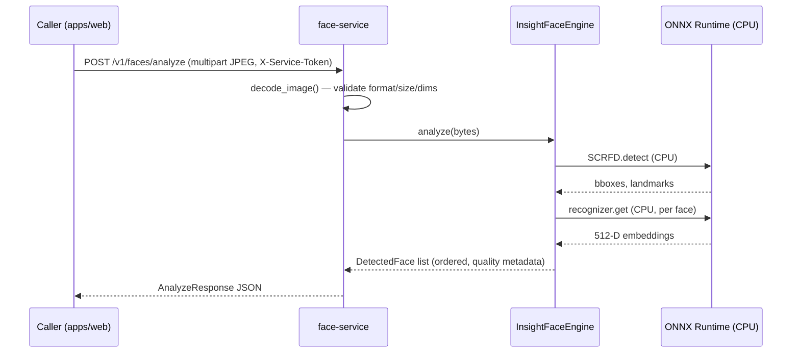

# Architecture

> Status: **Phase 4.6B1B** — PHASE 4.6A1 shipped the pure enrollment finalization
> math foundation. PHASE 4.6A2 adds the protected internal finalization
> endpoint (`POST /v1/faces/enrollment/finalize`) that receives
> already-decrypted, already-L2-normalized embeddings from the trusted
> Next.js server and returns a consistency result plus a normalized centroid.
> PHASE 4.6B1A extends the existing server-only Next.js `FaceServiceClient`
> with a `finalizeFaceEnrollment(...)` function that calls the PHASE 4.6A2
> endpoint. PHASE 4.6B1B adds the server-only Next.js orchestration service
> (`finalizeEnrollmentSessionForUser`) that loads the temporary
> `FaceEnrollmentSession`, decrypts its accepted samples server-side,
> reconstructs the exact AES-GCM AAD, validates plaintext vectors, calls
> the B1A client exactly once, and re-checks the enrollment generation
> after the Face Service response. PHASE 4.6B1B does NOT persist a
> `FaceProfile`, does NOT delete the temporary session, and does NOT
> expose a Next.js route — those belong to PHASE 4.6B2 and 4.6B3.
> typed `CapturedVideoFrame`. PHASE 4.5B3 shipped the **capture + submit
> + quality feedback loop**: a client helper posts one captured JPEG
> Blob to `POST /api/face-id/enrollment/sample`, the server response
> drives safe accepted/rejected feedback and server-authoritative
> progress. PHASE 4.5B4 adds **enrollment progress + recovery + reload
> resilience**: server-authoritative progress from page props, conflict
> reconciliation, expired session recovery, sample-limit handling, and
> model mismatch blocking. No finalization, no `FaceProfile` creation,
> no polling, no local persistence — those belong to PHASE 4.5B5 / 4.6.

## Goals

1. Keep facial recognition fully isolated from the web application.
2. Allow the recognition engine to be swapped without rewriting callers.
3. Avoid false-positive attendance: when uncertain, return `UNKNOWN`.
4. Minimize stored biometric data — embeddings only, never raw frames.
5. Phase-by-phase delivery: no premature InsightFace or MongoDB business
   code in early phases.
6. Separate identity data from business data: Better Auth owns the auth
   collections; the application owns the `profiles` collection.

## High-level components



- **Browser** opens the camera locally for the teacher; only sampled JPEG
  frames are sent to the Face Service (PHASE 3 ships no browser sampling
  logic yet — the Face Service already accepts multipart uploads).
- **`apps/web`** owns authentication (Better Auth + Google OAuth), and will
  later own RBAC, classes, attendance sessions, history, Excel export.
- **`services/face-service`** owns *all* face-related computation. It is
  the only component that imports InsightFace / ONNX Runtime. The engine
  is loaded once at process start and reused for every request.
- **MongoDB Atlas** stores Better Auth collections (`user`, `session`,
  `account`, `verification`) in the `face_attendance` database. The
  application owns `profiles` (Phase 2), `face_profiles` and
  `face_enrollment_sessions` (Phase 4.2) via Mongoose, and will own
  future business collections (`classrooms`, `class_memberships`,
  `attendance_sessions`, `attendance_records`) in later phases.
- **Google** is identity-only — only `sub`, `email`, `name`, `picture` are
  requested via the `openid email profile` scopes.

## FaceEngine abstraction

Defined in [`services/face-service/app/engine/base.py`](../services/face-service/app/engine/base.py)
as a `Protocol` with three legacy responsibilities plus four PHASE 3
additions:

**Phase 0 surface (preserved):**

- `detect_faces(image)` — return bounding boxes + confidence for every
  face in the frame.
- `extract_embeddings(image, faces)` — return a normalized embedding per
  detected face.
- `recognize_faces(image, candidate_index)` — return per-face
  `{ bbox, candidate_id | null, similarity, status }`.

**Phase 3 additions:**

- `load()` — synchronous, idempotent model init (called once by the
  FastAPI lifespan).
- `status()` — readiness snapshot for `/health` (distinguishes "process
  up, model not loaded" from "model ready").
- `metadata()` — immutable identification (engine name, library version,
  model name, model identity, provider, embedding dimension) used to
  guarantee model compatibility in later phases.
- `analyze(image)` — convenience that returns full `DetectedFace`
  dataclasses (bbox + 5-point landmarks + quality).

The web app and the rest of the Face Service depend on this `Protocol`,
not on InsightFace. PHASE 3 ships `InsightFaceEngine` as the first
implementation; future engines (e.g. a different backbone) can be added
without touching call sites.

```
FastAPI Route
      │
      ▼
Face Service (recognition_service.py)
      │
      ▼
FaceEngine Protocol  (app.engine.base.FaceEngine)
      │
      ▼
InsightFaceEngine    (app.engine.insightface_engine)
      │
      ├── SCRFD / detection
      └── ArcFace recognition (ResNet50@WebFace600K)
              │
              ▼
       normalized 512-D embedding
```

### Quality heuristics (PHASE 3, informational only)

Per detected face the engine reports a `FaceQuality` block:

- `detection_score`
- `face_width` / `face_height` (pixels)
- `relative_face_area` (face area / image area)
- `blur_score` (variance of Laplacian — resolution-dependent)
- `brightness` (normalised mean luminance — exposure only)
- `near_edge`

**No hard rejection is enforced in PHASE 3.** Hard rejection policies
belong to PHASE 4 enrollment.

## Authentication and authorization

### End users (Google OAuth via Better Auth)

Unchanged from Phase 2. See "Authentication and authorization" below.

### Server-to-server (web ↔ Face Service)

- All Face Service endpoints **except** `GET /health` require the shared
  `FACE_SERVICE_SECRET` sent as `X-Service-Token`.
- The browser **never** calls the Face Service directly — the web app is
  the only client.
- When the secret is not configured on the server, every protected
  request is rejected with `FACE_SERVICE_UNAUTHORIZED` so the
  misconfiguration is loud rather than silent.

```
Browser
   ↓
Next.js Server (apps/web)
   ↓  FACE_SERVICE_SECRET in X-Service-Token
FastAPI Face Service (services/face-service)
   ↓
RecognitionService
   ↓
FaceEngine (InsightFaceEngine)
   ├── SCRFD detector
   └── ArcFace recognizer
        └── 512-D L2-normalised embedding
```

## Face Service API (PHASE 3 surface)

Base URL: `${FACE_SERVICE_URL}`.
Authentication: `X-Service-Token: ${FACE_SERVICE_SECRET}` on every
request **except `GET /health`**.

| Endpoint | Method | Auth | Purpose |
| --- | --- | --- | --- |
| `/health` | GET | public | Liveness + readiness (engine state, model, provider, embedding dimension). |
| `/v1/faces/analyze` | POST | service token | Detect 0 / 1 / many faces + quality. Returns no embeddings. |
| `/v1/faces/compare` | POST | service token | 1:1 verification between two single-face images. |
| `/docs` | GET | public | OpenAPI Swagger UI (development only). |

### Error contract

```json
{
  "error": {
    "code": "STRING_CODE",
    "message": "Human readable."
  }
}
```

Stable codes include: `INVALID_IMAGE`, `IMAGE_TOO_LARGE`, `NO_FACE`,
`MULTIPLE_FACES`, `ENGINE_NOT_READY`, `MODEL_LOAD_FAILED`,
`INVALID_EMBEDDING`, `FACE_SERVICE_UNAUTHORIZED`.

Stack traces are logged server-side and **never** returned to clients.

## Next.js Face ID route architecture (PHASE 4.4B1 + 4.4B2)

PHASE 4.4B1 ships the first Next.js Face ID route —
`POST /api/face-id/enrollment/start`. PHASE 4.4B2 adds a second
read-only route — `GET /api/face-id/enrollment/status`. Both are
deliberately thin Route Handlers that delegate all persistence to
the existing PHASE 4.2 service modules:

```
Route Handler (apps/web/src/app/api/face-id/enrollment/start/route.ts)
  │
  ├── getSession()                ── Better Auth server session
  ├── isOnboardingComplete()      ── profile-service
  ├── hasFaceProfile()            ── face-profile-service
  └── createOrResetEnrollmentSession()
                                   ── enrollment-session-service
                                       (upsert keyed on userId,
                                        unique-indexed Mongo doc,
                                        15-minute TTL via the
                                        existing PHASE 4.2 helper)

Route Handler (apps/web/src/app/api/face-id/enrollment/status/route.ts)
  │
  ├── getSession()                ── Better Auth server session
  ├── isOnboardingComplete()      ── profile-service
  ├── getFaceProfileByUserId()    ── face-profile-service (read)
  ├── getEnrollmentSessionByUserId()
                                 ── enrollment-session-service (read)
  ├── isEnrollmentSessionExpired()
                                 ── enrollment-session-service (helper)
  └── deleteEnrollmentSessionByUserId()
                                 ── enrollment-session-service
                                       (best-effort cleanup of an
                                        expired session; failure is
                                        internal-only)

Route Handler (apps/web/src/app/api/face-id/enrollment/sample/route.ts)
  │  (PHASE 4.4C)
  │
  ├── getSession()                ── Better Auth server session
  ├── isOnboardingComplete()      ── profile-service
  ├── getEnrollmentSessionByUserId()
  │                              ── enrollment-session-service (read)
  ├── isEnrollmentSessionExpired()
  │                              ── enrollment-session-service (helper)
  ├── analyzeEnrollmentSample()  ── face-service-client (server-only)
  │                                   forwards to Face Service
  │                                   POST /v1/faces/enrollment/sample
  ├── encryptBiometricVector()   ── biometric encryption (server-only)
  │                                   AES-256-GCM with AAD binding
  └── appendAcceptedEnrollmentSample()
                                 ── enrollment-session-service
                                       atomic findOneAndUpdate with
                                       filter conditions (user,
                                       expiration, sample limit,
                                       model compatibility)
```

Design rules that future Face ID routes should follow:

- The Route Handler is thin. It does **not** touch Mongoose / MongoDB
  directly — that lives in the service layer, which is unit-tested
  separately.
- Identity comes from `session.user.id` exclusively. The request body
  is **never** trusted for `userId` or `email`. The status route
  additionally ignores query parameters for identity.
- Application-level errors are wrapped in
  `EnrollmentRouteError` (in `apps/web/src/lib/biometrics/enrollment-route-errors.ts`).
  Mongoose / MongoDB / Better Auth internals never leave the route.
- The status route never calls the Face Service in PHASE 4.4B2 —
  status is purely a database read. The status route also never
  decrypts anything; `BIOMETRIC_ENCRYPTION_KEY` is not required to
  read status.
- Constants are centralized in
  `apps/web/src/lib/biometrics/biometric-constants.ts`
  (`DEFAULT_FACE_ENROLLMENT_REQUIRED_SAMPLES = 5`,
  `DEFAULT_FACE_ENROLLMENT_TEMPLATE_VERSION = 1`). Call sites must
  not hard-code literals.
- The routes return only safe, non-biometric fields. They never
  include `userId`, `email`, encrypted samples, ciphertext / IV /
  authTag, model metadata, or embeddings in the response.

The routes are fully server-only; no Client Component or fetch hook
is introduced in PHASE 4.4B1 or 4.4B2.

## Browser camera foundation (PHASE 4.5A)

PHASE 4.5A ships the first **client-side** Face ID code: a reusable
camera foundation that future enrollment UI (PHASE 4.5B and beyond)
will consume. PHASE 4.5A is intentionally tiny — a primitive that
shows a live preview and nothing more.

### Surface

```
apps/web/src/components/face-id/
  camera-constants.ts   — stable error codes, friendly messages,
                          getUserMedia constraints (audio: false,
                          video: user-facing, 1280x720 ideal)
  camera-errors.ts      — pure utility mapping any thrown value to a
                          closed-enum CameraErrorShape (no stack
                          leakage, never throws)
  use-face-camera.ts    — "use client" React hook
                          (idle / requesting / ready / error)
  camera-preview.tsx    — "use client" React component rendering a
                          <video>, Turn on / Stop buttons, error
                          block, and a small privacy note
  index.ts              — public surface
```

The directory follows the existing component conventions under
`apps/web/src/components/` (named folders, paired co-located tests,
no barrel re-exports of internals).

### Client boundary

The camera module is `"use client"` and **MUST NOT** import any
server-only module:

- `face-service-client.ts`
- `encryption.ts`
- Mongoose models
- `FACE_SERVICE_SECRET`
- `BIOMETRIC_ENCRYPTION_KEY`
- `MONGODB_URI`

These imports would break the production `server-only` boundary
enforced by Next.js and would also leak server secrets into the
browser bundle. The camera module's only imports are:

- React (`useState`, `useEffect`, `useRef`, `useCallback`)
- The local `camera-constants.ts` and `camera-errors.ts` siblings
- The shared `cn()` helper

### Permission model

The browser's `getUserMedia` permission dialog is one of the most
disruptive UX events on the web. PHASE 4.5A therefore follows a
strict permission rule:

- `getUserMedia` is NEVER called on mount, render, or effect.
- The ONLY trigger is the user pressing the **"Turn on camera"**
  button.
- Opening a page that embeds `CameraPreview` must NOT immediately
  trigger the browser permission dialog.

### Audio

PHASE 4.5A requests `audio: false` unconditionally. Microphone
permission is NEVER requested. The microphone LED on supported
platforms therefore never lights up during PHASE 4.5A usage.

### getUserMedia constraints

Centralized in `camera-constants.ts`:

```ts
{
  audio: false,
  video: {
    facingMode: "user",     // ideal — desktop webcams without a
                            // front camera still work
    width:  { ideal: 1280 },
    height: { ideal: 720 }, // exact resolution not required
  },
}
```

### State model

Small typed lifecycle:

| Status      | Meaning                                                    |
| ----------- | ---------------------------------------------------------- |
| `idle`      | Nothing has happened, or the camera has been stopped.      |
| `requesting`| A `getUserMedia` call is in flight.                        |
| `ready`     | A stream is active and attached to `video.srcObject`.      |
| `error`     | The last attempt failed; `error` carries the safe shape.   |

The hook also exposes `isReady` as a convenience for consumers that
do not want to compare against the string literal `"ready"`.

### Lifecycle cleanup

Every active `MediaStreamTrack` is stopped when:

- the user presses **Stop camera**
- the consuming component unmounts (navigation, route change,
  modal close)
- a stream is replaced by another stream
- startup fails after a stream was partially obtained

The OS-level camera LED is therefore guaranteed to turn off after
the user navigates away.

### Repeated start

The hook treats a `startCamera()` call as **idempotent** when a
stream is already active: no second `getUserMedia` call is made,
no second stream is held. This keeps the foundation free of
MediaStream leaks from repeated clicks. After `stopCamera()` a new
start is allowed normally.

### Secure context

If the page is not in a secure context (`window.isSecureContext`
is `false`), `startCamera()` short-circuits and reports
`CAMERA_INSECURE_CONTEXT` without ever calling `getUserMedia`.
Localhost is treated as secure by modern browsers and works
without changes. No production domains are hard-coded.

### Error mapping

`camera-errors.ts` exposes a pure `mapCameraError(unknown)` function
that maps any thrown value to a closed enum:

| Browser exception                                              | Mapped code                |
| -------------------------------------------------------------- | -------------------------- |
| `NotAllowedError`                                              | `CAMERA_PERMISSION_DENIED` |
| `NotFoundError`, `OverconstrainedError`                        | `CAMERA_NOT_FOUND`         |
| `NotReadableError`                                             | `CAMERA_IN_USE`            |
| `SecurityError`                                                | `CAMERA_INSECURE_CONTEXT`  |
| anything else (incl. `null`, `undefined`, primitives)          | `CAMERA_UNAVAILABLE`       |

The function NEVER returns the raw exception name, message, or
stack. Friendly copy lives in `CAMERA_ERROR_MESSAGES` and is rendered
by the component.

### No capture / no upload / no route

PHASE 4.5A does NOT introduce:

- A `<canvas>` element
- `drawImage`, `toBlob`, `toDataURL`
- The `ImageCapture` API
- Any `fetch` call to `/api/face-id/enrollment/sample`
- A `/face-id` or `/face-id/setup` application route
- Any change to the sidebar / navigation

PHASE 4.5B will integrate the camera foundation into the actual
enrollment page and add image capture, but no part of that work
belongs to PHASE 4.5A.

## Face ID page shell (PHASE 4.5B1)

PHASE 4.5B1 ships the first two user-facing Face ID routes under the
authenticated app shell:

- `/face-id` — safe overview page
- `/face-id/setup` — enrollment shell

Both pages are Server Components. They follow the same guard
conventions as `/dashboard` and `/profile`:

- No session → `redirect("/login")`
- Profile incomplete → `redirect("/onboarding")`

### Shared safe status service

To avoid duplicating status logic between
`GET /api/face-id/enrollment/status` and the Server Components, a
shared server-only module is introduced:

```
apps/web/src/lib/biometrics/face-id-status-service.ts
```

This module is the single source of truth for reading safe Face ID
status server-side. It returns typed objects (not JSON over HTTP),
and never exposes:

- `userId`, `email`
- encrypted samples (`ciphertext`, `iv`, `authTag`, `keyVersion`)
- model metadata (`modelIdentity`, `modelName`, `embeddingDimension`)
- embeddings, centroids, quality summaries

It performs the same TTL handling as the status route (treats
`expiresAt <= now` as expired, attempts best-effort cleanup, and
always reports `enrollment.active = false` regardless of cleanup
outcome).

### `/face-id` page

The overview page renders one of three conceptual states, all
derived from the shared status service:

| State | UI |
| --- | --- |
| Not configured, no active enrollment | "Face ID — Not configured" + "Set up Face ID" → `/face-id/setup` |
| Not configured, active enrollment | "Setup in progress" + "N of 5 samples" + expiry copy + "Continue setup" → `/face-id/setup` |
| Configured | "Face ID — Configured" + enrolled date + sample count |

No biometric payload is rendered. No replace/delete actions are
exposed. No fabricated metrics (recognition accuracy, confidence,
last scan, attendance count) appear.

### `/face-id/setup` page

The enrollment shell does NOT auto-start enrollment and does NOT
auto-request camera permission. Behavior:

- If an active enrollment session exists → render safe progress and
  embed `CameraPreview` with the restrained "Camera preview is
  ready. Sample capture will be connected in the next step." copy.
- If no active session exists → render the explicit "Start setup"
  button. Pressing the button calls the server-only enrollment
  start action, then refreshes the page state via `router.refresh()`.
- If a `FaceProfile` already exists → redirect to `/face-id`
  (replace mode is not implemented in PHASE 4.5B1).

The page never exposes a functional-looking Capture button. There is
no "Capture sample" action in PHASE 4.5B1.

### Explicit enrollment start action

A Server Action (`startFaceEnrollment`) lives at
`apps/web/src/lib/biometrics/enrollment-start-action.ts`. It wraps
the existing service-layer `createOrResetEnrollmentSession` with
the same auth/profile/face-profile checks as the
`POST /api/face-id/enrollment/start` route. The Client Component
`EnrollmentStartButton` calls the action, disables repeated clicks
while pending, maps server error codes to friendly UI messages, and
calls `router.refresh()` on success.

The request body is empty; identity comes from the Better Auth
session only. The action never accepts a `userId` from the browser.

### CameraPreview integration

The setup page embeds the existing PHASE 4.5A `CameraPreview`
component directly. The component retains its original behavior:

- Camera permission is only requested after an explicit button click.
- `audio: false` — no microphone access.
- All tracks are stopped on unmount.
- `getUserMedia` is never called during page load.

The setup page does NOT introduce a Capture button. The preview is
present so the user can verify camera access works before later
phases add capture/submission.

### Face ID navigation entry

`nav-config.ts` updates the Face ID item from `coming_soon` to
`ready` with `href: "/face-id"`. The AppSidebar's existing
`pathname.startsWith(item.href)` active-state check correctly
highlights both `/face-id` and `/face-id/setup` because both paths
share the prefix.

### What PHASE 4.5B1 does NOT include

- `<canvas>`, `drawImage`, `toBlob`, `toDataURL`, `ImageCapture`
- POST `/api/face-id/enrollment/sample`
- 5-sample capture loop
- Quality feedback
- Embedding handling
- Centroid calculation
- FaceProfile creation / finalization
- Re-enrollment / Face ID deletion

These belong to PHASE 4.5B2.

## Frame capture foundation (PHASE 4.5B2)

PHASE 4.5B2 ships the first **client-side image processing** primitive
in the web app: a small, reusable utility that captures one frame
from an already-ready HTMLVideoElement and returns it as a JPEG Blob
held only in browser memory. PHASE 4.5B2 does NOT submit the frame
anywhere, does NOT persist it, and does NOT integrate into a UI yet.

### Surface

```
apps/web/src/components/face-id/
  capture-video-frame.ts   — captureVideoFrame() + dimension helper
                             + capture error codes / messages
```

A new test file sits beside it:

```
apps/web/src/components/face-id/
  capture-video-frame.test.ts
```

### Public API

```ts
type CapturedVideoFrame = {
  blob: Blob
  mimeType: "image/jpeg"
  width: number
  height: number
  size: number
}

captureVideoFrame(
  video: HTMLVideoElement,
): Promise<
  | { ok: true; frame: CapturedVideoFrame }
  | { ok: false; error: CaptureErrorShape }
>
```

The promise **resolves** on error (does not reject) so the caller
gets a typed `CaptureErrorShape` without unhandled promise
rejections in UI event handlers.

The capture utility never returns a base64 string, a data URL, or a
pixel array — a `Blob` is the entire output.

### Source video requirements

Capture is allowed only when:

- `video.videoWidth > 0`
- `video.videoHeight > 0`
- `video.readyState >= HTMLMediaElement.HAVE_CURRENT_DATA`

If the camera stream exists but the video has not produced a frame,
the call resolves with `FRAME_NOT_READY`. No blank JPEG is ever
produced.

### Capture error codes

A closed enum, deliberately separate from the camera-startup codes:

| Code | Meaning |
| --- | --- |
| `FRAME_NOT_READY` | The video has not yet produced a frame. |
| `FRAME_CANVAS_UNAVAILABLE` | The browser could not obtain a 2D context from the ephemeral canvas. |
| `FRAME_ENCODING_FAILED` | `toBlob` returned `null`, or an unexpected exception occurred during draw / encode. |

Raw browser exception names, messages, and stacks are NEVER surfaced.

### Resolution policy

Centralized constant:

```
FACE_CAPTURE_MAX_LONG_EDGE = 1280
```

The source aspect ratio is preserved. If the source long edge is
greater than 1280 the frame is scaled down proportionally; otherwise
it is **not upscaled**.

Examples (max long edge = 1280):

| Source | Output |
| --- | --- |
| 1920×1080 | 1280×720 |
| 1080×1920 | 720×1280 |
| 1280×720 | 1280×720 |
| 640×480 | 640×480 |
| 1000×1000 | 1000×1000 |

The dimension calculation lives in a pure helper,
`calculateCaptureDimensions(sourceWidth, sourceHeight, maxLongEdge)`,
which validates inputs (rejects zero, negative, NaN, Infinity,
non-integer dimensions) and is unit-tested in isolation.

### JPEG encoding

Centralized constants:

```
FACE_CAPTURE_JPEG_QUALITY = 0.85
FACE_CAPTURE_MIME_TYPE    = "image/jpeg"
```

Encoding uses `canvas.toBlob(...)`. `canvas.toDataURL()` is NOT used.
Iterative quality compression is NOT implemented. The Next.js sample
endpoint remains authoritative for its existing 1.5 MB request limit.

### Canvas

An ephemeral in-memory HTMLCanvasElement is created programmatically
via `document.createElement("canvas")`. It is NEVER rendered into
the page. After `toBlob` has completed the canvas backing memory is
released (`canvas.width = 0; canvas.height = 0`) — the clear happens
AFTER `toBlob` finishes, not before.

### Mirroring

The `CameraPreview` component applies a CSS `[transform:scaleX(-1)]`
to its `<video>` for selfie-style presentation. CSS transforms do
NOT affect source pixels drawn via `drawImage`. The capture utility
does NOT apply `ctx.scale(-1, 1)` or `ctx.translate(...)` to mirror
the source. The captured image preserves the original camera frame
orientation.

### Draw

The full current video frame is drawn at the calculated output
dimensions. No face detection, no face cropping, no overlays, no
guides, no text, no watermark. No face recognition belongs in browser
code.

```
context.drawImage(video, 0, 0, outputWidth, outputHeight)
```

### No object URL, no persistence, no network

PHASE 4.5B2 deliberately does NOT:

- Call `URL.createObjectURL()` (no captured preview yet)
- Write to disk, IndexedDB, localStorage, sessionStorage, the Cache
  API, MongoDB, or any public directory
- Call `fetch`, `XMLHttpRequest`, `sendBeacon`, or any Server Action
- Import any server-only module
  (`face-service-client`, `encryption`, Mongoose models,
  `FACE_SERVICE_SECRET`, `BIOMETRIC_ENCRYPTION_KEY`, `MONGODB_URI`)
- Call `getUserMedia` itself — capture consumes an already-ready
  `<video>` element managed by `useFaceCamera`

The captured frame exists only as temporary canvas pixels during
encoding and the returned in-memory JPEG `Blob`. Nothing leaves the
browser in this phase.

### Camera lifecycle is unchanged

PHASE 4.5B2 does NOT modify the PHASE 4.5A camera behavior:

- `getUserMedia` is still only triggered by an explicit button click.
- `audio: false` is still enforced.
- The pending-request guard, the request generation token, the
  unmount cleanup, and the error mapping all remain.

The capture utility is a pure consumer of an already-ready
`<video>` element.

### What PHASE 4.5B2 does NOT include

- POST `/api/face-id/enrollment/sample`
- A functional Capture button on `/face-id/setup`
- 5-sample progress mutations
- Quality rejection UI
- Finalization or `FaceProfile` creation
- Re-enrollment or Face ID deletion flows

Sample submission and finalization belong to PHASE 4.5B3.

## Sample capture + submission (PHASE 4.5B3)

PHASE 4.5B3 turns the previously-inert camera preview on
`/face-id/setup` into a working capture loop. The browser still
never speaks to the Face Service directly — every biometric frame
travels through the existing Next.js authenticated route.

### High-level data flow

```
Browser (EnrollmentSamplePanel, "use client")
  ├── useFaceCamera()           ── existing PHASE 4.5A hook
  ├── <video>                   ── live preview from camera
  ├── "Capture sample" button   ── explicit user action only
  ├── captureVideoFrame(video)  ── existing PHASE 4.5B2 utility
  │      ↓
  │    JPEG Blob (in-memory only)
  │      ↓
  └── submitFaceEnrollmentSample(blob)
         ↓ FormData { image: blob, "face-sample.jpg" }
         ↓ NO manual Content-Type
         ↓ Browser → Next.js only
       POST /api/face-id/enrollment/sample
         ↓ (existing PHASE 4.4C server route — unchanged)
         ↓ analyzeEnrollmentSample → Face Service
         ↓ encryptBiometricVector → AES-256-GCM
         ↓ appendAcceptedEnrollmentSample → Mongo
         ↓
       200 OK { accepted, rejectionReasons, progress }
         ↓
       client helper parses with Zod
         ↓
       update progress (server-authoritative)
       render accepted | rejected | domain-error | infra-error feedback
```

### Client surface

```
apps/web/src/components/face-id/
  enrollment-sample-client.ts   — submitFaceEnrollmentSample() helper
                                    + response / error contract types
                                    + quality rejection message map
```

```
apps/web/src/components/face-id-pages/
  enrollment-sample-panel.tsx   — "use client" UI component:
                                    - composes useFaceCamera
                                    - renders <video> + Turn on / Stop
                                    - renders "Capture sample" button
                                      (only when camera is ready)
                                    - orchestrates capture + submit
                                    - in-flight submission guard
                                    - safe feedback blocks
```

The setup page (`/face-id/setup`) replaces its previous
`CameraPreview` embed with `EnrollmentSamplePanel` whenever an
active enrollment session exists.

### Strict non-goals (PHASE 4.5B3 explicitly does NOT)

- Finalization or `FaceProfile` creation
- Centroid calculation
- Decryption of any persisted encrypted sample
- Re-enrollment, delete-Face-ID
- Liveness / anti-spoofing
- Automatic capture, continuous capture, video recording
- base64 encoding, `toDataURL`, object URL preview
- `localStorage`, `sessionStorage`, IndexedDB, Cache API
  persistence of any captured frame
- Direct browser → Face Service calls
- Sending `X-Service-Token` or `FACE_SERVICE_SECRET` from the browser
- Sending `userId`, `email`, `sampleIndex`, or `modelIdentity` from
  the browser
- Manual `Content-Type: multipart/form-data` (the browser MUST
  generate the multipart boundary)
- Any automatic retry of the POST

### Capture action is explicit only

A "Capture sample" button is rendered only while:

- an active enrollment session exists (`face-id-status-service` says
  `enrollment.active === true`), AND
- the camera hook is `ready` (`useFaceCamera().isReady === true`).

The button is disabled while the camera is `idle`, `requesting`, or
`error`, while a submission is pending, and once
`progress.complete === true` (the B3 cutoff — see below). There is
no timer, no interval, no `requestAnimationFrame` loop, and no
face-detection trigger. One click produces exactly one capture and
exactly one POST.

### Submission concurrency guard

A `submissionInFlightRef = React.useRef<boolean>(false)` provides
a synchronous guard inside `handleCapture`. Two clicks fired in
the same tick cannot produce two canvas captures or two POST
requests. The `pending` state from React still drives the disabled
attribute for accessibility; the ref protects the in-tick race.

### Server-authoritative progress

The browser receives safe initial progress from the existing
`face-id-status-service` and passes it to `EnrollmentSamplePanel`:

```ts
<EnrollmentSamplePanel
  initialAcceptedSamples={activeSession.acceptedSamples}
  requiredSamples={activeSession.requiredSamples}
/>
```

The panel NEVER increments its own counter. After every successful
POST response the panel replaces its displayed progress with the
`progress` block from the server response. Rejected samples,
conflicts, and timeouts do NOT advance progress.

### `complete=true` is an honest temporary state

When the server reports `progress.complete === true` the panel:

- disables further "Capture sample" submissions,
- displays an honest informational message such as
  *"All required samples collected. Final setup is not connected
  yet."* — it does NOT claim Face ID is configured, an Identity is
  verified, or a `FaceProfile` exists.

`FaceProfile` finalization belongs to PHASE 4.5B4 / 4.6.

### Response contract (browser-side)

The client helper parses the server's safe shape with a Zod schema.
Only the following fields are recognised:

```ts
{
  accepted: boolean,
  rejectionReasons: ReadonlyArray<
    "LOW_DETECTION_CONFIDENCE"
    | "FACE_TOO_SMALL"
    | "FACE_TOO_LARGE"
    | "TOO_BLURRY"
    | "TOO_DARK"
    | "TOO_BRIGHT"
    | "FACE_NEAR_EDGE"
  >,
  progress: {
    acceptedSamples: number,
    requiredSamples: number,
    complete: boolean,
  },
}
```

Error responses use the existing route contract
`{ error: { code, message } }`. The browser never sees
`embedding`, `ciphertext`, `iv`, `authTag`, `keyVersion`,
`modelIdentity`, or `userId`.

### Privacy / no Blob persistence

The captured JPEG Blob lives only in the local variable inside
`handleCapture`. It is:

- NOT stored in React state
- NOT placed in context / Redux
- NOT written to `localStorage`, `sessionStorage`, IndexedDB, or
  the Cache API
- NEVER exposed as an `URL.createObjectURL` preview
- NEVER rendered into an `` thumbnail

The setup page privacy copy is updated to reflect that each sample
the user explicitly chooses to capture is sent to the application
for face analysis and that raw camera images are not kept by the
application.

## Phase 4.5B4 enrollment progress + recovery + reload resilience

PHASE 4.5B4 makes the existing sample-capture UI robust across
browser reload, session expiration, sample conflict, and other
recovery scenarios. The authoritative enrollment state always lives
in `FaceEnrollmentSession` on the server — the browser never invents
progress.

### Server-authoritative progress

The browser receives safe initial progress from the existing
`face-id-status-service` via page props. On a normal page reload:

```
MongoDB has 3 accepted samples
  ↓
reload /face-id/setup
  ↓
server status → current database session
  ↓
page props → correct progress (3 of 5 samples)
```

The `EnrollmentSamplePanel` component initializes its React state
from `initialAcceptedSamples` and `requiredSamples` props:

```tsx
<EnrollmentSamplePanel
  initialAcceptedSamples={activeSession.acceptedSamples}
  requiredSamples={activeSession.requiredSamples}
  expiresAt={activeSession.expiresAt}
/>
```

The panel NEVER increments its own counter (`setCount(count + 1)` is
forbidden). After every successful POST response the panel replaces
its displayed progress with the `progress` block from the server
response.

### Prop reconciliation strategy

The panel uses a `useEffect` to synchronize local state when server
props change (e.g. after `router.refresh()`):

```tsx
React.useEffect(() => {
  const newProgress = {
    acceptedSamples: initialAcceptedSamples,
    requiredSamples,
    complete: initialComplete,
  };

  // Accept new server progress if it advanced beyond our last
  // acknowledged state, OR if the session became complete/invalid.
  const serverAdvanced = newProgress.acceptedSamples >
    lastServerProgressRef.current.acceptedSamples;
  const serverComplete = newProgress.complete;

  if (serverAdvanced || serverComplete) {
    setProgress(newProgress);
    lastServerProgressRef.current = newProgress;
  }
}, [initialAcceptedSamples, requiredSamples, initialComplete]);
```

The strategy avoids overwriting newer accepted responses with older
props. Only progressive updates are accepted.

### Conflict reconciliation

The server's atomic `findOneAndUpdate` may return
`ENROLLMENT_SAMPLE_CONFLICT` (HTTP 409) when another request won
the atomic index race. On this error:

1. The panel does NOT automatically retry the biometric POST.
2. The panel renders a conflict message: *"Another sample was saved
   first. Progress has been refreshed."*
3. The panel triggers `onReconcile()`, which calls `router.refresh()`
   to fetch authoritative progress from the server.
4. Camera remains running — the user can capture again after
   reconciliation.

### Expired session recovery

When the sample endpoint returns `ENROLLMENT_EXPIRED` (HTTP 409):

1. Capture is disabled immediately.
2. Camera is stopped (`stopCamera()`).
3. A clear message is shown: *"This setup session expired.
   Start setup again to continue."*
4. `onReconcile()` triggers `router.refresh()` so the setup
   page falls back to the explicit Start/Restart action.

### Sample limit reached

When `ENROLLMENT_SAMPLE_LIMIT_REACHED` (HTTP 502) is returned:

1. Camera is stopped.
2. A message is shown: *"All required samples have been collected.
   Progress has been refreshed."*
3. `onReconcile()` reconciles to the authoritative 5/5 state.

### Model mismatch blocking

When `MODEL_MISMATCH` (HTTP 502) is returned:

1. Capture is disabled for the current session.
2. Camera is stopped.
3. A message is shown: *"This setup session can no longer continue
   with the current face model. Restart setup to continue."*
4. NO automatic restart occurs — the user must explicitly start a
   new session.
5. The message does NOT expose `modelIdentity`, `modelName`, or
   embedding dimension.

### Network uncertainty

Network failure after POST is special: the browser cannot safely
assume the request reached the server. Therefore:

1. NO local `+1`.
2. NO automatic POST retry.
3. A connection error message is shown.
4. `onReconcile()` triggers `router.refresh()` so the user can
   check the authoritative progress before the next capture.

### Reconciliation callback architecture

The `EnrollmentSamplePanelWrapper` client component provides the
`router.refresh()` reconciliation seam:

```tsx
function EnrollmentSamplePanelWrapper({ initialAcceptedSamples, ... }) {
  const router = useRouter();

  const handleReconcile = useCallback(() => {
    router.refresh();
  }, [router]);

  return (
    <EnrollmentSamplePanel
      onReconcile={handleReconcile}
      initialAcceptedSamples={initialAcceptedSamples}
      ...
    />
  );
}
```

`router.refresh()` causes Next.js to re-render the Server Component
shell, fetching fresh status from the database. The refreshed page
has updated `initialAcceptedSamples`, `requiredSamples`, and
`initialComplete` props, which the panel accepts through its
reconciliation effect.

### 5/5 is NOT Face ID configured

When the server reports `acceptedSamples >= requiredSamples`:

1. Capture is disabled.
2. Honest copy is shown: *"All required samples collected. Final
   setup has not been completed yet."*
3. The page does NOT claim Face ID is configured, enrollment is
   complete, or a `FaceProfile` exists.

### Multi-tab behavior

Cross-tab synchronization is not implemented (no BroadcastChannel,
WebSocket, or polling). However, if:

- Tab A has 2/5 samples locally
- Tab B saves sample #3
- Tab A gets a conflict error or explicitly refreshes

…Tab A reconciles to 3/5.

### Camera behavior during recovery

For recoverable states (quality rejection, conflict, network timeout),
the camera stream is left running.

For session-invalid states (expired, not started, model mismatch,
limit reached), the camera is stopped. Stopping the camera uses the
existing `stopCamera()` function and is deterministic.

### What PHASE 4.5B4 does NOT implement

PHASE 4.5B4 deliberately does NOT implement:

- Finalization or `FaceProfile` creation
- Centroid calculation
- Re-enrollment or Face ID deletion
- Liveness / anti-spoofing
- Automatic capture or continuous capture
- Background polling (router.refresh is manual, not automatic)
- localStorage / sessionStorage / IndexedDB persistence
- Direct browser → Face Service calls
- Any new biometric fields (embedding, ciphertext, authTag, etc.)

## Phase 4.5B4.3 server-authoritative generation discriminator

PHASE 4.5B4.3 introduces a stable, server-authoritative
**`generationId`** for each `FaceEnrollmentSession`. The generation
ID is the primary reconciliation discriminator for the multi-tab and
reload-resilience paths. `expiresAt` is kept as the session TTL and
display value but it is **no longer** the trigger for the
downward-replacement reconciliation branch.

### Why a separate `generationId`?

`expiresAt` is a property of the *session TTL*. It changes every time
the server re-issues a session (including legitimate non-reset
extensions). The browser cannot reliably distinguish between
"session was extended in place" and "session was reset in another
tab" by looking at `expiresAt` alone. Even identical `expiresAt`
values across a rerender are not a guarantee of "same logical
session" — the server may have just reset the session and stamped
the same TTL by coincidence.

`generationId` is a UUID v4 issued by the server at the moment a
`FaceEnrollmentSession` document is created or explicitly reset.
Because UUID v4 is collision-resistant and is minted exactly once
per creation/reset, two reads of the same document always observe
the same `generationId`, and any operation that replaces the session
clears and re-mints it.

### Schema

The Mongoose `FaceEnrollmentSession` schema now requires:

```
generationId: string
  required: true
  minlength: 1
  // NO unique index — `userId` remains the unique ownership index.
```

A unique index on `generationId` is **deliberately avoided**. The
ownership invariant is owned by `userId`. Adding a global unique
index would be a global write bottleneck for an identifier that is
only consumed locally by the browser for reconciliation.

### Generation rules

1. **New sessions and explicit resets.** `createOrResetEnrollmentSession()`
   always stamps `generationId = randomUUID()` (Node.js `node:crypto`)
   into the document's `$set`. The browser never invents the ID and
   never sends it back to the server.

2. **Legacy sessions (created before B4.3).** The first read of a
   legacy document whose `generationId` is missing triggers a
   **lazy server-side backfill**. The service issues
   `findOneAndUpdate` with the guard:

   ```
   filter:  { userId: <owner>, generationId: { $exists: false } }
   update:  { $set: { generationId: randomUUID() } }
   returnDocument: "after"
   ```

   Only one concurrent request can win the match (atomic MongoDB
   update). The losing request re-reads the document and returns the
   winner's `generationId`. The final document has exactly one
   stable `generationId`. **No in-memory lock** is required.

3. **Inactive / missing session.** If no `FaceEnrollmentSession`
   exists for the user, `generationId` is `null` on the safe status
   DTO. The status service NEVER fabricates an ephemeral UUID.

4. **Expired legacy session.** The lazy backfill runs lazily but the
   expired-session check runs first. An expired document is treated
   as inactive and is NOT revived merely to attach a
   `generationId`. The TTL/cleanup path remains unchanged.

### Legacy session migration strategy

- Lazy / on-demand.
- Server-side only — no migration script, no batch update.
- Atomic per-document — no global scan.
- Preserves `acceptedSamples`, `expiresAt`, `mode`, model metadata,
  and `FaceProfile`.
- No change to the existing TTL behavior.
- The same-generation contract applies after backfill: subsequent
  reads return the same persisted `generationId`.

### Concurrency contract

Two simultaneous reads of the same legacy session:

| Request | Candidate UUID | Atomic match | Outcome |
| --- | --- | --- | --- |
| A | UUID-A | wins | DB `generationId = UUID-A` |
| B | UUID-B | loses | re-reads; observes `UUID-A` |

Only **one** `generationId` is ever persisted. All readers see the
same stable value.

### Status contract (safe DTO)

```
type EnrollmentStatusBlock =
  | { active: false; generationId: null }
  | { active: true;  generationId: string /* stable, server-issued */ }
```

The status service **never** invents an ephemeral UUID to satisfy a
`generationId ?? randomUUID()` fallback. ID creation belongs to the
persistence service.

### Browser-side reconciliation

The browser uses `generationId` as the primary discriminator:

```
lastGenerationIdRef.current !== generationId  →  new generation
```

The `new-generation` branch unconditionally adopts the incoming
server props as the new baseline. All transient UI artefacts
(accepted / rejected / conflict / quality-rejection / expired
feedback, `complete` flag, `sessionInvalid` flag) are reset. The
previous browser progress belonged to the OLD session and MUST NOT
leak into the NEW one.

The same-generation branch keeps the original B4 stale-prop guard:
accept the new server progress only if the server has advanced
beyond our last acknowledged count, OR the session is complete, OR
the session was invalidated.

`expiresAt` is preserved on the panel only as informational
"Session expires at …" copy. It does NOT gate reconciliation.

### Restrictions

- `generationId ?? randomUUID()` is forbidden in DTO construction.
- `generationId` is forbidden in any browser-storage write.
- `expiresAt` is NOT used as a fallback for `generationId`.
- The browser never sends `generationId` to the server in any
  fetch body or header.

## Data flow: a recognition call (PHASE 3)



## Pure enrollment finalization math (PHASE 4.6A1)

PHASE 4.6A1 ships a **pure-Python math module** inside the Face Service:
[`services/face-service/app/engine/enrollment_finalization.py`](../services/face-service/app/engine/enrollment_finalization.py).

The module turns a batch of *already validated, L2-normalised*
embeddings into a single L2-normalised centroid *iff* the batch is
mutually consistent enough to form one enrollment template:

```
normalized embeddings (FaceEmbedding)
        ↓
strict structural validation (non-empty, finite, correct dim, norm ≈ 1)
        ↓
all unique pairwise cosine similarities (upper triangle, no self-pair,
no duplicate reverse)
        ↓
min_self_similarity, mean_self_similarity
        ↓
consistency decision (min_self_similarity >= min_self_similarity threshold)
        ↓
arithmetic-mean-then-normalize centroid (numpy float32)
```

The module:

- **Reuses the PHASE 3 matcher** (`app.engine.matcher.cosine_similarity`)
  for pairwise cosine similarity so semantics stay identical to the
  existing 1:1 / 1:N code paths.
- **Does NOT read environment variables**, perform I/O, persist
  anything, decode images, call the engine, or touch network /
  database. Configuration is supplied as arguments by the caller.
- **Does NOT silently repair** malformed vectors. NaN, Infinity,
  zero vectors, mismatched dimensions, and clearly-not-normalised
  inputs are rejected with a stable domain error code.
- **Does NOT mutate** caller-owned embedding arrays.
- **Returns a typed `EnrollmentFinalizationResult`** with
  `centroid`, `embedding_dimension`, `sample_count`, `pair_count`,
  `min_self_similarity`, `mean_self_similarity`.

Stable domain error codes:

| Code | Meaning |
| --- | --- |
| `INVALID_SAMPLE_COUNT` | Nonsensical configuration (`required_sample_count < 2`, mismatched batch length, non-finite threshold). |
| `INVALID_EMBEDDING` | Empty / non-finite / wrong dimension / zero-norm embedding. |
| `EMBEDDING_DIMENSION_MISMATCH` | Embeddings disagree on dimension. |
| `EMBEDDING_NOT_NORMALIZED` | An input embedding is not L2-normalised. |
| `INCONSISTENT_FACE_SAMPLES` | Minimum pairwise similarity is below the configured threshold. No centroid is produced. |
| `INVALID_CENTROID` | Defensive: arithmetic mean is non-finite or zero-norm. |

The threshold policy is **NOT wired yet** — PHASE 4.6A2 will connect
`min_self_similarity` to `FACE_ENROLLMENT_MIN_SELF_SIMILARITY` and
introduce the finalization endpoint that orchestrates the Face
Service against the encrypted samples on the existing
`FaceEnrollmentSession`.

## Protected Face Service Finalization API (PHASE 4.6A2)

PHASE 4.6A2 ships a protected internal HTTP endpoint for enrollment
finalization: `POST /v1/faces/enrollment/finalize`. The endpoint is
**server-to-server only** — the trusted Next.js server calls it after
decrypting MongoDB data. The browser must never call this endpoint
directly.

### Architecture boundary

The Face Service remains **stateless** in PHASE 4.6A2. It does NOT know about:

- `FaceEnrollmentSession` or `FaceProfile` (MongoDB)
- AES-GCM decryption or `BIOMETRIC_ENCRYPTION_KEY`
- `userId` or Better Auth
- Any Next.js or web-app persistence layer

The Next.js server (PHASE 4.6B) will:
1. Read encrypted samples from MongoDB.
2. Decrypt them with `BIOMETRIC_ENCRYPTION_KEY`.
3. Send already-decrypted, already-L2-normalized vectors here.

### Authentication

The endpoint is protected by the existing `X-Service-Token` mechanism
(`FACE_SERVICE_SECRET`). `GET /health` remains unchanged and public.

### Endpoint: POST /v1/faces/enrollment/finalize

**Request shape:**

```json
{
  "model": {
    "identity": "insightface-buffalo-l",
    "name": "buffalo_l",
    "embedding_dimension": 512,
    "normalization": "l2"
  },
  "required_sample_count": 5,
  "embeddings": [[...], [...], ...]
}
```

The request NEVER carries: `userId`, `email`, ciphertext, IV,
authTag, keyVersion, images, or face crops.

**Response (consistent batch, HTTP 200):**

```json
{
  "consistent": true,
  "sample_count": 5,
  "pair_count": 10,
  "min_self_similarity": 0.82,
  "mean_self_similarity": 0.87,
  "threshold": 0.7,
  "centroid": [[...], [...], ...],
  "model": {
    "identity": "insightface-buffalo-l",
    "name": "buffalo_l",
    "embedding_dimension": 512,
    "normalization": "l2"
  }
}
```

**Response (inconsistent batch, HTTP 422):**

```json
{
  "consistent": false,
  "error": {
    "code": "INCONSISTENT_FACE_SAMPLES",
    "message": "Enrollment batch is internally inconsistent..."
  }
}
```

### Stable domain error codes

| Code | HTTP | Meaning |
| --- | --- | --- |
| `MODEL_MISMATCH` | 422 | Request metadata incompatible with active engine. |
| `INVALID_SAMPLE_COUNT` | 422 | `required_sample_count < 2` or `len(embeddings) != required_sample_count`. |
| `INVALID_EMBEDDING` | 422 | Empty / non-finite / wrong dimension embedding. |
| `EMBEDDING_DIMENSION_MISMATCH` | 422 | Embedding dimension does not match request metadata. |
| `EMBEDDING_NOT_NORMALIZED` | 422 | An embedding is not L2-normalised. |
| `INCONSISTENT_FACE_SAMPLES` | 422 | Minimum pairwise similarity below threshold. No centroid returned. |
| `INVALID_CENTROID` | 422 | Defensive: arithmetic mean is non-finite or zero-norm. |

### Configuration

`FACE_ENROLLMENT_MIN_SELF_SIMILARITY` (default: `0.7`) controls the
consistency threshold. This is a **DEVELOPMENT BASELINE ONLY** — it
must be re-calibrated against representative evaluation data before
any production deployment.

### Privacy guarantees

The endpoint receives biometric vectors, so:

- Embeddings, centroid values, and request bodies are **never logged**.
- Safe log fields include: `sample_count`, `pair_count`, `consistent`,
  `model_identity`, domain error code.
- The Face Service does **not** persist anything.

### What PHASE 4.6A2 does NOT implement

- MongoDB access or `FaceEnrollmentSession` / `FaceProfile` persistence.
- Biometric decryption (AES-GCM, `BIOMETRIC_ENCRYPTION_KEY`).
- Next.js server-side orchestration.
- Face ID enrollment workflow completion (belongs to PHASE 4.6B).

## Phase 4.6B1A Next.js finalization client (server-only)

PHASE 4.6B1A extends the existing server-only Next.js `FaceServiceClient`
(`apps/web/src/lib/biometrics/face-service-client.ts`) with a single
focused function:

```
finalizeFaceEnrollment(input: FinalizeFaceEnrollmentInput)
                       -> Promise<FinalizeFaceEnrollmentResult>
```

The function is the **only** entry point future Next.js orchestration
code (PHASE 4.6B1B+) will use to call
`POST /v1/faces/enrollment/finalize` against the trusted Face Service.

### Server-only boundary

`finalizeFaceEnrollment` lives inside the existing
`face-service-client.ts` module which opens with `import "server-only"`.
Client Components cannot import it. The module is the same one already
used by `getFaceServiceHealth()` and `analyzeEnrollmentSample()`, so no
new server-only surface is introduced.

### Reuse of the existing client

PHASE 4.6B1A deliberately does NOT create a second HTTP client. It
reuses the same:

- `FACE_SERVICE_URL` and `FACE_SERVICE_SECRET` env loading
- `X-Service-Token` header injection via `requireAuth: true`
- `AbortController` + 10-second timeout
- safe response parsing + Zod validation
- `FaceServiceClientError` + `domainError` shape for upstream codes

### Wire contract

The client serializes the A2 request shape exactly:

```json
{
  "model": {
    "identity": "insightface-buffalo-l",
    "name": "buffalo_l",
    "embedding_dimension": 512,
    "normalization": "l2"
  },
  "required_sample_count": 5,
  "embeddings": [[...], [...], ...]
}
```

The request NEVER carries `userId`, `email`, `generationId`, MongoDB
identifiers, ciphertext, IV, authTag, keyVersion, or face images.

### Client-side validation

Even though the caller is server-side, the client validates
obvious client-boundary requirements before sending:

- `requiredSampleCount >= 2`
- embeddings list non-empty
- embedding count matches required sample count
- all values finite (NaN / Infinity rejected)
- per-vector dimension matches request `embeddingDimension`
- `normalization === "l2"`

Failed validation throws `FaceServiceClientError` with
`code = FACE_SERVICE_INVALID_RESPONSE` BEFORE any HTTP request.

### Response validation

The client parses the A2 success response with Zod and additionally
enforces:

- `consistent === true`
- centroid non-empty, finite
- centroid dimension equals response model embedding dimension
- centroid dimension equals request model embedding dimension
- centroid L2 norm ≈ 1 (tolerance 1e-3, mirroring PHASE 4.6A1)
- response `model` exactly matches request `model` (identity, name,
  embedding dimension, normalization). A mismatch is treated as
  `FACE_SERVICE_INVALID_RESPONSE` so future persistence under
  mismatched metadata is impossible.

### Domain error preservation

Upstream domain codes are preserved verbatim on
`FaceServiceClientError.domainError.code`:

- `INCONSISTENT_FACE_SAMPLES` (HTTP 422) — the centroid is NEVER
  exposed on this path.
- `MODEL_MISMATCH`
- `INVALID_SAMPLE_COUNT`
- `INVALID_EMBEDDING`
- `EMBEDDING_DIMENSION_MISMATCH`
- `EMBEDDING_NOT_NORMALIZED`
- `INVALID_CENTROID`

The top-level `FaceServiceClientError.code` is the transport-level
`FACE_SERVICE_REJECTED_REQUEST` for any HTTP 422 domain rejection.
`INCONSISTENT_FACE_SAMPLES` is therefore NOT mapped to
`FACE_SERVICE_UNAVAILABLE`.

### Privacy

Plaintext embeddings and the centroid live only in server memory for
the lifetime of the call. They are never logged, never serialized into
a safe error message, never persisted, and never written to `.npy`,
`.npz`, `.pkl`, JSON dump, or any temp file.

### No automatic retry

The function fires exactly one POST. There is no automatic retry on
network failure, timeout, or domain rejection. Future orchestration
decides whether to expose an explicit user action that retries.

### What PHASE 4.6B1A does NOT do

- No MongoDB read / write
- No AES-GCM decryption
- No `BIOMETRIC_ENCRYPTION_KEY` usage
- No `FaceEnrollmentSession` or `FaceProfile` persistence
- No temporary-session deletion
- No finalization API route or Server Action
- No browser fetch
- No re-enrollment logic

PHASE 4.6B1A ships only the client abstraction. Orchestration belongs
to PHASE 4.6B1B.

## Phase 4.6B1B Next.js enrollment finalization orchestration (server-only)

PHASE 4.6B1B adds the server-only Next.js orchestration layer that
sits between the temporary `FaceEnrollmentSession` (PHASE 4.2 / 4.5B4)
and the PHASE 4.6B1A finalization client. The single new public
function lives in
[`apps/web/src/lib/biometrics/enrollment-finalization-service.ts`](../apps/web/src/lib/biometrics/enrollment-finalization-service.ts):

```
finalizeEnrollmentSessionForUser(userId: string)
                                    -> Promise<EnrollmentFinalizationResult>
```

### Server-only boundary

The module opens with `import "server-only"`. Client Components cannot
import it. No barrel re-export is added; the module is reachable only
through direct, server-side import.

### Authoritative userId

`finalizeEnrollmentSessionForUser(userId)` accepts a single
authoritative `userId`. The browser never chooses it: future
PHASE 4.6B3 will obtain it from `auth.api.getSession()`. B1B
documents caller ownership of authentication as a precondition;
B1B itself does not authenticate.

### Read path

The function loads the current session through the existing
PHASE 4.5B4.3 service (`getEnrollmentSessionByUserId`). That service
preserves the legacy `generationId` lazy backfill, so a legacy
document without `generationId` becomes a normal stable server
session through the existing backfill path. The orchestration
service does NOT access the Mongoose model directly for session
reads — only the persistence service is used.

### Validation

Before any decryption or Face Service call the orchestrator
validates:

- session exists,
- session is not expired (via the existing
  `isEnrollmentSessionExpired` helper),
- `generationId` is a non-empty string,
- `mode` is in the current MVP supported set (currently only
  `"create"` — `replace` is rejected with
  `UNSUPPORTED_ENROLLMENT_MODE`),
- `requiredSampleCount` is a positive integer ≥ 2,
- `acceptedSamples.length === requiredSampleCount`,
- `modelIdentity` and `modelName` exist,
- `embeddingDimension` is a positive integer,
- `normalization` is `"l2"`,
- `templateVersion` is in the supported set (currently
  `DEFAULT_FACE_ENROLLMENT_TEMPLATE_VERSION`).

Malformed sessions are rejected with stable error codes — no
silent repair.

### Sample-index integrity

Sample indexes must be exactly `0..N-1`, exactly once each. The
samples are sorted by `sampleIndex` before decryption and
forwarding; the orchestrator never relies on persisted array
position. Duplicates, gaps, negative values, or indexes ≥
`requiredSampleCount` are rejected with
`ENROLLMENT_SAMPLE_INDEX_INVALID`.

### AAD reconstruction

For each encrypted sample the orchestrator rebuilds the
EXACT PHASE 4.1 AAD using authoritative session metadata:

```ts
{
  userId,                    // from the function argument
  modelIdentity,             // session.modelIdentity
  templateVersion,           // session.templateVersion
  vectorType: "sample",      // constant literal
  sampleIndex                // persisted sample.sampleIndex
}
```

No new AAD fields are introduced. The format matches the PHASE 4.4C
sample route byte-for-byte.

### Decryption

The orchestrator uses the existing PHASE 4.1 AES-256-GCM utility
(`decryptBiometricVector`) — it does not read
`BIOMETRIC_ENCRYPTION_KEY` directly, does not duplicate AES-GCM
logic, and does not own key loading. Decryption is one call per
sample with the reconstructed AAD. A single decryption failure
aborts the whole operation; the orchestrator never finalizes a
partial batch.

### Plaintext validation

After decryption each plaintext vector is validated against the
authoritative `session.embeddingDimension`:

- length matches expected dimension,
- non-empty,
- every value finite,
- L2 norm ≈ 1 within the existing 1e-3 tolerance.

A malformed plaintext batch is treated as a server/data-integrity
failure — no silent re-normalization.

### B1A request shape

The B1A call uses only authoritative session metadata:

```json
{
  "model": {
    "identity": "<session.modelIdentity>",
    "name": "<session.modelName>",
    "embedding_dimension": <session.embeddingDimension>,
    "normalization": "l2"
  },
  "required_sample_count": <session.requiredSampleCount>,
  "embeddings": [<decrypted vector>, ...]
}
```

The request never carries `userId`, `email`, `generationId`,
`templateVersion`, or `sampleIndex`. Current PHASE 4.6A2 contract
does not require them on the finalization endpoint.

### Face Service call

The orchestrator calls `finalizeFaceEnrollment(...)` from PHASE
4.6B1A exactly once. No direct `fetch`, no automatic retry. Domain
errors are preserved on `domainError.code`:

- `INCONSISTENT_FACE_SAMPLES`,
- `MODEL_MISMATCH`,
- `INVALID_SAMPLE_COUNT`,
- `INVALID_EMBEDDING`,
- `EMBEDDING_DIMENSION_MISMATCH`,
- `EMBEDDING_NOT_NORMALIZED`,
- `INVALID_CENTROID`.

### Generation capture and re-check

The orchestrator captures `sourceGenerationId = session.generationId`
BEFORE the Face Service call. AFTER the call it re-reads the
current enrollment session through the same service and verifies:

- session still exists,
- session still unexpired,
- `generationId === sourceGenerationId`,
- session still complete.

If anything has drifted, the successful centroid is discarded and
a stable `ENROLLMENT_GENERATION_CHANGED` (or related) error is
thrown. No persistence happens.

> **IMPORTANT — PHASE 4.6B2 still needs the atomic generation
> compare.** The post-finalize recheck is a single-document,
> non-atomic read. PHASE 4.6B2 must still atomically verify
> `generationId === sourceGenerationId` when persisting a
> `FaceProfile` and consuming the temporary session. B1B reduces
> stale-result risk but does NOT close the persistence race.

### Result

The orchestrator returns a server-only `EnrollmentFinalizationResult`:

```ts
{
  sourceGenerationId,    // captured before finalize
  mode,                  // "create" today
  templateVersion,
  requiredSampleCount,
  model: { identity, name, embeddingDimension, normalization },
  finalization: {
    sampleCount, pairCount, minSelfSimilarity, meanSelfSimilarity,
    threshold, centroid,        // SERVER-ONLY
  },
}
```

The result never includes:

- `userId`,
- encrypted samples,
- plaintext sample embeddings,
- ciphertext / IV / authTag.

The plaintext sample vectors live only in local server memory for
the lifetime of the call; a best-effort wipe happens in a
`finally` block after the B1A call resolves.

### What PHASE 4.6B1B does NOT do

- No `FaceProfile` persistence
- No `deleteEnrollmentSessionByUserId` / session deletion
- No MongoDB write / transaction
- No finalization API route, Server Action, or browser fetch
- No UI / button / router.refresh
- No plaintext sample embedding return value
- No `console.log` of biometric data
- No filesystem write of biometric data

## Phase 4.6B2A atomic finalization claim (server-only)

PHASE 4.6B2A ships a single, focused persistence primitive that
closes the small race between PHASE 4.6B1B's post-finalize recheck
and the future PHASE 4.6B2B FaceProfile persistence. The race
exists because B1B performs:

```
load generation A → decrypt → Face Service finalize → re-read → return centroid
```

but a reset could theoretically occur AFTER the re-read and BEFORE
future persistence. The atomic claim ties future B2B persistence
to the exact (userId, generationId) pair that B1B just finalized.

### What the claim is

The temporary `FaceEnrollmentSession` document gains an OPTIONAL
embedded field:

```ts
finalizationClaim?: {
  token: string         // server-generated UUID
  generationId: string  // the active session's generationId
  claimedAt: Date        // wall-clock install time
}
```

The field is OPTIONAL so legacy / pre-B2A sessions remain valid
without it. There is intentionally **no** unique index on `token`,
no independent expiry, no lease, no heartbeat, no background
cleanup job, no `setTimeout` release. The claim lives only on the
temporary `FaceEnrollmentSession`; the session's existing
`expiresAt` TTL remains the lifecycle boundary.

### Atomic claim acquisition

A single new server-only service operation,
`claimEnrollmentSessionForFinalization(...)`, lives in
`apps/web/src/lib/biometrics/enrollment-finalization-claim-service.ts`.

```
input:  { userId, generationId }
output: { userId, generationId, claimToken, claimedAt }
```

The MongoDB filter is a **single** atomic `findOneAndUpdate`
that requires ALL of:

- `userId === input.userId`
- `generationId === input.generationId`
- `expiresAt > now` — defense-in-depth expiration guard
- `mode` is in the supported set (today only `create`)
- `templateVersion` is in the supported set
- `normalization` is in the supported set (today only `l2`)
- `finalizationClaim` is absent
- `$expr: { $eq: [ { $size: "$acceptedSamples" }, "$requiredSampleCount" ] }`

No read → check → write path. No in-memory lock. The CAS is the
ONLY claim acquisition path.

### Conditional release

A second operation,
`releaseEnrollmentFinalizationClaim(...)`, atomically clears the
claim ONLY when ALL of `userId`, `generationId`, and `claimToken`
match. A wrong token / wrong generation / wrong userId never clears
another finalizer's claim. The function is idempotent and never
throws raw Mongo errors.

### Reset / start protection

While an ACTIVE unexpired session carries a `finalizationClaim`,
`createOrResetEnrollmentSession(...)` MUST NOT replace the
generation, samples, expiry, model metadata, or claim. It rejects
with `ENROLLMENT_FINALIZATION_IN_PROGRESS`. The check is enforced
atomically by the conditional `findOneAndUpdate` filter — no
read → check → write fallback is used. The minimal start-route /
start-action mapping surfaces the safe code as
`ENROLLMENT_FINALIZATION_IN_PROGRESS` (HTTP 409) with friendly
"Face setup is finishing. Try again shortly." copy. No `claimToken`,
`generationId`, or Mongo detail is exposed.

### Privacy posture

The claim token is server-only. It is NEVER:

- logged,
- sent to the Face Service,
- sent to the browser,
- persisted anywhere except the temporary session claim,
- placed in cookies,
- put in URLs,
- written to `localStorage` / `sessionStorage` / IndexedDB.

The browser-visible status DTO, `/face-id`, `/face-id/setup`, and
start responses never include `finalizationClaim` or `claimToken`.

### What B2A does NOT do

- No `FaceProfile` persistence.
- No centroid encryption.
- No deletion of successful enrollment sessions.
- No finalize API route or UI.
- No claim expiry / lease / heartbeat / background job.
- No automatic retry on a CAS loss.
- No reset while a claim is active.

## Phase plan

| Phase | Goal |

| --- | --- |
| 0 | Repo skeleton, docs, buildable foundations. |
| 0.5 | Dependency modernization. |
| 0.6 | Vercel deployment readiness. |
| **1** | Better Auth + Google OAuth + MongoDB session. |
| **2** | Application profile + role + onboarding. |
| **3** | **FastAPI + InsightFace Face Service.** |
| 4 | Face enrollment (`/face-enrollment`). |
| 4.1 | AES-256-GCM biometric encryption foundation. |
| **4.2** | **FaceProfile + FaceEnrollmentSession Mongoose persistence (database-only).** |
| **4.3** | **Protected Face Service enrollment sample endpoint (`POST /v1/faces/enrollment/sample`).** |
| **4.4A** | **Next.js server-only FaceServiceClient (typed HTTP client).** |
| **4.4B1** | **`POST /api/face-id/enrollment/start` (start / reset temporary enrollment session, no biometric data).** |
| **4.4B2** | **`GET /api/face-id/enrollment/status` (read-only safe status of permanent Face ID + temporary enrollment, no biometric data, no Face Service call, no crypto).** |
| **4.4C** | **`POST /api/face-id/enrollment/sample` (single-image sample upload: server-only Face Service call, AES-256-GCM encryption, atomic append to temporary session, no finalization).** |
| **4.5A** | **Browser camera foundation (`useFaceCamera` hook + `CameraPreview` component). Video-only, permission-on-click, track-stopped on unmount. No capture, no upload, no `/face-id` route, no sidebar change. Foundation primitive for PHASE 4.5B.** |
| **4.5B1** | **Face ID page shell (`/face-id` overview + `/face-id/setup` enrollment shell). Safe status display, explicit enrollment start, CameraPreview integration, navigation entry. NO image capture, NO sample submission, NO finalization.** |
| **4.5B2** | **Video frame capture → JPEG Blob foundation (`captureVideoFrame` utility). Client-side only. Ephemeral canvas, max long edge 1280, JPEG quality 0.85, no upscale, aspect ratio preserved. Preview mirror does NOT mirror captured source. Blob held in browser memory only — no upload, no persistence, no enrollment API call, no Face Service call, no encryption.** |
| **4.5B3** | **Capture + submit + quality feedback: explicit Capture sample action, JPEG Blob → `POST /api/face-id/enrollment/sample`, friendly rejection feedback, server-authoritative progress, `complete=true` cutoff. No finalization, no `FaceProfile`, no auto-retry, no raw image persistence, no object URL preview.** |
| **4.5B4** | **Enrollment progress + recovery + reload resilience: server-authoritative progress from page props, conflict reconciliation with router.refresh(), expired session recovery, sample-limit handling, model mismatch blocking. 5/5 is temporary collection complete, NOT Face ID configured. No finalization, no `FaceProfile`, no polling, no local persistence.** |
| **4.6A1** | **Pure enrollment finalization math foundation (`app/engine/enrollment_finalization.py`): takes a batch of validated, L2-normalised embeddings and returns an L2-normalised centroid iff the batch is mutually consistent. Pairwise cosine similarity, min + mean self-similarity, arithmetic-mean-then-normalize centroid. Pure Python, numpy float32, no I/O, no persistence, no engine access, no HTTP. Reuses the PHASE 3 matcher for cosine semantics.** |
| **4.6A2** | **Protected finalization endpoint (`POST /v1/faces/enrollment/finalize`): receives already-decrypted, already-L2-normalized embeddings from trusted Next.js server, validates model compatibility, runs pairwise consistency check, returns centroid on success. X-Service-Token protected. No MongoDB, no decryption, no persistence.** |
| **4.6B1A** | **Server-only Next.js finalization client (`finalizeFaceEnrollment` in `face-service-client.ts`): one focused function extending the existing PHASE 4.4A server-only client. Calls `POST /v1/faces/enrollment/finalize`, validates request shape and returned centroid, preserves upstream domain codes. Server-only, no MongoDB, no decryption, no persistence. Stops at the client abstraction.** |
| **4.6B1B** | **Server-only Next.js finalization orchestration (`finalizeEnrollmentSessionForUser` in `enrollment-finalization-service.ts`): loads the current `FaceEnrollmentSession` through the existing PHASE 4.5B4.3 read service, validates the session, reconstructs the exact PHASE 4.1 AAD for each encrypted sample, decrypts server-side using the existing AES-256-GCM utility, validates plaintext vectors, calls the B1A client exactly once, re-checks the enrollment generation after the response. No `FaceProfile` persistence, no temporary-session deletion, no Next.js route / UI. Documents that PHASE 4.6B2 must still atomically verify generationId when persisting.** |
| **4.6B2A** | **Atomic completion claim on `FaceEnrollmentSession`: OPTIONAL `finalizationClaim` field (`token`, `generationId`, `claimedAt`). Server-only `claimEnrollmentSessionForFinalization` and `releaseEnrollmentFinalizationClaim` service operations. Single atomic `findOneAndUpdate` per claim action — no read → check → write. Generation-bound (CAS verifies `generationId`). Complete-bound (CAS verifies `$size(acceptedSamples) == requiredSampleCount`). Expiry-bound (CAS verifies `expiresAt > now`). `createOrResetEnrollmentSession` is guarded atomically — start/reset while a claim is active returns `ENROLLMENT_FINALIZATION_IN_PROGRESS`. Claim token is `node:crypto randomUUID()`, server-only, never sent to browser or Face Service, never logged. No claim expiry / lease / heartbeat / setTimeout / background cleanup in B2A — the existing session TTL remains the lifecycle boundary. No `FaceProfile` persistence, no encryption of centroid, no finalize API/UI.** |
| 4.4B | Next.js Face ID API routes + enrollment session orchestration. |
| 5 | Classroom creation and join-by-code+password. |
| 6 | Attendance session lifecycle. |
| 7 | Multi-face recognition + temporal confirmation. |
| 8 | Attendance history + Excel export. |
| 9 | Anti-spoofing / liveness (pluggable `LivenessProvider`). |
| 10 | Testing, calibration, deployment hardening. |

## Non-goals (for now)

- Employee / organization module. The recognition core uses generic user
  IDs so a future employee module can be added without touching
  `FaceEngine`.
- Mobile native apps. The web app must work in modern mobile browsers,
  but there is no React Native target in this MVP.
- Paid SaaS dependencies.
- Liveness / anti-spoofing. Phase 3 does **not** perform any liveness
  check; see `docs/privacy-security.md` for the explicit warning.
