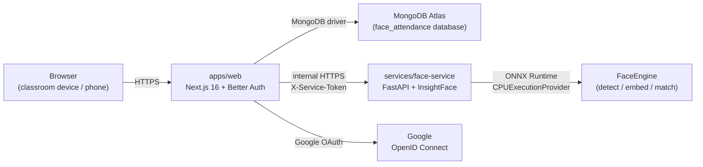
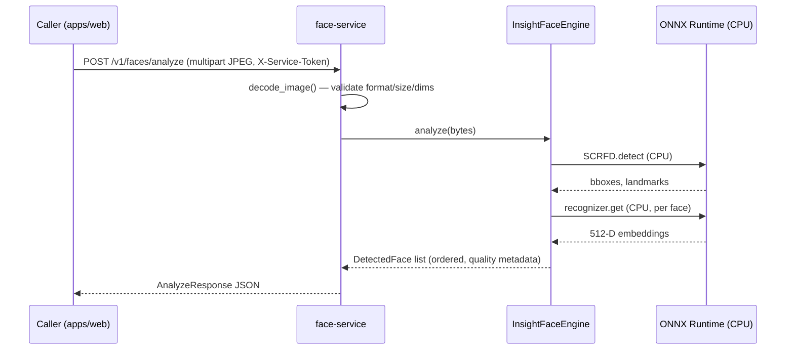

# Architecture

> Status: **Phase 6.2** — TEACHER ATTENDANCE CONTROL UI. PHASE 6.2 ships the teacher attendance lifecycle UI on the class detail page (`/classes/[classId]`), consisting of three new modules: (1) the server-only `getAttendanceSessionStatusForCurrentTeacher(classId)` read boundary (`attendance-session-status-read-service.ts`) that returns a browser-safe DTO `{ state, session }` for teachers only, with ACTIVE sessions preferred over CLOSED, and strict privacy guards; (2) the `AttendancePanel` Server Component that renders the three lifecycle states (NONE, ACTIVE, CLOSED) and the archived-class notice without any face recognition, attendance marks, or camera code; and (3) the `AttendanceControlButton` Client Component that calls `startAttendanceSessionAction` or `stopAttendanceSessionAction` with ONLY `classId` and uses a synchronous in-flight ref guard + `router.refresh()` for safe double-click protection and server-authoritative reconciliation. PHASE 6.2 does NOT add face recognition, does NOT create attendance marks, does NOT add camera UI, and does NOT introduce a public REST attendance API. See `## Phase 6.2 — Teacher Attendance Control UI` for the explicit phase statement.

> Status: **Phase 6.1** — ATTENDANCE SESSION FOUNDATION. The Attendance Session domain is now in place: a server-only `AttendanceSession` Mongoose model (`attendance_sessions` collection), a roster-snapshot service that captures the active membership at start time, and two authenticated Teacher Server Actions — `startAttendanceSessionAction` and `stopAttendanceSessionAction`. The session lifecycle is fully database-enforced: a partial unique index on `{ classId, status }` where `status === "active"` guarantees at most ONE active session per class; closing the session uses an atomic `findOneAndUpdate` CAS. Teachers who are NOT the owner cannot start or stop a session; archived classes cannot start. The roster snapshot is immutable: it captures `studentUserId` + `fullNameSnapshot` + `identificationCodeSnapshot` for every active member at start time, and is never refreshed. PHASE 6.1 does NOT add an Attendance UI, does NOT call the Face Service, does NOT perform recognition, does NOT mark any student present / absent / late, and does NOT introduce a public REST attendance API. See `## Phase 6.1 — Attendance Session Foundation` for the explicit phase statement.

> Status: **Phase 5.1E4C** — Class UX MVP closed. The four Class routes (`/classes`, `/classes/new`, `/classes/join`, `/classes/[classId]`) and three Class components (`CreateClassForm`, `JoinClassForm`, `RosterPanel`) implement the full teacher + student flows (list, create, detail, roster, join). No new Class domain features are introduced in E4C — this phase audits role-aware UX consistency, accessibility, empty / error / archived states, and navigation, and ships the final regression layer (`apps/web/src/app/classes/__tests__/class-ux-regression-closure.test.tsx`) proving the full teacher + student flows work together. See `## Phase 5.1E4C — Class UX Final Closure` for the explicit MVP-completion statement.

> Status: **Phase 5.1E4B** — PHASE 5.1A ships the persistence foundation for the `classes` and `class_memberships` collections. This phase adds two new Mongoose models, their service layers, and server-only utilities for class code generation, normalization, and password hashing. PHASE 5.1A.1 hardens the class join password primitive (PBKDF2-SHA256, async, constant-time verification, versioned encoded hash). PHASE 5.1B adds the **authenticated Teacher create-class Server Action** (`createClassAction`) — the first browser-reachable entry point on top of the 5.1A service. The action derives teacher identity exclusively from the Better Auth server session, requires a completed Profile with `role === "teacher"`, validates browser-supplied `name` + `password` server-side, generates a fresh canonical 7-char `classCode` server-side via the 5.1A generator, reuses `hashClassPassword(...)` from the service to persist `passwordHash` only, and performs a BOUNDED internal retry (at most `MAX_CLASS_CODE_ATTEMPTS`) on exact `classCode` unique-index collisions only. The action does NOT introduce a create-class UI, a `/api/classes` route, a `ClassMembership` write, an attendance session, a Face Service call, or any FaceProfile touch. PHASE 5.1C adds the **authenticated Student join-class Server Action** (`createJoinClassAction`) — the student-side counterpart to PHASE 5.1B. The action derives student identity exclusively from the Better Auth server session, requires a completed Profile with `role === "student"`, validates browser-supplied `classCode` + `password` server-side (canonicalizing the classCode via `z.preprocess` and enforcing the canonical alphabet `[A-HJ-NP-Z2-9]`), looks up the class through the server-only `getClassJoinCredentialByCode(...)` primitive, runs ONE async PBKDF2 verification workload (real or dummy) on every branch that would otherwise short-circuit — missing class / archived class / malformed stored hash all execute `await runDummyPasswordVerification(password)` against the fixed `DUMMY_CLASS_PASSWORD_HASH` constant before returning `INVALID_CLASS_CREDENTIALS` (wall-clock timing tests are explicitly NOT used; the contract asserts BEHAVIOR); classifies the membership insert's E11000 collision via the precise server-only `isMembershipDuplicateKeyError` predicate that accepts ONLY compound `(classId, studentUserId)` collisions — unrelated 11000 errors map to `CLASS_JOIN_FAILED` and the insert is NEVER retried. The action does NOT introduce a join UI, a `/api/classes/join` route, a `Class` write, a `Profile` mutation, a `FaceProfile` touch, a Face Service call, or any attendance logic. Better Auth collections remain untouched. PHASE 5.1D1 ships the **authenticated class-list read model foundation** as a server-only module (`getVisibleClassesForCurrentUser()` in `apps/web/src/lib/classes/class-read-service.ts`) — NOT a Server Action, NOT an REST route. The function accepts NO arguments and derives identity exclusively from the Better Auth server session and the persisted Profile. It is the canonical, READ-ONLY entry point for future Server Components that need to list the caller's classes. Teacher visibility = `Class.teacherUserId === session.user.id`; Student visibility = `ClassMembership.studentUserId === session.user.id` AND `status === "active"`. The student path batches the referenced `Class` lookups in a single `ClassModel.find({ _id: { $in: [...] } })` query — there is NO application-memory scan and NO obvious N+1. Missing referenced class ids are skipped safely; duplicate class ids across corrupt memberships are deduplicated. The safe summary DTO contains ONLY `{ id, name, classCode, status, createdAt }` — `passwordHash`, `teacherUserId`, `studentUserId`, membership internal ids, and biometric fields are NEVER serialized. The module is READ-ONLY: it does NOT create / mutate any `Class`, `ClassMembership`, or `Profile`; it does NOT call the Face Service; it does NOT touch `FaceProfile`; it does NOT verify a class password. D1 does NOT add a class list page, a class detail page, a roster, attendance, or any other public API surface. PHASE 5.1D2A ships the **authenticated class-detail read model** as a server-only function (`getClassDetailForCurrentUser(classId)` in `apps/web/src/lib/classes/class-read-service.ts`) — NOT a Server Action, NOT an HTTP route. The function accepts ONLY `classId` (the resource identifier). Identity derives exclusively from `session.user.id`; role derives exclusively from `Profile.role`. Teacher access = `ClassModel.findOne({ _id: classId, teacherUserId: session.user.id })` (the authorization constraint is encoded directly in the filter — the database refuses to surface a class the teacher does not own). Student access = `ClassMembershipModel.findOne({ classId, studentUserId: session.user.id, status: "active" })` THEN `ClassModel.findById(classId)`. Malformed `classId` (not a canonical 24-hex string) collapses to the SAME `CLASS_NOT_ACCESSIBLE` boundary used for missing / unauthorized classes — there is intentionally NO separate outward-facing code for "malformed syntax" vs "not yours" vs "no membership". The safe detail DTO contains ONLY `{ id, name, classCode, status, createdAt, updatedAt, role }` — `passwordHash`, `teacherUserId`, `studentUserId`, Mongoose internals, biometric fields, and roster / membership identifiers are NEVER serialized. The module is READ-ONLY: it does NOT create / mutate any `Class`, `ClassMembership`, or `Profile`; it does NOT call the Face Service; it does NOT touch `FaceProfile`; it does NOT verify a class password. Archived classes remain readable to authorized viewers (owner teacher or student with active membership); the result exposes `status: "archived"` safely. D2A does NOT add a class detail page, a roster, attendance, or any other public API surface. PHASE 5.1D2B ships the **authenticated teacher-owner roster read model** as a server-only function (`getClassRosterForCurrentTeacher(classId)` in `apps/web/src/lib/classes/class-read-service.ts`) — NOT a Server Action, NOT an HTTP route, NOT a UI surface. The function accepts ONLY `classId`. Identity derives exclusively from `session.user.id`; role derives exclusively from `Profile.role === "teacher"` (a student returns `TEACHER_REQUIRED` BEFORE any class / membership / Profile query is performed; a student must NOT be able to probe the existence of a class through the roster boundary). Teacher-owner access = `ClassModel.findOne({ _id: classId, teacherUserId: session.user.id })`. The active memberships are listed via `ClassMembershipModel.find({ classId, status: "active" }).sort({ joinedAt: 1 })` (oldest member first); student Profiles are batch-loaded in ONE call via the new server-only `getStudentProfilesByUserIds(userIds)` primitive on `@/lib/profile-service` — there is NO N+1 lookup, NO application-memory scan over the `profiles` collection. Orphaned / incomplete / non-student Profile references are skipped silently. The safe roster DTO contains ONLY `{ class: { id, name, classCode, status, createdAt, updatedAt }, students: [{ fullName, identificationCode, joinedAt }] }` — `passwordHash`, `teacherUserId`, `studentUserId`, membership internal ids, `emailSnapshot`, `phone`, Mongoose internals, biometric fields, attendance data, Better Auth user data, and credential helpers are NEVER serialized. The module is READ-ONLY: it does NOT create / mutate any `Class`, `ClassMembership`, or `Profile`; it does NOT call the Face Service; it does NOT touch `FaceProfile`; it does NOT verify a class password; it does NOT query the Better Auth user collection. Archived classes remain readable to the owner teacher; the result exposes `status: "archived"` safely. D2B does NOT add a roster UI, a Server Action, an HTTP route, an attendance endpoint, or any other public API surface. — PHASE 5.1A ships the persistence foundation for the `classes` and `class_memberships` collections. This phase adds two new Mongoose models, their service layers, and server-only utilities for class code generation, normalization, and password hashing. PHASE 5.1A.1 hardens the class join password primitive (PBKDF2-SHA256, async, constant-time verification, versioned encoded hash). PHASE 5.1B adds the **authenticated Teacher create-class Server Action** (`createClassAction`) — the first browser-reachable entry point on top of the 5.1A service. The action derives teacher identity exclusively from the Better Auth server session, requires a completed Profile with `role === "teacher"`, validates browser-supplied `name` + `password` server-side, generates a fresh canonical 7-char `classCode` server-side via the 5.1A generator, reuses `hashClassPassword(...)` from the service to persist `passwordHash` only, and performs a BOUNDED internal retry (at most `MAX_CLASS_CODE_ATTEMPTS`) on exact `classCode` unique-index collisions only. The action does NOT introduce a create-class UI, a `/api/classes` route, a `ClassMembership` write, an attendance session, a Face Service call, or any FaceProfile touch. PHASE 5.1C adds the **authenticated Student join-class Server Action** (`createJoinClassAction`) — the student-side counterpart to PHASE 5.1B. The action derives student identity exclusively from the Better Auth server session, requires a completed Profile with `role === "student"`, validates browser-supplied `classCode` + `password` server-side (canonicalizing the classCode via `z.preprocess` and enforcing the canonical alphabet `[A-HJ-NP-Z2-9]`), looks up the class through the server-only `getClassJoinCredentialByCode(...)` primitive, runs ONE async PBKDF2 verification workload (real or dummy) on every branch that would otherwise short-circuit — missing class / archived class / malformed stored hash all execute `await runDummyPasswordVerification(password)` against the fixed `DUMMY_CLASS_PASSWORD_HASH` constant before returning `INVALID_CLASS_CREDENTIALS` (wall-clock timing tests are explicitly NOT used; the contract asserts BEHAVIOR); classifies the membership insert's E11000 collision via the precise server-only `isMembershipDuplicateKeyError` predicate that accepts ONLY compound `(classId, studentUserId)` collisions — unrelated 11000 errors map to `CLASS_JOIN_FAILED` and the insert is NEVER retried. The action does NOT introduce a join UI, a `/api/classes/join` route, a `Class` write, a `Profile` mutation, a `FaceProfile` touch, a Face Service call, or any attendance logic. Better Auth collections remain untouched. PHASE 5.1D1 ships the **authenticated class-list read model foundation** as a server-only module (`getVisibleClassesForCurrentUser()` in `apps/web/src/lib/classes/class-read-service.ts`) — NOT a Server Action, NOT a REST route. The function accepts NO arguments and derives identity exclusively from the Better Auth server session and the persisted Profile. It is the canonical, READ-ONLY entry point for future Server Components that need to list the caller's classes. Teacher visibility = `Class.teacherUserId === session.user.id`; Student visibility = `ClassMembership.studentUserId === session.user.id` AND `status === "active"`. The student path batches the referenced `Class` lookups in a single `ClassModel.find({ _id: { $in: [...] } })` query — there is NO application-memory scan and NO obvious N+1. Missing referenced class ids are skipped safely; duplicate class ids across corrupt memberships are deduplicated. The safe summary DTO contains ONLY `{ id, name, classCode, status, createdAt }` — `passwordHash`, `teacherUserId`, `studentUserId`, membership internal ids, and biometric fields are NEVER serialized. The module is READ-ONLY: it does NOT create / mutate any `Class`, `ClassMembership`, or `Profile`; it does NOT call the Face Service; it does NOT touch `FaceProfile`; it does NOT verify a class password. D1 does NOT add a class list page, a class detail page, a roster, attendance, or any other public API surface.
> math foundation. PHASE 4.6A2 adds the protected internal finalization
> endpoint (`POST /v1/faces/enrollment/finalize`) that receives
> already-decrypted, already-L2-normalized embeddings from the trusted
> Next.js server and returns a consistency result plus a normalized centroid.
> PHASE 4.6B1A extends the existing server-only Next.js `FaceServiceClient`
> with a `finalizeFaceEnrollment(...)` function that calls the PHASE 4.6A2
> endpoint. PHASE 4.6B1B adds the server-only Next.js orchestration service
> (`finalizeEnrollmentSessionForUser`) that loads the temporary
> `FaceEnrollmentSession`, decrypts its accepted samples server-side,
> reconstructs the exact AES-GCM AAD, validates plaintext vectors, calls
> the B1A client exactly once, and re-checks the enrollment generation
> after the Face Service response. PHASE 4.6B1B does NOT persist a
> `FaceProfile`, does NOT delete the temporary session, and does NOT
> expose a Next.js route — those belong to PHASE 4.6B2 and 4.6B3.
> PHASE 4.6B2A ships the **atomic completion claim** on the temporary
> `FaceEnrollmentSession` (server-only). PHASE 4.6B2B ships the
> **claim-bound `FaceProfile` persistence** orchestrator
> (`persistFinalizedFaceProfileForUser`). PHASE 4.6B2C ships the
> **temporary-enrollment consumption + crash-recovery** orchestrator
> (`completeFinalizedFaceEnrollmentForUser`). All three are server-internal
> only — no Next.js route / Server Action / UI was added in 4.6B2.
> PHASE 4.6B3A ships the first authenticated server-side entry point
> that wraps the B2C orchestrator: a zero-argument Server Action
> (`finishFaceEnrollment`) that derives the user id exclusively from
> the Better Auth session, gates on a completed `Profile`, and
> delegates to `completeFinalizedFaceEnrollmentForUser(session.user.id)`
> exactly once. The action returns a small safe result and never
> exposes `userId`, `generationId`, `claimToken`, `centroid`,
> ciphertext, IV, authTag, keyVersion, or model metadata. PHASE
> 4.6B3A deliberately does NOT add a Finish setup button, a public
> `/api/face-id/enrollment/finalize` route, or any UI changes — UI
> consumption belongs to PHASE 4.6B3B.
>
> PHASE 4.6B3B ships the **explicit "Finish setup" UI** for the
> temporary enrollment → durable `FaceProfile` transition. The
> `/face-id/setup` page now renders a small `EnrollmentFinishButton`
> client component below the camera/sample panel when (and ONLY when)
> the temporary enrollment is in the server-authoritative complete
> state AND no durable `FaceProfile` already exists. The button is
> the ONLY browser-side trigger: it never auto-runs from a
> `useEffect`, page load, router refresh, progress update, or camera
> callback. On explicit click it invokes the PHASE 4.6B3A
> `finishFaceEnrollment()` zero-argument Server Action. Two rapid
> clicks collapse into exactly ONE Server Action invocation via a
> synchronous `finishInFlightRef` guard. On success the UI navigates
> to `/face-id` via `router.replace(...)` so the Back button cannot
> return the user to the completion screen. The button receives NO
> `userId`, `generationId`, `claimToken`, `centroid`, sample array,
> or model metadata. The button never writes to `localStorage`,
> `sessionStorage`, `IndexedDB`, or the `Cache` API; never issues
> `fetch()` to the Face Service; never restarts the camera or
> requests `getUserMedia`. There is NO automatic retry on failure;
> retryable errors keep the user on the 5/5 setup state and allow
> another explicit click. Expired / generation-changed / not-found
> / incomplete states trigger a single, safe `router.refresh()` to
> reconcile the server-rendered setup shell without re-invoking the
> action. PHASE 4.6B3B does NOT implement re-enrollment, delete-Face-ID,
> or any other next-step UI.
> typed `CapturedVideoFrame`. PHASE 4.5B3 shipped the **capture + submit
> + quality feedback loop**: a client helper posts one captured JPEG
> Blob to `POST /api/face-id/enrollment/sample`, the server response
> drives safe accepted/rejected feedback and server-authoritative
> progress. PHASE 4.5B4 adds **enrollment progress + recovery + reload
> resilience**: server-authoritative progress from page props, conflict
> reconciliation, expired session recovery, sample-limit handling, and
> model mismatch blocking. No finalization, no `FaceProfile` creation,
> no polling, no local persistence — those belong to PHASE 4.5B5 / 4.6.

## Goals

1. Keep facial recognition fully isolated from the web application.
2. Allow the recognition engine to be swapped without rewriting callers.
3. Avoid false-positive attendance: when uncertain, return `UNKNOWN`.
4. Minimize stored biometric data — embeddings only, never raw frames.
5. Phase-by-phase delivery: no premature InsightFace or MongoDB business
   code in early phases.
6. Separate identity data from business data: Better Auth owns the auth
   collections; the application owns the `profiles` collection.

## High-level components



- **Browser** opens the camera locally for the teacher; only sampled JPEG
  frames are sent to the Face Service (PHASE 3 ships no browser sampling
  logic yet — the Face Service already accepts multipart uploads).
- **`apps/web`** owns authentication (Better Auth + Google OAuth), and will
  later own RBAC, classes, attendance sessions, history, Excel export.
- **`services/face-service`** owns *all* face-related computation. It is
  the only component that imports InsightFace / ONNX Runtime. The engine
  is loaded once at process start and reused for every request.
- **MongoDB Atlas** stores Better Auth collections (`user`, `session`,
  `account`, `verification`) in the `face_attendance` database. The
  application owns `profiles` (Phase 2), `face_profiles` and
  `face_enrollment_sessions` (Phase 4.2) via Mongoose, and will own
  future business collections (`classrooms`, `class_memberships`,
  `attendance_sessions`, `attendance_records`) in later phases.
- **Google** is identity-only — only `sub`, `email`, `name`, `picture` are
  requested via the `openid email profile` scopes.

## FaceEngine abstraction

Defined in [`services/face-service/app/engine/base.py`](../services/face-service/app/engine/base.py)
as a `Protocol` with three legacy responsibilities plus four PHASE 3
additions:

**Phase 0 surface (preserved):**

- `detect_faces(image)` — return bounding boxes + confidence for every
  face in the frame.
- `extract_embeddings(image, faces)` — return a normalized embedding per
  detected face.
- `recognize_faces(image, candidate_index)` — return per-face
  `{ bbox, candidate_id | null, similarity, status }`.

**Phase 3 additions:**

- `load()` — synchronous, idempotent model init (called once by the
  FastAPI lifespan).
- `status()` — readiness snapshot for `/health` (distinguishes "process
  up, model not loaded" from "model ready").
- `metadata()` — immutable identification (engine name, library version,
  model name, model identity, provider, embedding dimension) used to
  guarantee model compatibility in later phases.
- `analyze(image)` — convenience that returns full `DetectedFace`
  dataclasses (bbox + 5-point landmarks + quality).

The web app and the rest of the Face Service depend on this `Protocol`,
not on InsightFace. PHASE 3 ships `InsightFaceEngine` as the first
implementation; future engines (e.g. a different backbone) can be added
without touching call sites.

```
FastAPI Route
      │
      ▼
Face Service (recognition_service.py)
      │
      ▼
FaceEngine Protocol  (app.engine.base.FaceEngine)
      │
      ▼
InsightFaceEngine    (app.engine.insightface_engine)
      │
      ├── SCRFD / detection
      └── ArcFace recognition (ResNet50@WebFace600K)
              │
              ▼
       normalized 512-D embedding
```

### Quality heuristics (PHASE 3, informational only)

Per detected face the engine reports a `FaceQuality` block:

- `detection_score`
- `face_width` / `face_height` (pixels)
- `relative_face_area` (face area / image area)
- `blur_score` (variance of Laplacian — resolution-dependent)
- `brightness` (normalised mean luminance — exposure only)
- `near_edge`

**No hard rejection is enforced in PHASE 3.** Hard rejection policies
belong to PHASE 4 enrollment.

## Authentication and authorization

### End users (Google OAuth via Better Auth)

Unchanged from Phase 2. See "Authentication and authorization" below.

### Server-to-server (web ↔ Face Service)

- All Face Service endpoints **except** `GET /health` require the shared
  `FACE_SERVICE_SECRET` sent as `X-Service-Token`.
- The browser **never** calls the Face Service directly — the web app is
  the only client.
- When the secret is not configured on the server, every protected
  request is rejected with `FACE_SERVICE_UNAUTHORIZED` so the
  misconfiguration is loud rather than silent.

```
Browser
   ↓
Next.js Server (apps/web)
   ↓  FACE_SERVICE_SECRET in X-Service-Token
FastAPI Face Service (services/face-service)
   ↓
RecognitionService
   ↓
FaceEngine (InsightFaceEngine)
   ├── SCRFD detector
   └── ArcFace recognizer
        └── 512-D L2-normalised embedding
```

## Face Service API (PHASE 3 surface)

Base URL: `${FACE_SERVICE_URL}`.
Authentication: `X-Service-Token: ${FACE_SERVICE_SECRET}` on every
request **except `GET /health`**.

| Endpoint | Method | Auth | Purpose |
| --- | --- | --- | --- |
| `/health` | GET | public | Liveness + readiness (engine state, model, provider, embedding dimension). |
| `/v1/faces/analyze` | POST | service token | Detect 0 / 1 / many faces + quality. Returns no embeddings. |
| `/v1/faces/compare` | POST | service token | 1:1 verification between two single-face images. |
| `/docs` | GET | public | OpenAPI Swagger UI (development only). |

### Error contract

```json
{
  "error": {
    "code": "STRING_CODE",
    "message": "Human readable."
  }
}
```

Stable codes include: `INVALID_IMAGE`, `IMAGE_TOO_LARGE`, `NO_FACE`,
`MULTIPLE_FACES`, `ENGINE_NOT_READY`, `MODEL_LOAD_FAILED`,
`INVALID_EMBEDDING`, `FACE_SERVICE_UNAUTHORIZED`.

Stack traces are logged server-side and **never** returned to clients.

## Next.js Face ID route architecture (PHASE 4.4B1 + 4.4B2)

PHASE 4.4B1 ships the first Next.js Face ID route —
`POST /api/face-id/enrollment/start`. PHASE 4.4B2 adds a second
read-only route — `GET /api/face-id/enrollment/status`. Both are
deliberately thin Route Handlers that delegate all persistence to
the existing PHASE 4.2 service modules:

```
Route Handler (apps/web/src/app/api/face-id/enrollment/start/route.ts)
  │
  ├── getSession()                ── Better Auth server session
  ├── isOnboardingComplete()      ── profile-service
  ├── hasFaceProfile()            ── face-profile-service
  └── createOrResetEnrollmentSession()
                                   ── enrollment-session-service
                                       (upsert keyed on userId,
                                        unique-indexed Mongo doc,
                                        15-minute TTL via the
                                        existing PHASE 4.2 helper)

Route Handler (apps/web/src/app/api/face-id/enrollment/status/route.ts)
  │
  ├── getSession()                ── Better Auth server session
  ├── isOnboardingComplete()      ── profile-service
  ├── getFaceProfileByUserId()    ── face-profile-service (read)
  ├── getEnrollmentSessionByUserId()
                                 ── enrollment-session-service (read)
  ├── isEnrollmentSessionExpired()
                                 ── enrollment-session-service (helper)
  └── deleteEnrollmentSessionByUserId()
                                 ── enrollment-session-service
                                       (best-effort cleanup of an
                                        expired session; failure is
                                        internal-only)

Route Handler (apps/web/src/app/api/face-id/enrollment/sample/route.ts)
  │  (PHASE 4.4C)
  │
  ├── getSession()                ── Better Auth server session
  ├── isOnboardingComplete()      ── profile-service
  ├── getEnrollmentSessionByUserId()
  │                              ── enrollment-session-service (read)
  ├── isEnrollmentSessionExpired()
  │                              ── enrollment-session-service (helper)
  ├── analyzeEnrollmentSample()  ── face-service-client (server-only)
  │                                   forwards to Face Service
  │                                   POST /v1/faces/enrollment/sample
  ├── encryptBiometricVector()   ── biometric encryption (server-only)
  │                                   AES-256-GCM with AAD binding
  └── appendAcceptedEnrollmentSample()
                                 ── enrollment-session-service
                                       atomic findOneAndUpdate with
                                       filter conditions (user,
                                       expiration, sample limit,
                                       model compatibility)
```

Design rules that future Face ID routes should follow:

- The Route Handler is thin. It does **not** touch Mongoose / MongoDB
  directly — that lives in the service layer, which is unit-tested
  separately.
- Identity comes from `session.user.id` exclusively. The request body
  is **never** trusted for `userId` or `email`. The status route
  additionally ignores query parameters for identity.
- Application-level errors are wrapped in
  `EnrollmentRouteError` (in `apps/web/src/lib/biometrics/enrollment-route-errors.ts`).
  Mongoose / MongoDB / Better Auth internals never leave the route.
- The status route never calls the Face Service in PHASE 4.4B2 —
  status is purely a database read. The status route also never
  decrypts anything; `BIOMETRIC_ENCRYPTION_KEY` is not required to
  read status.
- Constants are centralized in
  `apps/web/src/lib/biometrics/biometric-constants.ts`
  (`DEFAULT_FACE_ENROLLMENT_REQUIRED_SAMPLES = 5`,
  `DEFAULT_FACE_ENROLLMENT_TEMPLATE_VERSION = 1`). Call sites must
  not hard-code literals.
- The routes return only safe, non-biometric fields. They never
  include `userId`, `email`, encrypted samples, ciphertext / IV /
  authTag, model metadata, or embeddings in the response.

The routes are fully server-only; no Client Component or fetch hook
is introduced in PHASE 4.4B1 or 4.4B2.

## Browser camera foundation (PHASE 4.5A)

PHASE 4.5A ships the first **client-side** Face ID code: a reusable
camera foundation that future enrollment UI (PHASE 4.5B and beyond)
will consume. PHASE 4.5A is intentionally tiny — a primitive that
shows a live preview and nothing more.

### Surface

```
apps/web/src/components/face-id/
  camera-constants.ts   — stable error codes, friendly messages,
                          getUserMedia constraints (audio: false,
                          video: user-facing, 1280x720 ideal)
  camera-errors.ts      — pure utility mapping any thrown value to a
                          closed-enum CameraErrorShape (no stack
                          leakage, never throws)
  use-face-camera.ts    — "use client" React hook
                          (idle / requesting / ready / error)
  camera-preview.tsx    — "use client" React component rendering a
                          <video>, Turn on / Stop buttons, error
                          block, and a small privacy note
  index.ts              — public surface
```

The directory follows the existing component conventions under
`apps/web/src/components/` (named folders, paired co-located tests,
no barrel re-exports of internals).

### Client boundary

The camera module is `"use client"` and **MUST NOT** import any
server-only module:

- `face-service-client.ts`
- `encryption.ts`
- Mongoose models
- `FACE_SERVICE_SECRET`
- `BIOMETRIC_ENCRYPTION_KEY`
- `MONGODB_URI`

These imports would break the production `server-only` boundary
enforced by Next.js and would also leak server secrets into the
browser bundle. The camera module's only imports are:

- React (`useState`, `useEffect`, `useRef`, `useCallback`)
- The local `camera-constants.ts` and `camera-errors.ts` siblings
- The shared `cn()` helper

### Permission model

The browser's `getUserMedia` permission dialog is one of the most
disruptive UX events on the web. PHASE 4.5A therefore follows a
strict permission rule:

- `getUserMedia` is NEVER called on mount, render, or effect.
- The ONLY trigger is the user pressing the **"Turn on camera"**
  button.
- Opening a page that embeds `CameraPreview` must NOT immediately
  trigger the browser permission dialog.

### Audio

PHASE 4.5A requests `audio: false` unconditionally. Microphone
permission is NEVER requested. The microphone LED on supported
platforms therefore never lights up during PHASE 4.5A usage.

### getUserMedia constraints

Centralized in `camera-constants.ts`:

```ts
{
  audio: false,
  video: {
    facingMode: "user",     // ideal — desktop webcams without a
                            // front camera still work
    width:  { ideal: 1280 },
    height: { ideal: 720 }, // exact resolution not required
  },
}
```

### State model

Small typed lifecycle:

| Status      | Meaning                                                    |
| ----------- | ---------------------------------------------------------- |
| `idle`      | Nothing has happened, or the camera has been stopped.      |
| `requesting`| A `getUserMedia` call is in flight.                        |
| `ready`     | A stream is active and attached to `video.srcObject`.      |
| `error`     | The last attempt failed; `error` carries the safe shape.   |

The hook also exposes `isReady` as a convenience for consumers that
do not want to compare against the string literal `"ready"`.

### Lifecycle cleanup

Every active `MediaStreamTrack` is stopped when:

- the user presses **Stop camera**
- the consuming component unmounts (navigation, route change,
  modal close)
- a stream is replaced by another stream
- startup fails after a stream was partially obtained

The OS-level camera LED is therefore guaranteed to turn off after
the user navigates away.

### Repeated start

The hook treats a `startCamera()` call as **idempotent** when a
stream is already active: no second `getUserMedia` call is made,
no second stream is held. This keeps the foundation free of
MediaStream leaks from repeated clicks. After `stopCamera()` a new
start is allowed normally.

### Secure context

If the page is not in a secure context (`window.isSecureContext`
is `false`), `startCamera()` short-circuits and reports
`CAMERA_INSECURE_CONTEXT` without ever calling `getUserMedia`.
Localhost is treated as secure by modern browsers and works
without changes. No production domains are hard-coded.

### Error mapping

`camera-errors.ts` exposes a pure `mapCameraError(unknown)` function
that maps any thrown value to a closed enum:

| Browser exception                                              | Mapped code                |
| -------------------------------------------------------------- | -------------------------- |
| `NotAllowedError`                                              | `CAMERA_PERMISSION_DENIED` |
| `NotFoundError`, `OverconstrainedError`                        | `CAMERA_NOT_FOUND`         |
| `NotReadableError`                                             | `CAMERA_IN_USE`            |
| `SecurityError`                                                | `CAMERA_INSECURE_CONTEXT`  |
| anything else (incl. `null`, `undefined`, primitives)          | `CAMERA_UNAVAILABLE`       |

The function NEVER returns the raw exception name, message, or
stack. Friendly copy lives in `CAMERA_ERROR_MESSAGES` and is rendered
by the component.

### No capture / no upload / no route

PHASE 4.5A does NOT introduce:

- A `<canvas>` element
- `drawImage`, `toBlob`, `toDataURL`
- The `ImageCapture` API
- Any `fetch` call to `/api/face-id/enrollment/sample`
- A `/face-id` or `/face-id/setup` application route
- Any change to the sidebar / navigation

PHASE 4.5B will integrate the camera foundation into the actual
enrollment page and add image capture, but no part of that work
belongs to PHASE 4.5A.

## Face ID page shell (PHASE 4.5B1)

PHASE 4.5B1 ships the first two user-facing Face ID routes under the
authenticated app shell:

- `/face-id` — safe overview page
- `/face-id/setup` — enrollment shell

Both pages are Server Components. They follow the same guard
conventions as `/dashboard` and `/profile`:

- No session → `redirect("/login")`
- Profile incomplete → `redirect("/onboarding")`

### Shared safe status service

To avoid duplicating status logic between
`GET /api/face-id/enrollment/status` and the Server Components, a
shared server-only module is introduced:

```
apps/web/src/lib/biometrics/face-id-status-service.ts
```

This module is the single source of truth for reading safe Face ID
status server-side. It returns typed objects (not JSON over HTTP),
and never exposes:

- `userId`, `email`
- encrypted samples (`ciphertext`, `iv`, `authTag`, `keyVersion`)
- model metadata (`modelIdentity`, `modelName`, `embeddingDimension`)
- embeddings, centroids, quality summaries

It performs the same TTL handling as the status route (treats
`expiresAt <= now` as expired, attempts best-effort cleanup, and
always reports `enrollment.active = false` regardless of cleanup
outcome).

### `/face-id` page

The overview page renders one of four conceptual states, all derived
from the shared status service:

| State | UI |
| --- | --- |
| Configured (FaceProfile exists) | "Configured" + enrolled date + sample count |
| Configured + residual temp session | "Configured" (FaceProfile outranks temp residue) |
| Not configured, active enrollment (N < 5) | "Setup in progress" + "N of 5 samples" + expiry copy + "Continue setup" → `/face-id/setup` |
| Not configured, 5/5 temp (no FaceProfile yet) | "Samples collected" + honest intermediate copy + "Continue setup" → `/face-id/setup` |
| Not configured, no active enrollment | "Not configured" + "Set up Face ID" → `/face-id/setup` |

**PHASE 4.6B3C — Source-of-truth priority:**
1. `FaceProfile` exists → **CONFIGURED**. The durable profile outranks any
   leftover temporary `FaceEnrollmentSession` (cleanup-pending, TTL-not-yet-reaped,
   post-B2B crash, etc.). No "Continue setup" / "Finish setup" / "Start setup" /
   cleanup warning / claim status is rendered.
2. No `FaceProfile` + active session → IN PROGRESS or SAMPLES COLLECTED.
3. No `FaceProfile` + no active session → NOT CONFIGURED.

The temporary 5/5 state is an **honest intermediate state** — it shows
"All required samples collected" and routes to `/face-id/setup` for the
explicit Finish setup action. It does NOT say "Configured" or "identity verified".

Legacy `FaceProfile` documents (pre-dating `sourceEnrollmentGenerationId`)
are rendered as Configured without requiring the lineage field.

No biometric payload is rendered. No replace/delete actions are
exposed. No fabricated metrics (recognition accuracy, confidence,
last scan, attendance count) appear.

### `/face-id/setup` page

The enrollment shell does NOT auto-start enrollment and does NOT
auto-request camera permission. Behavior:

- If an active enrollment session exists → render safe progress and
  embed `CameraPreview` with the restrained "Camera preview is
  ready. Sample capture will be connected in the next step." copy.
- If no active session exists → render the explicit "Start setup"
  button. Pressing the button calls the server-only enrollment
  start action, then refreshes the page state via `router.refresh()`.
- If a `FaceProfile` already exists → redirect to `/face-id`
  (replace mode is not implemented in PHASE 4.5B1).

The page never exposes a functional-looking Capture button. There is
no "Capture sample" action in PHASE 4.5B1.

### Explicit enrollment start action

A Server Action (`startFaceEnrollment`) lives at
`apps/web/src/lib/biometrics/enrollment-start-action.ts`. It wraps
the existing service-layer `createOrResetEnrollmentSession` with
the same auth/profile/face-profile checks as the
`POST /api/face-id/enrollment/start` route. The Client Component
`EnrollmentStartButton` calls the action, disables repeated clicks
while pending, maps server error codes to friendly UI messages, and
calls `router.refresh()` on success.

The request body is empty; identity comes from the Better Auth
session only. The action never accepts a `userId` from the browser.

### CameraPreview integration

The setup page embeds the existing PHASE 4.5A `CameraPreview`
component directly. The component retains its original behavior:

- Camera permission is only requested after an explicit button click.
- `audio: false` — no microphone access.
- All tracks are stopped on unmount.
- `getUserMedia` is never called during page load.

The setup page does NOT introduce a Capture button. The preview is
present so the user can verify camera access works before later
phases add capture/submission.

### Face ID navigation entry

`nav-config.ts` updates the Face ID item from `coming_soon` to
`ready` with `href: "/face-id"`. The AppSidebar's existing
`pathname.startsWith(item.href)` active-state check correctly
highlights both `/face-id` and `/face-id/setup` because both paths
share the prefix.

### What PHASE 4.5B1 does NOT include

- `<canvas>`, `drawImage`, `toBlob`, `toDataURL`, `ImageCapture`
- POST `/api/face-id/enrollment/sample`
- 5-sample capture loop
- Quality feedback
- Embedding handling
- Centroid calculation
- FaceProfile creation / finalization
- Re-enrollment / Face ID deletion

These belong to PHASE 4.5B2.

## Frame capture foundation (PHASE 4.5B2)

PHASE 4.5B2 ships the first **client-side image processing** primitive
in the web app: a small, reusable utility that captures one frame
from an already-ready HTMLVideoElement and returns it as a JPEG Blob
held only in browser memory. PHASE 4.5B2 does NOT submit the frame
anywhere, does NOT persist it, and does NOT integrate into a UI yet.

### Surface

```
apps/web/src/components/face-id/
  capture-video-frame.ts   — captureVideoFrame() + dimension helper
                             + capture error codes / messages
```

A new test file sits beside it:

```
apps/web/src/components/face-id/
  capture-video-frame.test.ts
```

### Public API

```ts
type CapturedVideoFrame = {
  blob: Blob
  mimeType: "image/jpeg"
  width: number
  height: number
  size: number
}

captureVideoFrame(
  video: HTMLVideoElement,
): Promise<
  | { ok: true; frame: CapturedVideoFrame }
  | { ok: false; error: CaptureErrorShape }
>
```

The promise **resolves** on error (does not reject) so the caller
gets a typed `CaptureErrorShape` without unhandled promise
rejections in UI event handlers.

The capture utility never returns a base64 string, a data URL, or a
pixel array — a `Blob` is the entire output.

### Source video requirements

Capture is allowed only when:

- `video.videoWidth > 0`
- `video.videoHeight > 0`
- `video.readyState >= HTMLMediaElement.HAVE_CURRENT_DATA`

If the camera stream exists but the video has not produced a frame,
the call resolves with `FRAME_NOT_READY`. No blank JPEG is ever
produced.

### Capture error codes

A closed enum, deliberately separate from the camera-startup codes:

| Code | Meaning |
| --- | --- |
| `FRAME_NOT_READY` | The video has not yet produced a frame. |
| `FRAME_CANVAS_UNAVAILABLE` | The browser could not obtain a 2D context from the ephemeral canvas. |
| `FRAME_ENCODING_FAILED` | `toBlob` returned `null`, or an unexpected exception occurred during draw / encode. |

Raw browser exception names, messages, and stacks are NEVER surfaced.

### Resolution policy

Centralized constant:

```
FACE_CAPTURE_MAX_LONG_EDGE = 1280
```

The source aspect ratio is preserved. If the source long edge is
greater than 1280 the frame is scaled down proportionally; otherwise
it is **not upscaled**.

Examples (max long edge = 1280):

| Source | Output |
| --- | --- |
| 1920×1080 | 1280×720 |
| 1080×1920 | 720×1280 |
| 1280×720 | 1280×720 |
| 640×480 | 640×480 |
| 1000×1000 | 1000×1000 |

The dimension calculation lives in a pure helper,
`calculateCaptureDimensions(sourceWidth, sourceHeight, maxLongEdge)`,
which validates inputs (rejects zero, negative, NaN, Infinity,
non-integer dimensions) and is unit-tested in isolation.

### JPEG encoding

Centralized constants:

```
FACE_CAPTURE_JPEG_QUALITY = 0.85
FACE_CAPTURE_MIME_TYPE    = "image/jpeg"
```

Encoding uses `canvas.toBlob(...)`. `canvas.toDataURL()` is NOT used.
Iterative quality compression is NOT implemented. The Next.js sample
endpoint remains authoritative for its existing 1.5 MB request limit.

### Canvas

An ephemeral in-memory HTMLCanvasElement is created programmatically
via `document.createElement("canvas")`. It is NEVER rendered into
the page. After `toBlob` has completed the canvas backing memory is
released (`canvas.width = 0; canvas.height = 0`) — the clear happens
AFTER `toBlob` finishes, not before.

### Mirroring

The `CameraPreview` component applies a CSS `[transform:scaleX(-1)]`
to its `<video>` for selfie-style presentation. CSS transforms do
NOT affect source pixels drawn via `drawImage`. The capture utility
does NOT apply `ctx.scale(-1, 1)` or `ctx.translate(...)` to mirror
the source. The captured image preserves the original camera frame
orientation.

### Draw

The full current video frame is drawn at the calculated output
dimensions. No face detection, no face cropping, no overlays, no
guides, no text, no watermark. No face recognition belongs in browser
code.

```
context.drawImage(video, 0, 0, outputWidth, outputHeight)
```

### No object URL, no persistence, no network

PHASE 4.5B2 deliberately does NOT:

- Call `URL.createObjectURL()` (no captured preview yet)
- Write to disk, IndexedDB, localStorage, sessionStorage, the Cache
  API, MongoDB, or any public directory
- Call `fetch`, `XMLHttpRequest`, `sendBeacon`, or any Server Action
- Import any server-only module
  (`face-service-client`, `encryption`, Mongoose models,
  `FACE_SERVICE_SECRET`, `BIOMETRIC_ENCRYPTION_KEY`, `MONGODB_URI`)
- Call `getUserMedia` itself — capture consumes an already-ready
  `<video>` element managed by `useFaceCamera`

The captured frame exists only as temporary canvas pixels during
encoding and the returned in-memory JPEG `Blob`. Nothing leaves the
browser in this phase.

### Camera lifecycle is unchanged

PHASE 4.5B2 does NOT modify the PHASE 4.5A camera behavior:

- `getUserMedia` is still only triggered by an explicit button click.
- `audio: false` is still enforced.
- The pending-request guard, the request generation token, the
  unmount cleanup, and the error mapping all remain.

The capture utility is a pure consumer of an already-ready
`<video>` element.

### What PHASE 4.5B2 does NOT include

- POST `/api/face-id/enrollment/sample`
- A functional Capture button on `/face-id/setup`
- 5-sample progress mutations
- Quality rejection UI
- Finalization or `FaceProfile` creation
- Re-enrollment or Face ID deletion flows

Sample submission and finalization belong to PHASE 4.5B3.

## Sample capture + submission (PHASE 4.5B3)

PHASE 4.5B3 turns the previously-inert camera preview on
`/face-id/setup` into a working capture loop. The browser still
never speaks to the Face Service directly — every biometric frame
travels through the existing Next.js authenticated route.

### High-level data flow

```
Browser (EnrollmentSamplePanel, "use client")
  ├── useFaceCamera()           ── existing PHASE 4.5A hook
  ├── <video>                   ── live preview from camera
  ├── "Capture sample" button   ── explicit user action only
  ├── captureVideoFrame(video)  ── existing PHASE 4.5B2 utility
  │      ↓
  │    JPEG Blob (in-memory only)
  │      ↓
  └── submitFaceEnrollmentSample(blob)
         ↓ FormData { image: blob, "face-sample.jpg" }
         ↓ NO manual Content-Type
         ↓ Browser → Next.js only
       POST /api/face-id/enrollment/sample
         ↓ (existing PHASE 4.4C server route — unchanged)
         ↓ analyzeEnrollmentSample → Face Service
         ↓ encryptBiometricVector → AES-256-GCM
         ↓ appendAcceptedEnrollmentSample → Mongo
         ↓
       200 OK { accepted, rejectionReasons, progress }
         ↓
       client helper parses with Zod
         ↓
       update progress (server-authoritative)
       render accepted | rejected | domain-error | infra-error feedback
```

### Client surface

```
apps/web/src/components/face-id/
  enrollment-sample-client.ts   — submitFaceEnrollmentSample() helper
                                    + response / error contract types
                                    + quality rejection message map
```

```
apps/web/src/components/face-id-pages/
  enrollment-sample-panel.tsx   — "use client" UI component:
                                    - composes useFaceCamera
                                    - renders <video> + Turn on / Stop
                                    - renders "Capture sample" button
                                      (only when camera is ready)
                                    - orchestrates capture + submit
                                    - in-flight submission guard
                                    - safe feedback blocks
```

The setup page (`/face-id/setup`) replaces its previous
`CameraPreview` embed with `EnrollmentSamplePanel` whenever an
active enrollment session exists.

### Strict non-goals (PHASE 4.5B3 explicitly does NOT)

- Finalization or `FaceProfile` creation
- Centroid calculation
- Decryption of any persisted encrypted sample
- Re-enrollment, delete-Face-ID
- Liveness / anti-spoofing
- Automatic capture, continuous capture, video recording
- base64 encoding, `toDataURL`, object URL preview
- `localStorage`, `sessionStorage`, IndexedDB, Cache API
  persistence of any captured frame
- Direct browser → Face Service calls
- Sending `X-Service-Token` or `FACE_SERVICE_SECRET` from the browser
- Sending `userId`, `email`, `sampleIndex`, or `modelIdentity` from
  the browser
- Manual `Content-Type: multipart/form-data` (the browser MUST
  generate the multipart boundary)
- Any automatic retry of the POST

### Capture action is explicit only

A "Capture sample" button is rendered only while:

- an active enrollment session exists (`face-id-status-service` says
  `enrollment.active === true`), AND
- the camera hook is `ready` (`useFaceCamera().isReady === true`).

The button is disabled while the camera is `idle`, `requesting`, or
`error`, while a submission is pending, and once
`progress.complete === true` (the B3 cutoff — see below). There is
no timer, no interval, no `requestAnimationFrame` loop, and no
face-detection trigger. One click produces exactly one capture and
exactly one POST.

### Submission concurrency guard

A `submissionInFlightRef = React.useRef<boolean>(false)` provides
a synchronous guard inside `handleCapture`. Two clicks fired in
the same tick cannot produce two canvas captures or two POST
requests. The `pending` state from React still drives the disabled
attribute for accessibility; the ref protects the in-tick race.

### Server-authoritative progress

The browser receives safe initial progress from the existing
`face-id-status-service` and passes it to `EnrollmentSamplePanel`:

```ts
<EnrollmentSamplePanel
  initialAcceptedSamples={activeSession.acceptedSamples}
  requiredSamples={activeSession.requiredSamples}
/>
```

The panel NEVER increments its own counter. After every successful
POST response the panel replaces its displayed progress with the
`progress` block from the server response. Rejected samples,
conflicts, and timeouts do NOT advance progress.

### `complete=true` is an honest temporary state

When the server reports `progress.complete === true` the panel:

- disables further "Capture sample" submissions,
- displays an honest informational message such as
  *"All required samples collected. Final setup is not connected
  yet."* — it does NOT claim Face ID is configured, an Identity is
  verified, or a `FaceProfile` exists.

`FaceProfile` finalization belongs to PHASE 4.5B4 / 4.6.

### Response contract (browser-side)

The client helper parses the server's safe shape with a Zod schema.
Only the following fields are recognised:

```ts
{
  accepted: boolean,
  rejectionReasons: ReadonlyArray<
    "LOW_DETECTION_CONFIDENCE"
    | "FACE_TOO_SMALL"
    | "FACE_TOO_LARGE"
    | "TOO_BLURRY"
    | "TOO_DARK"
    | "TOO_BRIGHT"
    | "FACE_NEAR_EDGE"
  >,
  progress: {
    acceptedSamples: number,
    requiredSamples: number,
    complete: boolean,
  },
}
```

Error responses use the existing route contract
`{ error: { code, message } }`. The browser never sees
`embedding`, `ciphertext`, `iv`, `authTag`, `keyVersion`,
`modelIdentity`, or `userId`.

### Privacy / no Blob persistence

The captured JPEG Blob lives only in the local variable inside
`handleCapture`. It is:

- NOT stored in React state
- NOT placed in context / Redux
- NOT written to `localStorage`, `sessionStorage`, IndexedDB, or
  the Cache API
- NEVER exposed as an `URL.createObjectURL` preview
- NEVER rendered into an `` thumbnail

The setup page privacy copy is updated to reflect that each sample
the user explicitly chooses to capture is sent to the application
for face analysis and that raw camera images are not kept by the
application.

## Phase 4.5B4 enrollment progress + recovery + reload resilience

PHASE 4.5B4 makes the existing sample-capture UI robust across
browser reload, session expiration, sample conflict, and other
recovery scenarios. The authoritative enrollment state always lives
in `FaceEnrollmentSession` on the server — the browser never invents
progress.

### Server-authoritative progress

The browser receives safe initial progress from the existing
`face-id-status-service` via page props. On a normal page reload:

```
MongoDB has 3 accepted samples
  ↓
reload /face-id/setup
  ↓
server status → current database session
  ↓
page props → correct progress (3 of 5 samples)
```

The `EnrollmentSamplePanel` component initializes its React state
from `initialAcceptedSamples` and `requiredSamples` props:

```tsx
<EnrollmentSamplePanel
  initialAcceptedSamples={activeSession.acceptedSamples}
  requiredSamples={activeSession.requiredSamples}
  expiresAt={activeSession.expiresAt}
/>
```

The panel NEVER increments its own counter (`setCount(count + 1)` is
forbidden). After every successful POST response the panel replaces
its displayed progress with the `progress` block from the server
response.

### Prop reconciliation strategy

The panel uses a `useEffect` to synchronize local state when server
props change (e.g. after `router.refresh()`):

```tsx
React.useEffect(() => {
  const newProgress = {
    acceptedSamples: initialAcceptedSamples,
    requiredSamples,
    complete: initialComplete,
  };

  // Accept new server progress if it advanced beyond our last
  // acknowledged state, OR if the session became complete/invalid.
  const serverAdvanced = newProgress.acceptedSamples >
    lastServerProgressRef.current.acceptedSamples;
  const serverComplete = newProgress.complete;

  if (serverAdvanced || serverComplete) {
    setProgress(newProgress);
    lastServerProgressRef.current = newProgress;
  }
}, [initialAcceptedSamples, requiredSamples, initialComplete]);
```

The strategy avoids overwriting newer accepted responses with older
props. Only progressive updates are accepted.

### Conflict reconciliation

The server's atomic `findOneAndUpdate` may return
`ENROLLMENT_SAMPLE_CONFLICT` (HTTP 409) when another request won
the atomic index race. On this error:

1. The panel does NOT automatically retry the biometric POST.
2. The panel renders a conflict message: *"Another sample was saved
   first. Progress has been refreshed."*
3. The panel triggers `onReconcile()`, which calls `router.refresh()`
   to fetch authoritative progress from the server.
4. Camera remains running — the user can capture again after
   reconciliation.

### Expired session recovery

When the sample endpoint returns `ENROLLMENT_EXPIRED` (HTTP 409):

1. Capture is disabled immediately.
2. Camera is stopped (`stopCamera()`).
3. A clear message is shown: *"This setup session expired.
   Start setup again to continue."*
4. `onReconcile()` triggers `router.refresh()` so the setup
   page falls back to the explicit Start/Restart action.

### Sample limit reached

When `ENROLLMENT_SAMPLE_LIMIT_REACHED` (HTTP 502) is returned:

1. Camera is stopped.
2. A message is shown: *"All required samples have been collected.
   Progress has been refreshed."*
3. `onReconcile()` reconciles to the authoritative 5/5 state.

### Model mismatch blocking

When `MODEL_MISMATCH` (HTTP 502) is returned:

1. Capture is disabled for the current session.
2. Camera is stopped.
3. A message is shown: *"This setup session can no longer continue
   with the current face model. Restart setup to continue."*
4. NO automatic restart occurs — the user must explicitly start a
   new session.
5. The message does NOT expose `modelIdentity`, `modelName`, or
   embedding dimension.

### Network uncertainty

Network failure after POST is special: the browser cannot safely
assume the request reached the server. Therefore:

1. NO local `+1`.
2. NO automatic POST retry.
3. A connection error message is shown.
4. `onReconcile()` triggers `router.refresh()` so the user can
   check the authoritative progress before the next capture.

### Reconciliation callback architecture

The `EnrollmentSamplePanelWrapper` client component provides the
`router.refresh()` reconciliation seam:

```tsx
function EnrollmentSamplePanelWrapper({ initialAcceptedSamples, ... }) {
  const router = useRouter();

  const handleReconcile = useCallback(() => {
    router.refresh();
  }, [router]);

  return (
    <EnrollmentSamplePanel
      onReconcile={handleReconcile}
      initialAcceptedSamples={initialAcceptedSamples}
      ...
    />
  );
}
```

`router.refresh()` causes Next.js to re-render the Server Component
shell, fetching fresh status from the database. The refreshed page
has updated `initialAcceptedSamples`, `requiredSamples`, and
`initialComplete` props, which the panel accepts through its
reconciliation effect.

### 5/5 is NOT Face ID configured

When the server reports `acceptedSamples >= requiredSamples`:

1. Capture is disabled.
2. Honest copy is shown: *"All required samples collected. Final
   setup has not been completed yet."*
3. The page does NOT claim Face ID is configured, enrollment is
   complete, or a `FaceProfile` exists.

### Multi-tab behavior

Cross-tab synchronization is not implemented (no BroadcastChannel,
WebSocket, or polling). However, if:

- Tab A has 2/5 samples locally
- Tab B saves sample #3
- Tab A gets a conflict error or explicitly refreshes

…Tab A reconciles to 3/5.

### Camera behavior during recovery

For recoverable states (quality rejection, conflict, network timeout),
the camera stream is left running.

For session-invalid states (expired, not started, model mismatch,
limit reached), the camera is stopped. Stopping the camera uses the
existing `stopCamera()` function and is deterministic.

### What PHASE 4.5B4 does NOT implement

PHASE 4.5B4 deliberately does NOT implement:

- Finalization or `FaceProfile` creation
- Centroid calculation
- Re-enrollment or Face ID deletion
- Liveness / anti-spoofing
- Automatic capture or continuous capture
- Background polling (router.refresh is manual, not automatic)
- localStorage / sessionStorage / IndexedDB persistence
- Direct browser → Face Service calls
- Any new biometric fields (embedding, ciphertext, authTag, etc.)

## Phase 4.5B4.3 server-authoritative generation discriminator

PHASE 4.5B4.3 introduces a stable, server-authoritative
**`generationId`** for each `FaceEnrollmentSession`. The generation
ID is the primary reconciliation discriminator for the multi-tab and
reload-resilience paths. `expiresAt` is kept as the session TTL and
display value but it is **no longer** the trigger for the
downward-replacement reconciliation branch.

### Why a separate `generationId`?

`expiresAt` is a property of the *session TTL*. It changes every time
the server re-issues a session (including legitimate non-reset
extensions). The browser cannot reliably distinguish between
"session was extended in place" and "session was reset in another
tab" by looking at `expiresAt` alone. Even identical `expiresAt`
values across a rerender are not a guarantee of "same logical
session" — the server may have just reset the session and stamped
the same TTL by coincidence.

`generationId` is a UUID v4 issued by the server at the moment a
`FaceEnrollmentSession` document is created or explicitly reset.
Because UUID v4 is collision-resistant and is minted exactly once
per creation/reset, two reads of the same document always observe
the same `generationId`, and any operation that replaces the session
clears and re-mints it.

### Schema

The Mongoose `FaceEnrollmentSession` schema now requires:

```
generationId: string
  required: true
  minlength: 1
  // NO unique index — `userId` remains the unique ownership index.
```

A unique index on `generationId` is **deliberately avoided**. The
ownership invariant is owned by `userId`. Adding a global unique
index would be a global write bottleneck for an identifier that is
only consumed locally by the browser for reconciliation.

### Generation rules

1. **New sessions and explicit resets.** `createOrResetEnrollmentSession()`
   always stamps `generationId = randomUUID()` (Node.js `node:crypto`)
   into the document's `$set`. The browser never invents the ID and
   never sends it back to the server.

2. **Legacy sessions (created before B4.3).** The first read of a
   legacy document whose `generationId` is missing triggers a
   **lazy server-side backfill**. The service issues
   `findOneAndUpdate` with the guard:

   ```
   filter:  { userId: <owner>, generationId: { $exists: false } }
   update:  { $set: { generationId: randomUUID() } }
   returnDocument: "after"
   ```

   Only one concurrent request can win the match (atomic MongoDB
   update). The losing request re-reads the document and returns the
   winner's `generationId`. The final document has exactly one
   stable `generationId`. **No in-memory lock** is required.

3. **Inactive / missing session.** If no `FaceEnrollmentSession`
   exists for the user, `generationId` is `null` on the safe status
   DTO. The status service NEVER fabricates an ephemeral UUID.

4. **Expired legacy session.** The lazy backfill runs lazily but the
   expired-session check runs first. An expired document is treated
   as inactive and is NOT revived merely to attach a
   `generationId`. The TTL/cleanup path remains unchanged.

### Legacy session migration strategy

- Lazy / on-demand.
- Server-side only — no migration script, no batch update.
- Atomic per-document — no global scan.
- Preserves `acceptedSamples`, `expiresAt`, `mode`, model metadata,
  and `FaceProfile`.
- No change to the existing TTL behavior.
- The same-generation contract applies after backfill: subsequent
  reads return the same persisted `generationId`.

### Concurrency contract

Two simultaneous reads of the same legacy session:

| Request | Candidate UUID | Atomic match | Outcome |
| --- | --- | --- | --- |
| A | UUID-A | wins | DB `generationId = UUID-A` |
| B | UUID-B | loses | re-reads; observes `UUID-A` |

Only **one** `generationId` is ever persisted. All readers see the
same stable value.

### Status contract (safe DTO)

```
type EnrollmentStatusBlock =
  | { active: false; generationId: null }
  | { active: true;  generationId: string /* stable, server-issued */ }
```

The status service **never** invents an ephemeral UUID to satisfy a
`generationId ?? randomUUID()` fallback. ID creation belongs to the
persistence service.

### Browser-side reconciliation

The browser uses `generationId` as the primary discriminator:

```
lastGenerationIdRef.current !== generationId  →  new generation
```

The `new-generation` branch unconditionally adopts the incoming
server props as the new baseline. All transient UI artefacts
(accepted / rejected / conflict / quality-rejection / expired
feedback, `complete` flag, `sessionInvalid` flag) are reset. The
previous browser progress belonged to the OLD session and MUST NOT
leak into the NEW one.

The same-generation branch keeps the original B4 stale-prop guard:
accept the new server progress only if the server has advanced
beyond our last acknowledged count, OR the session is complete, OR
the session was invalidated.

`expiresAt` is preserved on the panel only as informational
"Session expires at …" copy. It does NOT gate reconciliation.

### Restrictions

- `generationId ?? randomUUID()` is forbidden in DTO construction.
- `generationId` is forbidden in any browser-storage write.
- `expiresAt` is NOT used as a fallback for `generationId`.
- The browser never sends `generationId` to the server in any
  fetch body or header.

## Data flow: a recognition call (PHASE 3)



## Pure enrollment finalization math (PHASE 4.6A1)

PHASE 4.6A1 ships a **pure-Python math module** inside the Face Service:
[`services/face-service/app/engine/enrollment_finalization.py`](../services/face-service/app/engine/enrollment_finalization.py).

The module turns a batch of *already validated, L2-normalised*
embeddings into a single L2-normalised centroid *iff* the batch is
mutually consistent enough to form one enrollment template:

```
normalized embeddings (FaceEmbedding)
        ↓
strict structural validation (non-empty, finite, correct dim, norm ≈ 1)
        ↓
all unique pairwise cosine similarities (upper triangle, no self-pair,
no duplicate reverse)
        ↓
min_self_similarity, mean_self_similarity
        ↓
consistency decision (min_self_similarity >= min_self_similarity threshold)
        ↓
arithmetic-mean-then-normalize centroid (numpy float32)
```

The module:

- **Reuses the PHASE 3 matcher** (`app.engine.matcher.cosine_similarity`)
  for pairwise cosine similarity so semantics stay identical to the
  existing 1:1 / 1:N code paths.
- **Does NOT read environment variables**, perform I/O, persist
  anything, decode images, call the engine, or touch network /
  database. Configuration is supplied as arguments by the caller.
- **Does NOT silently repair** malformed vectors. NaN, Infinity,
  zero vectors, mismatched dimensions, and clearly-not-normalised
  inputs are rejected with a stable domain error code.
- **Does NOT mutate** caller-owned embedding arrays.
- **Returns a typed `EnrollmentFinalizationResult`** with
  `centroid`, `embedding_dimension`, `sample_count`, `pair_count`,
  `min_self_similarity`, `mean_self_similarity`.

Stable domain error codes:

| Code | Meaning |
| --- | --- |
| `INVALID_SAMPLE_COUNT` | Nonsensical configuration (`required_sample_count < 2`, mismatched batch length, non-finite threshold). |
| `INVALID_EMBEDDING` | Empty / non-finite / wrong dimension / zero-norm embedding. |
| `EMBEDDING_DIMENSION_MISMATCH` | Embeddings disagree on dimension. |
| `EMBEDDING_NOT_NORMALIZED` | An input embedding is not L2-normalised. |
| `INCONSISTENT_FACE_SAMPLES` | Minimum pairwise similarity is below the configured threshold. No centroid is produced. |
| `INVALID_CENTROID` | Defensive: arithmetic mean is non-finite or zero-norm. |

The threshold policy is **NOT wired yet** — PHASE 4.6A2 will connect
`min_self_similarity` to `FACE_ENROLLMENT_MIN_SELF_SIMILARITY` and
introduce the finalization endpoint that orchestrates the Face
Service against the encrypted samples on the existing
`FaceEnrollmentSession`.

## Protected Face Service Finalization API (PHASE 4.6A2)

PHASE 4.6A2 ships a protected internal HTTP endpoint for enrollment
finalization: `POST /v1/faces/enrollment/finalize`. The endpoint is
**server-to-server only** — the trusted Next.js server calls it after
decrypting MongoDB data. The browser must never call this endpoint
directly.

### Architecture boundary

The Face Service remains **stateless** in PHASE 4.6A2. It does NOT know about:

- `FaceEnrollmentSession` or `FaceProfile` (MongoDB)
- AES-GCM decryption or `BIOMETRIC_ENCRYPTION_KEY`
- `userId` or Better Auth
- Any Next.js or web-app persistence layer

The Next.js server (PHASE 4.6B) will:
1. Read encrypted samples from MongoDB.
2. Decrypt them with `BIOMETRIC_ENCRYPTION_KEY`.
3. Send already-decrypted, already-L2-normalized vectors here.

### Authentication

The endpoint is protected by the existing `X-Service-Token` mechanism
(`FACE_SERVICE_SECRET`). `GET /health` remains unchanged and public.

### Endpoint: POST /v1/faces/enrollment/finalize

**Request shape:**

```json
{
  "model": {
    "identity": "insightface-buffalo-l",
    "name": "buffalo_l",
    "embedding_dimension": 512,
    "normalization": "l2"
  },
  "required_sample_count": 5,
  "embeddings": [[...], [...], ...]
}
```

The request NEVER carries: `userId`, `email`, ciphertext, IV,
authTag, keyVersion, images, or face crops.

**Response (consistent batch, HTTP 200):**

```json
{
  "consistent": true,
  "sample_count": 5,
  "pair_count": 10,
  "min_self_similarity": 0.82,
  "mean_self_similarity": 0.87,
  "threshold": 0.7,
  "centroid": [[...], [...], ...],
  "model": {
    "identity": "insightface-buffalo-l",
    "name": "buffalo_l",
    "embedding_dimension": 512,
    "normalization": "l2"
  }
}
```

**Response (inconsistent batch, HTTP 422):**

```json
{
  "consistent": false,
  "error": {
    "code": "INCONSISTENT_FACE_SAMPLES",
    "message": "Enrollment batch is internally inconsistent..."
  }
}
```

### Stable domain error codes

| Code | HTTP | Meaning |
| --- | --- | --- |
| `MODEL_MISMATCH` | 422 | Request metadata incompatible with active engine. |
| `INVALID_SAMPLE_COUNT` | 422 | `required_sample_count < 2` or `len(embeddings) != required_sample_count`. |
| `INVALID_EMBEDDING` | 422 | Empty / non-finite / wrong dimension embedding. |
| `EMBEDDING_DIMENSION_MISMATCH` | 422 | Embedding dimension does not match request metadata. |
| `EMBEDDING_NOT_NORMALIZED` | 422 | An embedding is not L2-normalised. |
| `INCONSISTENT_FACE_SAMPLES` | 422 | Minimum pairwise similarity below threshold. No centroid returned. |
| `INVALID_CENTROID` | 422 | Defensive: arithmetic mean is non-finite or zero-norm. |

### Configuration

`FACE_ENROLLMENT_MIN_SELF_SIMILARITY` (default: `0.7`) controls the
consistency threshold. This is a **DEVELOPMENT BASELINE ONLY** — it
must be re-calibrated against representative evaluation data before
any production deployment.

### Privacy guarantees

The endpoint receives biometric vectors, so:

- Embeddings, centroid values, and request bodies are **never logged**.
- Safe log fields include: `sample_count`, `pair_count`, `consistent`,
  `model_identity`, domain error code.
- The Face Service does **not** persist anything.

### What PHASE 4.6A2 does NOT implement

- MongoDB access or `FaceEnrollmentSession` / `FaceProfile` persistence.
- Biometric decryption (AES-GCM, `BIOMETRIC_ENCRYPTION_KEY`).
- Next.js server-side orchestration.
- Face ID enrollment workflow completion (belongs to PHASE 4.6B).

## Phase 4.6B1A Next.js finalization client (server-only)

PHASE 4.6B1A extends the existing server-only Next.js `FaceServiceClient`
(`apps/web/src/lib/biometrics/face-service-client.ts`) with a single
focused function:

```
finalizeFaceEnrollment(input: FinalizeFaceEnrollmentInput)
                       -> Promise<FinalizeFaceEnrollmentResult>
```

The function is the **only** entry point future Next.js orchestration
code (PHASE 4.6B1B+) will use to call
`POST /v1/faces/enrollment/finalize` against the trusted Face Service.

### Server-only boundary

`finalizeFaceEnrollment` lives inside the existing
`face-service-client.ts` module which opens with `import "server-only"`.
Client Components cannot import it. The module is the same one already
used by `getFaceServiceHealth()` and `analyzeEnrollmentSample()`, so no
new server-only surface is introduced.

### Reuse of the existing client

PHASE 4.6B1A deliberately does NOT create a second HTTP client. It
reuses the same:

- `FACE_SERVICE_URL` and `FACE_SERVICE_SECRET` env loading
- `X-Service-Token` header injection via `requireAuth: true`
- `AbortController` + 10-second timeout
- safe response parsing + Zod validation
- `FaceServiceClientError` + `domainError` shape for upstream codes

### Wire contract

The client serializes the A2 request shape exactly:

```json
{
  "model": {
    "identity": "insightface-buffalo-l",
    "name": "buffalo_l",
    "embedding_dimension": 512,
    "normalization": "l2"
  },
  "required_sample_count": 5,
  "embeddings": [[...], [...], ...]
}
```

The request NEVER carries `userId`, `email`, `generationId`, MongoDB
identifiers, ciphertext, IV, authTag, keyVersion, or face images.

### Client-side validation

Even though the caller is server-side, the client validates
obvious client-boundary requirements before sending:

- `requiredSampleCount >= 2`
- embeddings list non-empty
- embedding count matches required sample count
- all values finite (NaN / Infinity rejected)
- per-vector dimension matches request `embeddingDimension`
- `normalization === "l2"`

Failed validation throws `FaceServiceClientError` with
`code = FACE_SERVICE_INVALID_RESPONSE` BEFORE any HTTP request.

### Response validation

The client parses the A2 success response with Zod and additionally
enforces:

- `consistent === true`
- centroid non-empty, finite
- centroid dimension equals response model embedding dimension
- centroid dimension equals request model embedding dimension
- centroid L2 norm ≈ 1 (tolerance 1e-3, mirroring PHASE 4.6A1)
- response `model` exactly matches request `model` (identity, name,
  embedding dimension, normalization). A mismatch is treated as
  `FACE_SERVICE_INVALID_RESPONSE` so future persistence under
  mismatched metadata is impossible.

### Domain error preservation

Upstream domain codes are preserved verbatim on
`FaceServiceClientError.domainError.code`:

- `INCONSISTENT_FACE_SAMPLES` (HTTP 422) — the centroid is NEVER
  exposed on this path.
- `MODEL_MISMATCH`
- `INVALID_SAMPLE_COUNT`
- `INVALID_EMBEDDING`
- `EMBEDDING_DIMENSION_MISMATCH`
- `EMBEDDING_NOT_NORMALIZED`
- `INVALID_CENTROID`

The top-level `FaceServiceClientError.code` is the transport-level
`FACE_SERVICE_REJECTED_REQUEST` for any HTTP 422 domain rejection.
`INCONSISTENT_FACE_SAMPLES` is therefore NOT mapped to
`FACE_SERVICE_UNAVAILABLE`.

### Privacy

Plaintext embeddings and the centroid live only in server memory for
the lifetime of the call. They are never logged, never serialized into
a safe error message, never persisted, and never written to `.npy`,
`.npz`, `.pkl`, JSON dump, or any temp file.

### No automatic retry

The function fires exactly one POST. There is no automatic retry on
network failure, timeout, or domain rejection. Future orchestration
decides whether to expose an explicit user action that retries.

### What PHASE 4.6B1A does NOT do

- No MongoDB read / write
- No AES-GCM decryption
- No `BIOMETRIC_ENCRYPTION_KEY` usage
- No `FaceEnrollmentSession` or `FaceProfile` persistence
- No temporary-session deletion
- No finalization API route or Server Action
- No browser fetch
- No re-enrollment logic

PHASE 4.6B1A ships only the client abstraction. Orchestration belongs
to PHASE 4.6B1B.

## Phase 4.6B1B Next.js enrollment finalization orchestration (server-only)

PHASE 4.6B1B adds the server-only Next.js orchestration layer that
sits between the temporary `FaceEnrollmentSession` (PHASE 4.2 / 4.5B4)
and the PHASE 4.6B1A finalization client. The single new public
function lives in
[`apps/web/src/lib/biometrics/enrollment-finalization-service.ts`](../apps/web/src/lib/biometrics/enrollment-finalization-service.ts):

```
finalizeEnrollmentSessionForUser(userId: string)
                                    -> Promise<EnrollmentFinalizationResult>
```

### Server-only boundary

The module opens with `import "server-only"`. Client Components cannot
import it. No barrel re-export is added; the module is reachable only
through direct, server-side import.

### Authoritative userId

`finalizeEnrollmentSessionForUser(userId)` accepts a single
authoritative `userId`. The browser never chooses it: future
PHASE 4.6B3 will obtain it from `auth.api.getSession()`. B1B
documents caller ownership of authentication as a precondition;
B1B itself does not authenticate.

### Read path

The function loads the current session through the existing
PHASE 4.5B4.3 service (`getEnrollmentSessionByUserId`). That service
preserves the legacy `generationId` lazy backfill, so a legacy
document without `generationId` becomes a normal stable server
session through the existing backfill path. The orchestration
service does NOT access the Mongoose model directly for session
reads — only the persistence service is used.

### Validation

Before any decryption or Face Service call the orchestrator
validates:

- session exists,
- session is not expired (via the existing
  `isEnrollmentSessionExpired` helper),
- `generationId` is a non-empty string,
- `mode` is in the current MVP supported set (currently only
  `"create"` — `replace` is rejected with
  `UNSUPPORTED_ENROLLMENT_MODE`),
- `requiredSampleCount` is a positive integer ≥ 2,
- `acceptedSamples.length === requiredSampleCount`,
- `modelIdentity` and `modelName` exist,
- `embeddingDimension` is a positive integer,
- `normalization` is `"l2"`,
- `templateVersion` is in the supported set (currently
  `DEFAULT_FACE_ENROLLMENT_TEMPLATE_VERSION`).

Malformed sessions are rejected with stable error codes — no
silent repair.

### Sample-index integrity

Sample indexes must be exactly `0..N-1`, exactly once each. The
samples are sorted by `sampleIndex` before decryption and
forwarding; the orchestrator never relies on persisted array
position. Duplicates, gaps, negative values, or indexes ≥
`requiredSampleCount` are rejected with
`ENROLLMENT_SAMPLE_INDEX_INVALID`.

### AAD reconstruction

For each encrypted sample the orchestrator rebuilds the
EXACT PHASE 4.1 AAD using authoritative session metadata:

```ts
{
  userId,                    // from the function argument
  modelIdentity,             // session.modelIdentity
  templateVersion,           // session.templateVersion
  vectorType: "sample",      // constant literal
  sampleIndex                // persisted sample.sampleIndex
}
```

No new AAD fields are introduced. The format matches the PHASE 4.4C
sample route byte-for-byte.

### Decryption

The orchestrator uses the existing PHASE 4.1 AES-256-GCM utility
(`decryptBiometricVector`) — it does not read
`BIOMETRIC_ENCRYPTION_KEY` directly, does not duplicate AES-GCM
logic, and does not own key loading. Decryption is one call per
sample with the reconstructed AAD. A single decryption failure
aborts the whole operation; the orchestrator never finalizes a
partial batch.

### Plaintext validation

After decryption each plaintext vector is validated against the
authoritative `session.embeddingDimension`:

- length matches expected dimension,
- non-empty,
- every value finite,
- L2 norm ≈ 1 within the existing 1e-3 tolerance.

A malformed plaintext batch is treated as a server/data-integrity
failure — no silent re-normalization.

### B1A request shape

The B1A call uses only authoritative session metadata:

```json
{
  "model": {
    "identity": "<session.modelIdentity>",
    "name": "<session.modelName>",
    "embedding_dimension": <session.embeddingDimension>,
    "normalization": "l2"
  },
  "required_sample_count": <session.requiredSampleCount>,
  "embeddings": [<decrypted vector>, ...]
}
```

The request never carries `userId`, `email`, `generationId`,
`templateVersion`, or `sampleIndex`. Current PHASE 4.6A2 contract
does not require them on the finalization endpoint.

### Face Service call

The orchestrator calls `finalizeFaceEnrollment(...)` from PHASE
4.6B1A exactly once. No direct `fetch`, no automatic retry. Domain
errors are preserved on `domainError.code`:

- `INCONSISTENT_FACE_SAMPLES`,
- `MODEL_MISMATCH`,
- `INVALID_SAMPLE_COUNT`,
- `INVALID_EMBEDDING`,
- `EMBEDDING_DIMENSION_MISMATCH`,
- `EMBEDDING_NOT_NORMALIZED`,
- `INVALID_CENTROID`.

### Generation capture and re-check

The orchestrator captures `sourceGenerationId = session.generationId`
BEFORE the Face Service call. AFTER the call it re-reads the
current enrollment session through the same service and verifies:

- session still exists,
- session still unexpired,
- `generationId === sourceGenerationId`,
- session still complete.

If anything has drifted, the successful centroid is discarded and
a stable `ENROLLMENT_GENERATION_CHANGED` (or related) error is
thrown. No persistence happens.

> **IMPORTANT — PHASE 4.6B2 still needs the atomic generation
> compare.** The post-finalize recheck is a single-document,
> non-atomic read. PHASE 4.6B2 must still atomically verify
> `generationId === sourceGenerationId` when persisting a
> `FaceProfile` and consuming the temporary session. B1B reduces
> stale-result risk but does NOT close the persistence race.

### Result

The orchestrator returns a server-only `EnrollmentFinalizationResult`:

```ts
{
  sourceGenerationId,    // captured before finalize
  mode,                  // "create" today
  templateVersion,
  requiredSampleCount,
  model: { identity, name, embeddingDimension, normalization },
  finalization: {
    sampleCount, pairCount, minSelfSimilarity, meanSelfSimilarity,
    threshold, centroid,        // SERVER-ONLY
  },
}
```

The result never includes:

- `userId`,
- encrypted samples,
- plaintext sample embeddings,
- ciphertext / IV / authTag.

The plaintext sample vectors live only in local server memory for
the lifetime of the call; a best-effort wipe happens in a
`finally` block after the B1A call resolves.

### What PHASE 4.6B1B does NOT do

- No `FaceProfile` persistence
- No `deleteEnrollmentSessionByUserId` / session deletion
- No MongoDB write / transaction
- No finalization API route, Server Action, or browser fetch
- No UI / button / router.refresh
- No plaintext sample embedding return value
- No `console.log` of biometric data
- No filesystem write of biometric data

## Phase 4.6B2A atomic finalization claim (server-only)

PHASE 4.6B2A ships a single, focused persistence primitive that
closes the small race between PHASE 4.6B1B's post-finalize recheck
and the future PHASE 4.6B2B FaceProfile persistence. The race
exists because B1B performs:


```
load generation A → decrypt → Face Service finalize → re-read → return centroid
```

but a reset could theoretically occur AFTER the re-read and BEFORE
future persistence. The atomic claim ties future B2B persistence
to the exact (userId, generationId) pair that B1B just finalized.

### What the claim is

The temporary `FaceEnrollmentSession` document gains an OPTIONAL
embedded field:

```ts
finalizationClaim?: {
  token: string         // server-generated UUID
  generationId: string  // the active session's generationId
  claimedAt: Date        // wall-clock install time
}
```

The field is OPTIONAL so legacy / pre-B2A sessions remain valid
without it. There is intentionally **no** unique index on `token`,
no independent expiry, no lease, no heartbeat, no background
cleanup job, no `setTimeout` release. The claim lives only on the
temporary `FaceEnrollmentSession`; the session's existing
`expiresAt` TTL remains the lifecycle boundary.

### Atomic claim acquisition

A single new server-only service operation,
`claimEnrollmentSessionForFinalization(...)`, lives in
`apps/web/src/lib/biometrics/enrollment-finalization-claim-service.ts`.

```
input:  { userId, generationId }
output: { userId, generationId, claimToken, claimedAt }
```

The MongoDB filter is a **single** atomic `findOneAndUpdate`
that requires ALL of:

- `userId === input.userId`
- `generationId === input.generationId`
- `expiresAt > now` — defense-in-depth expiration guard
- `mode` is in the supported set (today only `create`)
- `templateVersion` is in the supported set
- `normalization` is in the supported set (today only `l2`)
- `finalizationClaim` is absent
- `$expr: { $eq: [ { $size: "$acceptedSamples" }, "$requiredSampleCount" ] }`

No read → check → write path. No in-memory lock. The CAS is the
ONLY claim acquisition path.

### Conditional release

A second operation,
`releaseEnrollmentFinalizationClaim(...)`, atomically clears the
claim ONLY when ALL of `userId`, `generationId`, and `claimToken`
match. A wrong token / wrong generation / wrong userId never clears
another finalizer's claim. The function is idempotent and never
throws raw Mongo errors.

### Reset / start protection

While an ACTIVE unexpired session carries a `finalizationClaim`,
`createOrResetEnrollmentSession(...)` MUST NOT replace the
generation, samples, expiry, model metadata, or claim. It rejects
with `ENROLLMENT_FINALIZATION_IN_PROGRESS`. The check is enforced
atomically by the conditional `findOneAndUpdate` filter — no
read → check → write fallback is used. The minimal start-route /
start-action mapping surfaces the safe code as
`ENROLLMENT_FINALIZATION_IN_PROGRESS` (HTTP 409) with friendly
"Face setup is finishing. Try again shortly." copy. No `claimToken`,
`generationId`, or Mongo detail is exposed.

### Privacy posture

The claim token is server-only. It is NEVER:

- logged,
- sent to the Face Service,
- sent to the browser,
- persisted anywhere except the temporary session claim,
- placed in cookies,
- put in URLs,
- written to `localStorage` / `sessionStorage` / IndexedDB.

The browser-visible status DTO, `/face-id`, `/face-id/setup`, and
start responses never include `finalizationClaim` or `claimToken`.

### What B2A does NOT do

- No `FaceProfile` persistence.
- No centroid encryption.
- No deletion of successful enrollment sessions.
- No finalize API route or UI.
- No claim expiry / lease / heartbeat / background job.
- No automatic retry on a CAS loss.
- No reset while a claim is active.
- No exposure of the claim token in any browser DTO.

## Phase 4.6B2B claim-bound FaceProfile persistence (server-only)

PHASE 4.6B2B closes the enrollment loop by persisting the
finalized `FaceProfile` after the B2A atomic claim is held.
The new orchestration lives in
`apps/web/src/lib/biometrics/face-profile-finalization-service.ts`
and is exposed only as the server-only function
`persistFinalizedFaceProfileForUser(userId)`. There is **no**
browser route, Server Action, or UI in this phase.

**Order of operations**

1. Run B1B (`finalizeEnrollmentSessionForUser`) to obtain the
   canonical `sourceGenerationId` and B1B-validated metadata.
2. Run B2A (`claimEnrollmentSessionForFinalization`) using that
   `sourceGenerationId`. This keeps the reset-blocking window
   short — the claim is acquired only AFTER expensive B1B work.
3. Re-read the claimed session and verify the claim token still
   matches the persisted `finalizationClaim.token`.
4. Validate the claimed session's `mode`, `templateVersion`, and
   `normalization`. Mismatch ⇒ release claim + reject.
5. Cross-check B1B model metadata (`identity`, `name`, `embedding
   dimension`, `normalization`) against the claimed session.
6. Validate encrypted sample index set is exactly `0..N-1` once
   each and sort deterministically by `sampleIndex`.
7. Encrypt the centroid with `encryptBiometricVector` using the
   EXACT AAD `(userId, modelIdentity, templateVersion,
   vectorType="centroid")`.
8. Forward encrypted sample envelopes **verbatim** — no decrypt /
   re-encrypt. The sample AAD remains cryptographically valid
   because the authoritative fields did not change.
9. Build the deterministic quality summary from accepted-sample
   quality data and call `saveFinalizedFaceProfile` for
   idempotent persistence.
10. On failure BEFORE successful persistence, release the
    claim (best-effort, never masks the original error).
11. On success, **keep** the claim and the temporary session in
    place for PHASE 4.6B2C.

**Idempotency**

The first write for generation `A` creates the `FaceProfile`
and records `sourceEnrollmentGenerationId = "A"`. A retry with
generation `A` returns the same persisted profile with
`created=false`; `enrolledAt` is preserved. A generation-`B`
create attempt while generation `A` already exists is rejected
with `FACE_PROFILE_ALREADY_EXISTS` — the existing profile is
**never** overwritten. The `userId` unique index is the final
safety net.

**No multi-document transaction**

B2B does NOT introduce a MongoDB transaction. The lineage-aware
`findOneAndUpdate` in `saveFinalizedFaceProfile` is
independently idempotent. Enrollment session cleanup belongs to
PHASE 4.6B2C.

**Session is NOT consumed in B2B**

The temporary `FaceEnrollmentSession` is intentionally **not**
deleted or reset by B2B. The `finalizationClaim` block remains
in place so that PHASE 4.6B2C can atomically consume the
matching generation without losing lineage.

**Crash recovery**

If B2B persists the `FaceProfile` but crashes before B2C, a
retry of the same generation is recognized by
`sourceEnrollmentGenerationId` and returns the existing profile
as idempotent success. B2C will later consume the matching
session safely.

**Result type**

`persistFinalizedFaceProfileForUser(userId)` returns a
`PersistedFaceProfile` containing the persisted profile
metadata, the `sourceGenerationId`, and the `claimToken`. The
returned object is **server-only**. The claim token is for
trusted-server continuation (B2C) only and MUST NOT appear in
any browser-safe DTO.

**Lineage privacy**

`sourceEnrollmentGenerationId` is a server-only lineage field.
It is **not** exposed in:

- the browser-safe Face ID status DTO (`face-id-status-service`)
- `/face-id` or `/face-id/setup` pages
- any other browser-facing payload

Legacy `FaceProfile` documents without this field remain
readable for backward compatibility with PHASE 4.2 fixtures.
New persistence requires the lineage marker.

### What B2B does NOT do

- No browser route / Server Action / UI.
- No finalize API endpoint.
- No enrollment session deletion.
- No reset of the source generation.
- No multi-document MongoDB transaction.
- No plaintext centroid / embedding / claim token logging.
- No direct `BIOMETRIC_ENCRYPTION_KEY` access — the encryption
  utility owns key handling.
- No manual AES — only the existing PHASE 4.1
  `encryptBiometricVector` utility.
- No new statuses beyond `"active"`.
- No decrypt / re-encrypt of accepted samples.

## Phase 4.6B2C temporary-enrollment consumption + crash recovery (server-only)

PHASE 4.6B2C closes the enrollment loop by **consuming the
temporary `FaceEnrollmentSession`** AFTER PHASE 4.6B2B has already
persisted the finalized `FaceProfile`. The orchestration lives at
`apps/web/src/lib/biometrics/face-enrollment-completion-service.ts`
and is exposed **only** as the server-only function
`completeFinalizedFaceEnrollmentForUser(userId)`.

### Core principle — FaceProfile IS the commit point

Once a valid `FaceProfile` has been persisted for
`(userId, sourceEnrollmentGenerationId)`, the durable enrollment
result exists. Deleting the temporary `FaceEnrollmentSession` is
**CLEANUP**, not commit. Therefore:

- Cleanup failure must **NOT** roll back `FaceProfile`.
- A retry must **NOT** attempt to create a second `FaceProfile`.
- A retry must **NOT** rerun B1B or call the Face Service.

### Pre-flight: inspect the existing FaceProfile

The orchestrator reads `getFaceProfileByUserId(userId)` BEFORE any
write. Three branches:

1. **No profile exists** → NORMAL path. Run B2B to persist the
   profile, then atomically consume the matching session via the
   strict-CAS primitive.
2. **Profile exists with lineage** → CRASH-RECOVERY path. Use
   `FaceProfile.sourceEnrollmentGenerationId` as the lineage proof.
   Run the lineage-bound CAS-consume primitive. The original claim
   token is NOT required.
3. **Legacy profile (no lineage field)** → return a safe
   `cleanup_pending` completion; never delete any temporary
   session by inference.

### Strict CAS consume primitive — NORMAL path

`consumeEnrollmentSession({ userId, generationId, claimToken })`
performs a single atomic `findOneAndDelete` whose filter requires
ALL of:

- `userId === input.userId`
- `generationId === input.generationId`
- `finalizationClaim.token === input.claimToken`
- `finalizationClaim.generationId === input.generationId`

There is **no** read → check → write path. The CAS IS the only
deletion path. There is **no** delete-by-userId-only operation in
B2C. The function is idempotent and never throws on a CAS miss.

### Lineage-bound CAS consume primitive — CRASH-RECOVERY path

`recoverAndConsumeEnrollmentSession({ userId, generationId })`
performs a single atomic `findOneAndDelete` whose filter requires
BOTH `userId` AND `generationId`. No claim token is required
because the lineage proof already comes from the durable
`FaceProfile.sourceEnrollmentGenerationId`. The primitive is
server-internal ONLY and MUST NOT be exposed as a browser API.
The filter is strict: a different generation is NEVER deleted.

### Behavior matrix

| Existing `FaceProfile` | Existing temp session | Action | `cleanupStatus` |
| --- | --- | --- | --- |
| none | none | NORMAL → B2B → consume (strict CAS against absent session) | `already_consumed` |
| none | matching gen + claim | NORMAL → B2B → consume (strict CAS) | `consumed` |
| same lineage | matching gen | RECOVERY → consume (lineage-bound CAS) | `consumed` |
| same lineage | absent / TTL-removed | RECOVERY re-read → idempotent | `already_consumed` |
| same lineage | different gen | RECOVERY re-read; left untouched | `cleanup_pending` |
| legacy | any | Safe existing-profile; left untouched | `cleanup_pending` or `already_consumed` |

### Result shape (server-only)

`FinalizedEnrollmentCompletion` carries only:

```ts
{
  configured: boolean;
  enrolledAt: Date | null;
  sampleCount: number | null;
  cleanupStatus: "consumed" | "already_consumed" | "cleanup_pending";
}
```

NEVER included: `userId`, `sourceEnrollmentGenerationId`,
`claimToken`, `centroid`, embeddings, ciphertext, IV, authTag,
keyVersion, model metadata, encrypted samples.

### What B2C does NOT do

- No browser route / Server Action / UI.
- No finalize API endpoint yet (public finalize belongs to 4.6B3).
- No re-enrollment.
- No `FaceProfile` deletion — `FaceProfile` is the commit point.
- No MongoDB multi-document transaction.
- No B1B rerun / no Face Service call.
- No biometric decryption / encryption / re-encryption.
- No claim release on the success path (`releaseEnrollmentFinalizationClaim`
  belongs to B2B's failure path; B2C either atomically consumes
  the session via strict CAS or leaves it alone).
- No delete-by-userId-only operation.
- No plaintext biometric data in the result.
- No browser storage (`localStorage` / `sessionStorage` /
  IndexedDB).
- No direct `BIOMETRIC_ENCRYPTION_KEY` access.

## Phase 4.6B3A authenticated enrollment completion Server Action

PHASE 4.6B3A ships the first authenticated entry point on top of
the B2C orchestrator. It is a small, focused Server Action that
plugs the B2C module into the Better Auth identity boundary
without introducing any new HTTP surface area. The action lives at
[`apps/web/src/lib/biometrics/enrollment-completion-action.ts`](../apps/web/src/lib/biometrics/enrollment-completion-action.ts)
and opens with `"use server"`.

### Server-only boundary

The module declares the `"use server"` directive at the top. The
Server Action function (`finishFaceEnrollment`) is therefore
executed exclusively on the server. Client Components may import
the reference (Next.js generates a thin RPC stub) but cannot
execute the body directly. The action never exposes any
biometric payload and never imports Mongoose models, the
encryption utility, or the Face Service client.

### Zero browser parameters

`finishFaceEnrollment` takes ZERO arguments. The function
signature is `finishFaceEnrollment(): Promise<FaceEnrollmentCompletionActionResult>`.
Identity, profile state, enrollment state, biometric data, and
claim tokens are all derived server-side. The browser cannot
choose the userId, the generationId, the claim token, the
centroid, the sample indexes, or any other internal state.

### Authentication and profile gating

The action performs the following gates BEFORE delegating to
B2C:

1. **`getSession()`** — uses the same Better Auth server-session
   pattern as every other authenticated route. A missing session
   produces `UNAUTHENTICATED`. Raw Better Auth errors are NEVER
   surfaced to the browser.
2. **`isOnboardingComplete(session.user.id)`** — uses the existing
   `profile-service`. A profile that does not exist or has
   `onboardingCompleted === false` produces `PROFILE_INCOMPLETE`.
   This is identical to the gating already enforced by
   `startFaceEnrollment` and the enrollment API routes.

### Delegation to B2C

After auth + profile validation the action calls
`completeFinalizedFaceEnrollmentForUser(session.user.id)` EXACTLY
ONCE. The action does NOT call any of:

- B1B (`finalizeEnrollmentSessionForUser`) directly
- B2A (`claimEnrollmentSessionForFinalization`) directly
- B2B (`persistFinalizedFaceProfileForUser`) directly
- The Face Service client directly
- A Mongoose model directly

B2C is the authoritative completion orchestration boundary. The
action is a thin wrapper.

### Idempotency

The B2C orchestrator already supports idempotent retries: the
NORMAL path handles the first persistence, the CRASH-RECOVERY
path handles a re-attempt after the FaceProfile has already been
written. The action therefore preserves this behavior end-to-end:

- First call → `cleanupStatus: "consumed"` (or `"already_consumed"`
  if the temporary session was TTL-removed by MongoDB).
- Second explicit call → `cleanupStatus: "already_consumed"`,
  `configured: true`. The action does NOT fabricate an error
  merely because completion already happened.
- `cleanupStatus: "cleanup_pending"` is treated as a successful
  completion — the durable `FaceProfile` is the commit point and
  is never rolled back just because temporary cleanup is pending.

### Safe success result

The action returns a discriminated union:

```ts
type FaceEnrollmentCompletionActionResult =
  | {
      ok: true;
      configured: true;
      faceId: {
        enrolledAt: string;   // ISO 8601
        sampleCount: number;
      };
      cleanupStatus: "consumed" | "already_consumed" | "cleanup_pending";
    }
  | {
      ok: false;
      code: FaceEnrollmentCompletionActionErrorCode;
      message: string;
      retryable: boolean;
    };
```

The success result NEVER includes `userId`, `generationId`,
`sourceEnrollmentGenerationId`, `claimToken`, `centroid`,
plaintext embeddings, ciphertext, IV, authTag, keyVersion,
`modelIdentity`, `modelName`, `embeddingDimension`,
`normalization`, or any other internal lineage. Only
non-biometric Face ID status information (`configured`,
`enrolledAt`, `sampleCount`, `cleanupStatus`) reaches the
browser.

### Error mapping

The action maps every typed upstream error into a small,
stable, browser-facing enum:

| Upstream | Mapped action code |
| --- | --- |
| No Better Auth session | `UNAUTHENTICATED` |
| Incomplete onboarding | `PROFILE_INCOMPLETE` |
| `ENROLLMENT_SESSION_NOT_FOUND` (B1B / B2B) | `ENROLLMENT_SESSION_NOT_FOUND` |
| `ENROLLMENT_SESSION_EXPIRED` | `ENROLLMENT_SESSION_EXPIRED` |
| `ENROLLMENT_INCOMPLETE` | `ENROLLMENT_INCOMPLETE` |
| `ENROLLMENT_GENERATION_CHANGED` | `ENROLLMENT_GENERATION_CHANGED` |
| `ENROLLMENT_SAMPLE_DECRYPTION_FAILED` | `ENROLLMENT_SAMPLE_DECRYPTION_FAILED` |
| `ENROLLMENT_SAMPLE_VECTOR_INVALID` | `ENROLLMENT_SAMPLE_VECTOR_INVALID` |
| `ENROLLMENT_FINALIZATION_ALREADY_CLAIMED` | `ENROLLMENT_FINALIZATION_ALREADY_CLAIMED` |
| `ENROLLMENT_FINALIZATION_IN_PROGRESS` | `ENROLLMENT_FINALIZATION_IN_PROGRESS` |
| `FACE_PROFILE_ALREADY_EXISTS` (lineage conflict) | `FACE_PROFILE_ALREADY_EXISTS` |
| B1B `domainError.code === "INCONSISTENT_FACE_SAMPLES"` | `INCONSISTENT_FACE_SAMPLES` |
| B1B `domainError.code === "MODEL_MISMATCH"` | `MODEL_MISMATCH` |
| `FACE_PROFILE_CENTROID_ENCRYPTION_FAILED` | `BIOMETRIC_ENCRYPTION_UNAVAILABLE` |
| B1B `domainError.code === "FACE_SERVICE_TIMEOUT"` | `FACE_SERVICE_TIMEOUT` |
| B1B `domainError.code === "FACE_SERVICE_UNAVAILABLE"` | `FACE_SERVICE_UNAVAILABLE` |
| B1B `domainError.code === "FACE_SERVICE_UNAUTHORIZED"` | `FACE_SERVICE_UNAUTHORIZED` |
| B1B `domainError.code === "FACE_SERVICE_INVALID_RESPONSE"` | `FACE_SERVICE_INVALID_RESPONSE` |
| anything else | `ENROLLMENT_COMPLETION_FAILED` |

Each error code carries a `retryable: boolean` hint. Transient
infrastructure / concurrency issues are flagged retryable;
domain / data integrity issues are flagged non-retryable so the
future UI can prompt for an explicit "Restart setup".

### One invocation → one B2C invocation

The Server Action invokes B2C exactly ONCE per call. There is
NO automatic retry on Face Service timeout, claim conflict,
generation drift, or Mongo errors. The future UI may decide
whether to expose an explicit user-driven retry.

### No revalidation / no navigation

The action does NOT call `router.refresh()`, `redirect()`, or
`revalidatePath()`. B3A is pure authenticated action plumbing;
UI refresh and navigation behavior belong to PHASE 4.6B3B.

### No public API route

PHASE 4.6B3A deliberately does NOT add
`POST /api/face-id/enrollment/finalize` or any other HTTP
endpoint. The Server Action is the only entry point. This keeps
the public surface area minimal and removes the need for a
separate authorization layer.

### What PHASE 4.6B3A does NOT do

- No Finish setup button — UI is PHASE 4.6B3B's responsibility.
- No `EnrollmentSamplePanel` change.
- No navigation change.
- No `/face-id` or `/face-id/setup` page change.
- No public `/api/face-id/enrollment/finalize` route.
- No Face Service fetch — only B2C is invoked.
- No re-enrollment flow.
- No automatic retry.
- No `router.refresh` / `redirect` / `revalidatePath`.
- No `console.log` of biometric data.

## Phase 4.6B3C — Final enrollment state consistency + UX polish

PHASE 4.6B3C is the final enrollment polish phase. It does NOT add:
- Biometric core behavior
- Re-enrollment
- Face ID deletion
- Attendance / classes

### FaceProfile as the durable source of truth

`FaceProfile` is the durable commit point. Once it exists, it outranks any
simultaneously-present temporary `FaceEnrollmentSession` document. This matters
because B2C deliberately treats `FaceProfile` as the durable commit point —
cleanup is post-commit and asynchronous.

The following UI invariants hold for B3C:

| Condition | UI |
| --- | --- |
| `FaceProfile` exists | `/face-id` → **Configured**. `/face-id/setup` → redirect `/face-id`. |
| `FaceProfile` + residual partial temp session | Same as above — configured outranks residue. |
| `FaceProfile` + residual 5/5 temp session | Same as above — configured outranks residue. |
| No profile + active session + N < 5 | "Setup in progress" + "N of 5 samples" + Continue setup. |
| No profile + active 5/5 | "Samples collected" + honest intermediate copy + Continue setup. |
| No profile + no session | "Not configured" + Set up Face ID. |

### Configured outranks temporary enrollment residue

A `FaceProfile` existence is the only thing that makes Face ID "Configured".
A leftover temporary session (B2B post-persistence, TTL-not-yet-reaped,
cleanup-pending, crash-recovery residue) is never surfaced to the user
when a `FaceProfile` already exists. The `/face-id` page checks
`status.configured === true` first; the `/face-id/setup` page redirects
to `/face-id` when `status.configured === true`. No UI surface is added
to expose cleanup state, claim status, or temporary session residue.

### Setup page configured guard

`/face-id/setup` redirects to `/face-id` when a durable `FaceProfile`
already exists. This guard is enforced at the Server Component level (before
rendering any camera or finish controls). It holds even when a temporary
session also exists. Direct URL navigation after completion safely redirects.

### No automatic camera or finalization

B3C does not change camera privacy guarantees. Direct navigation to
`/face-id` or `/face-id/setup` never calls `getUserMedia` without an
explicit button press. 5/5 never auto-finalizes — explicit "Finish setup"
on the setup page is the only trigger.

### Legacy `FaceProfile` compatibility

Existing legacy `FaceProfile` documents may not contain
`sourceEnrollmentGenerationId` (they predate PHASE 4.6B2B). They are
rendered as Configured using their `enrolledAt` and `sampleCount` fields.
The status service does not require the lineage field to report configured.

### Status service privacy

`GET /api/face-id/enrollment/status` and the `face-id-status-service`
module do not expose:

- `sourceEnrollmentGenerationId`
- `generationId` (enrollment session is safe to expose as reconciliation token)
- `centroid`
- `claimToken` / `finalizationClaim`
- `ciphertext` / `iv` / `authTag`
- plaintext embeddings

`generationId` on the enrollment session is safe to expose because it
is a non-secret UUID used as the reload/multi-tab reconciliation token;
the Face Service does not accept it as authentication.

### What B3C does NOT implement

- No session deletion, cleanup endpoint, or background cleanup from the UI layer.
- No automatic camera trigger.
- No automatic finalization.
- No re-enrollment flow.
- No Face ID deletion flow.
- No attendance / classes integration.
- No public `/api/face-id/enrollment/finalize` route.
- No browser storage of configured state (`localStorage` / `sessionStorage`).

## Phase 4.6B3B — explicit "Finish setup" UI

PHASE 4.6B3B introduces the user-visible trigger for the temporary
enrollment → durable `FaceProfile` transition. It does NOT add a
new server-side capability; it consumes the PHASE 4.6B3A
`finishFaceEnrollment()` Server Action through a small,
focused client component.

### Component surface

- `apps/web/src/components/face-id-pages/enrollment-finish-button.tsx`
  — the explicit "Finish setup" Client Component. It receives ONLY
  two server-derived flags: `canFinish: boolean` and
  `faceProfileConfigured: boolean`. It does NOT receive `userId`,
  `generationId`, `claimToken`, `centroid`, sample data, or model
  metadata.
- `apps/web/src/components/face-id-pages/enrollment-sample-panel-wrapper.tsx`
  composes the camera/sample panel and the Finish setup button in
  the same client boundary. The wrapper does NOT add new logic; it
  forwards the server-derived flags and a `router.refresh()`
  reconciliation callback to the sample panel.

### Visibility contract

The button is rendered ONLY when:

1. `canFinish === true` (server-authoritative: the temporary
   enrollment has reached the configured `requiredSamples` count),
   AND
2. `faceProfileConfigured === false` (no durable `FaceProfile`
   already in place for this user).

At 0/5, 1/5, 2/5, 3/5, or 4/5 the button is hidden. The button is
also hidden after the user has already configured Face ID. The
`/face-id/setup` page already redirects to `/face-id` when a durable
profile is in place, so the second condition is enforced both at
the page level and at the component level.

### Explicit-action contract

Finalization is NEVER automatic. The `finishFaceEnrollment()`
Server Action is invoked ONLY when the user clicks the button. The
component does NOT call the action from:

- `useEffect` (mount, props update, prop reconciliation)
- page load
- `router.refresh()`
- progress updates
- camera callbacks
- `getUserMedia` callbacks

### Zero-argument action

The Server Action is invoked with zero arguments
(`finishFaceEnrollment()`). Identity, profile state, enrollment
state, generation, claim, and biometric data are all derived
server-side from the Better Auth session and the B2C orchestrator.

### Double-click protection

A synchronous `finishInFlightRef` guards against two rapid clicks
landing in the same React dispatch tick. The ref is checked and set
BEFORE the first `await`, so the second click observes the guard
immediately and is silently dropped. The ref is released after a
failed action so the user can explicitly retry when the contract
allows (retryable errors only). On success the user is navigated
away via `router.replace("/face-id")`; a second invocation is not
needed.

### Pending state

While the action is in flight, the button is disabled and labelled
"Finishing setup…". The "Capture sample", "Start setup", and other
controls in the page continue to be governed by the camera/sample
panel logic; the Finish button does not interfere with them.

### Success navigation

On `ok: true` / `configured: true` the UI calls
`router.replace("/face-id")`. The URL never receives biometric
values. `router.replace` (not `push`) is used so the Back button
cannot return the user to the completion screen.

### Browser persistence

The Finish setup flow does NOT write to `localStorage`,
`sessionStorage`, `IndexedDB`, or the `Cache` API. The durable
commit point is the `FaceProfile` document in MongoDB; the action's
safe result is only useful for the immediate UI flow.

### Error feedback

Safe error codes from B3A are mapped to a small, restrained
heading / body pair and rendered with `role="alert"`. The mapping
never references thresholds, model identifiers, service URLs, or
raw error strings. Retryable errors keep the user on the 5/5
setup state and allow another explicit click. Non-retryable
errors render the safe message without auto-restart; a later phase
may add a richer recovery affordance. Expired / not-found /
incomplete / generation-changed states trigger a single, safe
`router.refresh()` so the server-rendered setup shell can present
the next valid state.

### Camera regression

The Finish setup flow does NOT restart the camera, request
`getUserMedia`, capture another image, or call the sample upload
endpoint. It is purely a UI action that invokes the completion
Server Action.

### What PHASE 4.6B3B does NOT do

- No automatic finalization — the button is the ONLY trigger.
- No re-enrollment flow.
- No delete-Face-ID flow.
- No public `/api/face-id/enrollment/finalize` route.
- No additional Face Service endpoint.
- No browser-side persistence (`localStorage` / `sessionStorage` /
  `IndexedDB` / `Cache`).
- No biometric data in the URL.
- No biometric fields in the rendered DOM (centroid, generation,
  claim, ciphertext, authTag, keyVersion, model identity).
- No automatic retry.
- No camera restart / new capture.

## Phase plan

| Phase | Goal |

| --- | --- |
| 0 | Repo skeleton, docs, buildable foundations. |
| 0.5 | Dependency modernization. |
| 0.6 | Vercel deployment readiness. |
| **1** | Better Auth + Google OAuth + MongoDB session. |
| **2** | Application profile + role + onboarding. |
| **3** | **FastAPI + InsightFace Face Service.** |
| 4 | Face enrollment (`/face-enrollment`). |
| 4.1 | AES-256-GCM biometric encryption foundation. |
| **4.2** | **FaceProfile + FaceEnrollmentSession Mongoose persistence (database-only).** |
| **4.3** | **Protected Face Service enrollment sample endpoint (`POST /v1/faces/enrollment/sample`).** |
| **4.4A** | **Next.js server-only FaceServiceClient (typed HTTP client).** |
| **4.4B1** | **`POST /api/face-id/enrollment/start` (start / reset temporary enrollment session, no biometric data).** |
| **4.4B2** | **`GET /api/face-id/enrollment/status` (read-only safe status of permanent Face ID + temporary enrollment, no biometric data, no Face Service call, no crypto).** |
| **4.4C** | **`POST /api/face-id/enrollment/sample` (single-image sample upload: server-only Face Service call, AES-256-GCM encryption, atomic append to temporary session, no finalization).** |
| **4.5A** | **Browser camera foundation (`useFaceCamera` hook + `CameraPreview` component). Video-only, permission-on-click, track-stopped on unmount. No capture, no upload, no `/face-id` route, no sidebar change. Foundation primitive for PHASE 4.5B.** |
| **4.5B1** | **Face ID page shell (`/face-id` overview + `/face-id/setup` enrollment shell). Safe status display, explicit enrollment start, CameraPreview integration, navigation entry. NO image capture, NO sample submission, NO finalization.** |
| **4.5B2** | **Video frame capture → JPEG Blob foundation (`captureVideoFrame` utility). Client-side only. Ephemeral canvas, max long edge 1280, JPEG quality 0.85, no upscale, aspect ratio preserved. Preview mirror does NOT mirror captured source. Blob held in browser memory only — no upload, no persistence, no enrollment API call, no Face Service call, no encryption.** |
| **4.5B3** | **Capture + submit + quality feedback: explicit Capture sample action, JPEG Blob → `POST /api/face-id/enrollment/sample`, friendly rejection feedback, server-authoritative progress, `complete=true` cutoff. No finalization, no `FaceProfile`, no auto-retry, no raw image persistence, no object URL preview.** |
| **4.5B4** | **Enrollment progress + recovery + reload resilience: server-authoritative progress from page props, conflict reconciliation with router.refresh(), expired session recovery, sample-limit handling, model mismatch blocking. 5/5 is temporary collection complete, NOT Face ID configured. No finalization, no `FaceProfile`, no polling, no local persistence.** |
| **4.6A1** | **Pure enrollment finalization math foundation (`app/engine/enrollment_finalization.py`): takes a batch of validated, L2-normalised embeddings and returns an L2-normalised centroid iff the batch is mutually consistent. Pairwise cosine similarity, min + mean self-similarity, arithmetic-mean-then-normalize centroid. Pure Python, numpy float32, no I/O, no persistence, no engine access, no HTTP. Reuses the PHASE 3 matcher for cosine semantics.** |
| **4.6A2** | **Protected finalization endpoint (`POST /v1/faces/enrollment/finalize`): receives already-decrypted, already-L2-normalized embeddings from trusted Next.js server, validates model compatibility, runs pairwise consistency check, returns centroid on success. X-Service-Token protected. No MongoDB, no decryption, no persistence.** |
| **4.6B1A** | **Server-only Next.js finalization client (`finalizeFaceEnrollment` in `face-service-client.ts`): one focused function extending the existing PHASE 4.4A server-only client. Calls `POST /v1/faces/enrollment/finalize`, validates request shape and returned centroid, preserves upstream domain codes. Server-only, no MongoDB, no decryption, no persistence. Stops at the client abstraction.** |
| **4.6B1B** | **Server-only Next.js finalization orchestration (`finalizeEnrollmentSessionForUser` in `enrollment-finalization-service.ts`): loads the current `FaceEnrollmentSession` through the existing PHASE 4.5B4.3 read service, validates the session, reconstructs the exact PHASE 4.1 AAD for each encrypted sample, decrypts server-side using the existing AES-256-GCM utility, validates plaintext vectors, calls the B1A client exactly once, re-checks the enrollment generation after the response. No `FaceProfile` persistence, no temporary-session deletion, no Next.js route / UI. Documents that PHASE 4.6B2 must still atomically verify generationId when persisting.** |
| **4.6B2A** | **Atomic completion claim on `FaceEnrollmentSession`: OPTIONAL `finalizationClaim` field (`token`, `generationId`, `claimedAt`). Server-only `claimEnrollmentSessionForFinalization` and `releaseEnrollmentFinalizationClaim` service operations. Single atomic `findOneAndUpdate` per claim action — no read → check → write. Generation-bound (CAS verifies `generationId`). Complete-bound (CAS verifies `$size(acceptedSamples) == requiredSampleCount`). Expiry-bound (CAS verifies `expiresAt > now`). `createOrResetEnrollmentSession` is guarded atomically — start/reset while a claim is active returns `ENROLLMENT_FINALIZATION_IN_PROGRESS`. Claim token is `node:crypto randomUUID()`, server-only, never sent to browser or Face Service, never logged. No claim expiry / lease / heartbeat / setTimeout / background cleanup in B2A — the existing session TTL remains the lifecycle boundary. No `FaceProfile` persistence, no encryption of centroid, no finalize API/UI.** |
| **4.6B2B** | **Claim-bound `FaceProfile` persistence (server-only `persistFinalizedFaceProfileForUser`): runs B1B to obtain `sourceGenerationId`, acquires B2A atomic claim, re-validates the claimed session, validates `mode`/`templateVersion`/`normalization`, cross-checks B1B model metadata against the claimed session, validates the encrypted sample index set, encrypts the centroid with `encryptBiometricVector` using the existing AAD contract `(userId, modelIdentity, templateVersion, vectorType="centroid")`, copies encrypted sample envelopes verbatim, persists via `saveFinalizedFaceProfile` (idempotent). New internal `sourceEnrollmentGenerationId` lineage field — optional at the schema level for legacy compatibility, required for new persistence. First write creates; same-generation retry returns idempotent success and preserves `enrolledAt`; different-generation create rejected with `FACE_PROFILE_ALREADY_EXISTS` (no overwrite). On failure BEFORE successful persistence, releases own claim (best-effort, never masks the original error). On success, keeps the claim and the temporary session for PHASE 4.6B2C. No MongoDB multi-document transaction. No browser route / Server Action / UI. No enrollment session deletion. No plaintext logging of centroid / claimToken / lineage.** |
| **4.6B2C** | **Temporary-enrollment consumption + post-persistence crash-recovery orchestration (server-only `completeFinalizedFaceEnrollmentForUser`): pre-flight inspects the existing `FaceProfile`. NORMAL path: no profile yet → invoke B2B to persist a `FaceProfile`, then atomically consume the matching temporary session via the strict CAS primitive `consumeEnrollmentSession({ userId, generationId, claimToken })` (single `findOneAndDelete` filter — `userId` + `generationId` + `finalizationClaim.token` + `finalizationClaim.generationId`). CRASH-RECOVERY path: a profile already exists → prove lineage via `FaceProfile.sourceEnrollmentGenerationId`, then lineage-bound CAS-consume via `recoverAndConsumeEnrollmentSession({ userId, generationId })` (single `findOneAndDelete` filter — `userId` + `generationId`, no claim token required). FaceProfile is the durable commit point; cleanup is idempotent. A retry NEVER reruns B1B, NEVER calls the Face Service, NEVER decrypts or re-encrypts samples, NEVER rewrites the `FaceProfile`. A different temp generation is NEVER deleted. A TTL-removed or already-consumed temp session is treated as idempotent success (`already_consumed`). Legacy profiles without `sourceEnrollmentGenerationId` are still readable; no temp session is deleted by inference. Result is `FinalizedEnrollmentCompletion { configured, enrolledAt, sampleCount, cleanupStatus }` — never includes `userId`, `claimToken`, `sourceEnrollmentGenerationId`, `centroid`, ciphertext / IV / authTag. No MongoDB transaction. No direct Face Service fetch. No browser route / Server Action / UI. No re-enrollment. No `releaseEnrollmentFinalizationClaim` / claim release on cleanup path.** |
| **4.6B3A** | **Authenticated enrollment completion Server Action (`finishFaceEnrollment` in `enrollment-completion-action.ts`): zero-argument `"use server"` action that derives identity EXCLUSIVELY from `auth.api.getSession()` (Better Auth server session), gates on a completed `Profile` via `isOnboardingComplete`, delegates to `completeFinalizedFaceEnrollmentForUser(session.user.id)` EXACTLY ONCE. No browser-supplied `userId` / `generationId` / `claimToken` / `centroid`. Safe success result `FaceEnrollmentCompletionActionResult { ok, configured, faceId: { enrolledAt, sampleCount }, cleanupStatus }` — never includes `userId`, `generationId`, `sourceEnrollmentGenerationId`, `claimToken`, `centroid`, ciphertext, IV, authTag, keyVersion, or model metadata. Discriminated-union error result maps every typed upstream error (B1B / B2A / B2B / B2C / Face Service / persistence / encryption) into a small, stable, browser-facing enum (`UNAUTHENTICATED`, `PROFILE_INCOMPLETE`, `ENROLLMENT_SESSION_NOT_FOUND`, `ENROLLMENT_SESSION_EXPIRED`, `ENROLLMENT_INCOMPLETE`, `ENROLLMENT_GENERATION_CHANGED`, `ENROLLMENT_SAMPLE_DECRYPTION_FAILED`, `ENROLLMENT_SAMPLE_VECTOR_INVALID`, `ENROLLMENT_FINALIZATION_ALREADY_CLAIMED`, `ENROLLMENT_FINALIZATION_IN_PROGRESS`, `FACE_PROFILE_ALREADY_EXISTS`, `INCONSISTENT_FACE_SAMPLES`, `MODEL_MISMATCH`, `BIOMETRIC_ENCRYPTION_UNAVAILABLE`, `FACE_SERVICE_TIMEOUT`, `FACE_SERVICE_UNAVAILABLE`, `FACE_SERVICE_UNAUTHORIZED`, `FACE_SERVICE_INVALID_RESPONSE`, `ENROLLMENT_COMPLETION_FAILED`). Idempotent: re-invoking the action on an already-configured user returns `configured: true` with `cleanupStatus: "already_consumed"` — no fabricated error. NO automatic retry. NO `router.refresh` / `redirect` / `revalidatePath`. NO public `/api/face-id/enrollment/finalize` route. NO Finish setup button — UI consumption belongs to PHASE 4.6B3B.** |
| **4.6B3B** | **Explicit "Finish setup" UI (`EnrollmentFinishButton` client component + `EnrollmentSamplePanelWrapper` composition): renders a single "Finish setup" button on `/face-id/setup` ONLY when the server-derived `canFinish` flag is true (temporary enrollment is in the configured complete state) AND `faceProfileConfigured` is false. The button is the ONLY browser-side trigger for `finishFaceEnrollment()` — it never auto-runs from a `useEffect`, page load, `router.refresh()`, progress update, or camera callback. The Server Action is invoked with ZERO arguments. A synchronous `finishInFlightRef` ensures two rapid clicks collapse into exactly ONE Server Action invocation. On success the UI navigates to `/face-id` via `router.replace(...)` so Back cannot return to the completion screen; the URL never receives biometric values. The component receives NO `userId`, `generationId`, `claimToken`, `centroid`, sample data, or model metadata. NO `localStorage` / `sessionStorage` / `IndexedDB` / `Cache` persistence. NO direct `fetch()` to the Face Service. NO camera restart / new capture / `getUserMedia`. NO automatic retry on failure; retryable errors keep the user on the 5/5 setup state and allow another explicit click. Expired / generation-changed / not-found / incomplete states trigger a single, safe `router.refresh()` to reconcile the server-rendered setup shell without re-invoking the action. NO public `/api/face-id/enrollment/finalize` route. NO re-enrollment / delete-Face-ID flows.** |
| **4.6B3C** | **Final enrollment state consistency + UX polish**: `FaceProfile` is the durable configured source of truth. When a `FaceProfile` exists, the `/face-id` overview renders "Configured" and the `/face-id/setup` page redirects to `/face-id` — even if a temporary `FaceEnrollmentSession` document still exists (cleanup-pending, TTL-not-yet-reaped, B2C post-persistence residue, etc.). No "Continue setup" / "Finish setup" / "Start setup" / cleanup warning / claim status is rendered when a profile is configured. Temporary 5/5 is an honest intermediate state: "Samples collected" + "Finish setup to complete Face ID" + Continue setup CTA (routes to setup page where the explicit Finish action lives). Legacy `FaceProfile` documents without `sourceEnrollmentGenerationId` render as Configured. Status service / API do not expose `sourceEnrollmentGenerationId`, `claimToken`, `centroid`, ciphertext, IV, authTag, or plaintext embeddings. No automatic camera, no automatic finalization, no browser persistence, no public finalize API. No re-enrollment, no Face ID deletion, no attendance.** |
| 4.4B | Next.js Face ID API routes + enrollment session orchestration. |
| **5.1A** | **Class + membership persistence foundation**: `classes` and `class_memberships` Mongoose models, class code generation/normalization, PBKDF2 password hashing. No UI, API routes, Server Actions, or attendance. Better Auth collections untouched. |
| **5.1A.1** | **Class password request-path hardening**: PBKDF2-SHA256 (`pbkdf2` via `util.promisify` — no `pbkdf2Sync`), 100k iterations, random 32-byte salt per hash, versioned encoded format `pbkdf2-sha256$<iter>$<saltHex>$<keyHex>`, constant-time `crypto.timingSafeEqual` verification with explicit length pre-validation, total parser that never throws on malformed input. No plaintext password retention. No `Math.random()` for class code / salt generation. `verifyClassPassword` is the join-time primitive used in PHASE 5.1C. |
| **5.1B** | **Authenticated Teacher create-class Server Action (`createClassAction` in `apps/web/src/lib/classes/create-class-action.ts`)**: `"use server"` Server Action — the first browser-reachable entry point on top of the 5.1A service. Identity derives EXCLUSIVELY from `auth.api.getSession()` (Better Auth) — the browser cannot supply `teacherUserId` / `userId` / `role` / `classCode` / `passwordHash`; the action's Zod input schema is `.strict()` and strips any extra keys. Profile gating via the existing `getProfileByUserId` requires `onboardingCompleted === true` AND `role === "teacher"`; missing profile → `PROFILE_INCOMPLETE`, wrong role → `TEACHER_REQUIRED`. Browser input is `{ name, password }` only; the schema trims the name (canonicalized) but NEVER trims or transforms the password bytes. `classCode` is generated server-side via the existing `generateClassCode()` (canonical 7-char, crypto-random, no `Math.random`). The action reuses `hashClassPassword(...)` from the 5.1A.1 primitive — only `passwordHash` (PBKDF2) is persisted, the plaintext password is never stored, logged, returned, or included in error messages. Bounded internal retry: at most `MAX_CLASS_CODE_ATTEMPTS` insert attempts, retried ONLY when the service throws `ClassServiceError(CLASS_CODE_ALREADY_EXISTS)` — which the service produces ONLY when the precise `isClassCodeDuplicateKeyError` classifier confirms the MongoDB duplicate-key (`code === 11000`) collided key is `classCode`. Unrelated 11000 errors and any other failure stop the loop immediately and surface `CLASS_CREATION_FAILED`. Exhausting the retry budget surfaces `CLASS_CODE_GENERATION_FAILED`. Discriminated-union safe result `{ ok, class: { id, name, classCode, status: "active", createdAt } }`; safe error union `UNAUTHENTICATED | PROFILE_INCOMPLETE | TEACHER_REQUIRED | INVALID_CLASS_NAME | INVALID_CLASS_PASSWORD | CLASS_CODE_GENERATION_FAILED | CLASS_CREATION_FAILED` with `retryable` hint — never `password`, `passwordHash`, `teacherUserId`, raw stack, or Mongo internals. No browser-side retry policy is enforced by the action. NO create-class UI, NO `/api/classes` route, NO `ClassMembership` write, NO attendance session, NO Face Service call, NO `FaceProfile` touch. Better Auth collections untouched. |
| **5.1C** | **Authenticated Student join-class Server Action (`createJoinClassAction` in `apps/web/src/lib/classes/join-class-action.ts`)**: `"use server"` Server Action — the first student-side browser-reachable entry point on top of the 5.1A service. **Architectural lockdown invariants** — (a) a fixed, syntactically-valid `DUMMY_CLASS_PASSWORD_HASH` constant (`pbkdf2-sha256$100000$<32-byte salt hex>$<32-byte derived key hex>`) lives in `class-service.ts` and is generated as a single string literal at MODULE LOAD — NEVER via `hashClassPassword()`, `pbkdf2`, `randomBytes`, top-level `await`, or any other runtime primitive; (b) the `getClassJoinCredentialByCode(code)` primitive (also in `class-service.ts`) is the ONLY sanctioned server-side entry point that exposes `passwordHash` via its `ClassJoinCredential` return shape — it is INTENTIONALLY NOT re-exported through the public `index.ts` barrel so `passwordHash` cannot leak into a browser-facing payload; `SafeClassDto` continues to omit `passwordHash`; (c) the canonical timing path runs ONE async PBKDF2 verification workload (real or dummy) on EVERY branch that would otherwise short-circuit — missing class / archived class / malformed stored hash all execute `await runDummyPasswordVerification(password)` against the dummy hash before returning the SAME safe code `INVALID_CLASS_CREDENTIALS`, so an attacker observing latency cannot differentiate the branches by less than the cost of one async PBKDF2 workload; wall-clock timing tests are explicitly NOT used; (d) the precise server-only `isMembershipDuplicateKeyError` classifier accepts a Mongo `code === 11000` collision ONLY when `keyValue` (or `keyPattern`) identifies the compound `(classId, studentUserId)` uniqueness — unrelated 11000 collisions (a future `idempotencyKey` index, etc.) map to `MEMBERSHIP_CREATE_FAILED` and the insert is NEVER retried. Build contract: identity derives EXCLUSIVELY from `auth.api.getSession()` (Better Auth); profile gating requires `onboardingCompleted === true` AND `role === "student"`; browser input is `{ classCode, password }` only via a `.strict()` Zod schema that canonicalizes the classCode to uppercase via `z.preprocess` and rejects the forbidden alphabet characters (`I`, `O`, `0`, `1`); `studentUserId` is derived from `session.user.id`; `classId` is derived from the canonical lookup. Discriminated-union safe result `{ ok, membership: { id, classId, classCode, joinedAt, status: "active" } }`; safe error union `UNAUTHENTICATED | PROFILE_INCOMPLETE | STUDENT_REQUIRED | INVALID_CLASS_CODE | INVALID_CLASS_PASSWORD | INVALID_CLASS_CREDENTIALS | ALREADY_JOINED | CLASS_JOIN_FAILED` with `retryable` hint — never `password`, `passwordHash`, `studentUserId`, `teacherUserId`, raw stack, Mongo internals, or `classId` ObjectId. NO join UI, NO `/api/classes/join` route, NO `Class` write, NO `Profile` mutation, NO `FaceProfile` touch, NO Face Service call, NO attendance. Better Auth collections untouched. |
| 5 | Classroom creation and join-by-code+password. |
| 6 | Attendance session lifecycle. |
| 7 | Multi-face recognition + temporal confirmation. |
| 8 | Attendance history + Excel export. |
| 9 | Anti-spoofing / liveness (pluggable `LivenessProvider`). |
| 10 | Testing, calibration, deployment hardening. |

## Phase 5.1B — Authenticated Teacher create class Server Action

PHASE 5.1B adds the first browser-reachable entry point on top of
the PHASE 5.1A service: a `"use server"` Server Action that lets an
authenticated, fully-onboarded Teacher create a Class.

### Action location

`apps/web/src/lib/classes/create-class-action.ts` opens with
`"use server"` and exports a single function:

```
createClassAction(input: unknown): Promise<CreateClassActionResult>
```

The Client Component bundle can import the function reference but
Next.js refuses to bundle the body into the client build. There is
**no** `/api/classes` route and there is no other public entry
point.

### Authoritative identity / role

| Concern         | Source                                                         |
| --------------- | -------------------------------------------------------------- |
| Authentication  | `auth.api.getSession()` via `getSession()` (Better Auth).       |
| `teacherUserId` | `session.user.id`. The browser never supplies it.              |
| Role            | Loaded from the application `Profile` via `getProfileByUserId`. |
| Onboarding      | `Profile.onboardingCompleted === true`.                         |

A missing Profile or `onboardingCompleted === false` surfaces
`PROFILE_INCOMPLETE`. A Profile whose `role !== "teacher"` surfaces
`TEACHER_REQUIRED`. The action NEVER reads a browser-supplied
`teacherUserId` / `userId` / `role` field — the Zod input schema is
`.strict()` and rejects any extra keys.

### Browser input contract

The browser supplies exactly:

```json
{ "name": "<string>", "password": "<string>" }
```

The action's Zod schema trims the name (canonicalized) but
deliberately does NOT trim, lowercase, or otherwise transform the
password bytes. Whitespace is preserved verbatim. The password is
4–128 characters — a restrained, deliberate policy that lives
inside the action schema and is documented inline.

### Server-side class code generation

`classCode` is generated server-side via the existing PHASE 5.1A
`generateClassCode()` primitive (canonical 7-char uppercase,
unambiguous alphabet, `node:crypto.randomBytes()` — no
`Math.random`). The action NEVER accepts a browser-supplied
`classCode`.

### Bounded retry on `classCode` unique collisions

The MongoDB unique index on `classCode` is the authoritative
uniqueness guard. The action performs a **bounded** internal
retry loop with at most `MAX_CLASS_CODE_ATTEMPTS` insert
attempts. The loop retries ONLY when the service throws
`ClassServiceError(CLASS_CODE_ALREADY_EXISTS)`, which the service
produces ONLY when the precise `isClassCodeDuplicateKeyError`
classifier confirms the Mongo `code === 11000` collided key is
`classCode` (via `keyValue.classCode`).

Any other duplicate-key error (e.g. a future `teacherUserId`
unique guard) and any other service error stops the loop
immediately. There is no read-before-insert uniqueness check
serving as authority; the unique index closes the race.

Exhausting the retry budget surfaces
`CLASS_CODE_GENERATION_FAILED` with a `retryable: true` hint.

### Password handling

- Reuses the PHASE 5.1A.1 `hashClassPassword(...)` primitive —
  no `pbkdf2Sync`, no SHA-256, no reversible encryption.
- Persists only `passwordHash` (PBKDF2-SHA256, 100k iterations,
  random 32-byte salt).
- The plaintext password is never stored, logged, returned, or
  serialized. It is discarded immediately after
  `await hashClassPassword(...)` returns.
- `passwordHash` is never serialized into the browser-safe result.

### Service boundary

The action calls the existing PHASE 5.1A `createClass(...)`
service function — it never touches the Mongoose model directly.
PHASE 5.1B adds one precise classifier helper
(`isClassCodeDuplicateKeyError`) to the service so the action can
distinguish an exact `classCode` collision from any unrelated
duplicate-key error.

### Result contract (browser-safe discriminated union)

**Success** (`{ ok: true, class: { id, name, classCode, status: "active", createdAt } }`):

- `id`         — Mongo `_id.toString()`.
- `name`       — canonical trimmed class name.
- `classCode`  — canonical 7-char uppercase code.
- `status`     — always `"active"` on a fresh create.
- `createdAt`  — ISO 8601 string.

`password`, `passwordHash`, `teacherUserId`, Mongo internals, and
stack traces are NEVER serialized.

**Error** (`{ ok: false, code, message, retryable }`):

| Code                            | Meaning                                                   |
| ------------------------------- | --------------------------------------------------------- |
| `UNAUTHENTICATED`               | No Better Auth session.                                   |
| `PROFILE_INCOMPLETE`            | Profile missing or `onboardingCompleted === false`.       |
| `TEACHER_REQUIRED`              | Profile exists but `role !== "teacher"`.                  |
| `INVALID_CLASS_NAME`            | Server-side name validation failed.                       |
| `INVALID_CLASS_PASSWORD`        | Server-side password validation failed.                   |
| `CLASS_CODE_GENERATION_FAILED`  | `MAX_CLASS_CODE_ATTEMPTS` exact `classCode` collisions.   |
| `CLASS_CREATION_FAILED`         | Generic / unmapped persistence failure (no internals).    |

### Scope guarantees (PHASE 5.1B)

- NO create-class UI (`/classes`, `/classes/new`, buttons, forms).
- NO public `/api/classes` route.
- NO `ClassMembership` write — teacher ownership lives on
  `Class.teacherUserId` only.
- NO attendance session / record.
- NO Face Service call.
- NO `FaceProfile` touch.
- NO Profile mutation.
- NO automatic browser-side retry policy.
- NO new rate-limit dependency.
- NO Better Auth configuration change.
- NO membership / join semantics implementation (PHASE 5.1C).

## Phase 5.1C — Authenticated Student join class Server Action

PHASE 5.1C ships the student-side counterpart to PHASE 5.1B: a
`"use server"` Server Action that lets an authenticated, fully-
onboarded Student join a Class by code + password. The action
runs on top of the existing 5.1A service (`getClassByCode`,
`verifyClassPassword`, `createMembership`) and introduces four
new server-only primitives that are the heart of this phase's
architectural lockdown.

### Architectural lockdown invariants

These four invariants are non-negotiable and locked-in by the
PHASE 5.1C test suite.

1. **Fixed `DUMMY_CLASS_PASSWORD_HASH` constant.** A single,
   syntactically-valid encoded PBKDF2 hash (`pbkdf2-sha256$
   100000$<32-byte salt hex>$<32-byte derived key hex>`) lives in
   `apps/web/src/lib/classes/class-service.ts` as a single
   string literal. It is NEVER generated at module load via
   `hashClassPassword()`, `pbkdf2`, `randomBytes`, top-level
   `await`, or any other runtime primitive. Module evaluation is
   therefore synchronous and side-effect-free. The salt and
   derived-key bytes are random-looking placeholders — verifying
   any real password against this hash returns `false`.

2. **Internal `getClassJoinCredentialByCode(code)` primitive.** The
   server-only credential lookup primitive is the ONLY sanctioned
   entry point for join orchestration to access `passwordHash`.
   Its return type `ClassJoinCredential` deliberately exposes
   `passwordHash` for the join Server Action's use, but it is
   INTENTIONALLY NOT re-exported through the public
   `apps/web/src/lib/classes/index.ts` barrel so a hand-crafted
   client (or a future careless consumer) cannot smuggle
   `passwordHash` into a browser-facing payload. `SafeClassDto`
   continues to omit `passwordHash`.

3. **Canonical timing path.** The action performs a single async
   PBKDF2 verification workload on EVERY branch that would
   otherwise short-circuit:
     - missing class → `await runDummyPasswordVerification(password)`
     - archived class → `await runDummyPasswordVerification(password)`
     - malformed stored hash → `await runDummyPasswordVerification(password)`
     - wrong password → `await verifyClassPassword(password, storedHash)`

   On all four branches the action returns the SAME browser-safe
   code `INVALID_CLASS_CREDENTIALS`. This is a deliberate timing-
   attack mitigation: an attacker observing response latency
   cannot differentiate "wrong password" from "missing class" /
   "archived class" / "malformed hash" by less than the cost of
   one async PBKDF2 workload. Wall-clock timing tests are
   explicitly NOT used in this module's test suite — the test
   contract asserts the BEHAVIOR (which primitive is invoked on
   each branch), not the latency. Latency is implementation-
   dependent and must not be locked in by tests.

4. **Precise server-only `isMembershipDuplicateKeyError`
   classifier.** The classifier returns `true` ONLY when the
   supplied thrown value matches the canonical Mongo / Mongoose
   duplicate-key error shape AND the collided index is the
   compound `(classId, studentUserId)` uniqueness guard on the
   `class_memberships` collection. It accepts both the modern
   `keyValue` shape and the older `keyPattern` shape. Any
   unrelated error — a future unique index, a non-11000 error,
   or a 11000 error whose `keyValue` / `keyPattern` does not
   identify the compound `(classId, studentUserId)` uniqueness —
   returns `false`. The join Server Action maps a positive
   classification to an **idempotent success** with
   `alreadyJoined: true` (PHASE 5.1C.1) and NEVER retries the
   insert. An unrelated 11000 collision (e.g. a future
   `idempotencyKey` index) maps to `CLASS_JOIN_FAILED`.

### Action location

- File: `apps/web/src/lib/classes/join-class-action.ts`
- Test file: `apps/web/src/lib/classes/join-class-action.test.ts`
- Opens with `"use server"` — Next.js refuses to bundle the
  body into the client build.

### Input contract

```jsonc
{
  "classCode": "ABCDEFG",        // 7-char canonical code
  "password":  "ClassP@ssw0rd-2026" // 4..128 chars, NOT trimmed
}
```

The Zod input schema is `.strict()` — the browser cannot smuggle
`studentUserId`, `userId`, `classId`, `role`, `passwordHash`,
`status`, `joinedAt`, or any other field through the action
signature. The schema canonicalizes the classCode to uppercase
via `z.preprocess` and enforces the canonical alphabet
`[A-HJ-NP-Z2-9]` (excludes `I`, `O`, `0`, `1`). The password is
NEVER trimmed or transformed — the student's exact bytes are
hashed.

### Service boundary

The action calls the existing 5.1A primitives:

  - `verifyClassPassword(rawPassword, storedHash)` from
    `apps/web/src/lib/classes/class-password.ts`.
  - `createMembership({ classId, studentUserId })` from
    `apps/web/src/lib/classes/class-membership-service.ts`.

Plus three new server-only primitives introduced in 5.1C:

  - `getClassJoinCredentialByCode(code)` from
    `apps/web/src/lib/classes/class-service.ts` — internal
    credential lookup that exposes `passwordHash` ONLY to
    server-side join orchestration.
  - `runDummyPasswordVerification(rawPassword)` from
    `apps/web/src/lib/classes/class-service.ts` — the canonical
    "shape the timing surface" helper used by every short-
    circuit branch.
    - `isMembershipDuplicateKeyError(err)` from
      `apps/web/src/lib/classes/class-membership-service.ts` —
      the precise compound-key classifier that backs the
      idempotent `alreadyJoined: true` mapping (PHASE 5.1C.1).

None of these three new primitives are re-exported through the
public `apps/web/src/lib/classes/index.ts` barrel.

### Result contract (browser-safe discriminated union)

Success:

```json
{
  "ok": true,
  "membership": {
    "id":        "<mongo _id.toString()>",
    "classId":   "<canonical ObjectId string>",
    "classCode": "ABCDEFG",
    "joinedAt":  "<ISO 8601>",
    "status":    "active"
  }
}
```

Error:

```json
{
  "ok": false,
  "code": "<safe enum>",
  "message": "<restrained human-readable>",
  "retryable": true | false
}
```

Stable error codes:

| Code                          | Meaning                                                | Retryable |
| ----------------------------- | ------------------------------------------------------ | --------- |
| `UNAUTHENTICATED`             | No Better Auth session.                                | false     |
| `PROFILE_INCOMPLETE`          | Profile missing or `onboardingCompleted === false`.    | false     |
| `STUDENT_REQUIRED`            | Profile exists but `role !== "student"`.               | false     |
| `INVALID_CLASS_CODE`          | Server-side class-code validation failed.              | false     |
| `INVALID_CLASS_PASSWORD`      | Server-side password validation failed.                | false     |
| `INVALID_CLASS_CREDENTIALS`   | Wrong password / missing class / archived class /      | false     |
|                               | malformed stored hash — collapsed to one code so the   |           |
|                               | browser cannot enumerate live classes by error code.   |           |
| `CLASS_JOIN_FAILED`           | Generic / unmapped persistence failure (no internals). | true      |

Note: duplicate membership (compound `(classId, studentUserId)`
uniqueness hit) is **NOT** represented as an error code. It is an
**idempotent success** with `alreadyJoined: true` (PHASE 5.1C.1).
The existing membership is fetched via the server-only
`getSafeMembership(classId, studentUserId)` primitive and projected
into the browser-safe shape — no second membership document is
written.

`password`, `passwordHash`, `studentUserId`, `teacherUserId`,
raw Mongoose fields, raw stack traces, Mongo error messages,
and the raw `classId` ObjectId are NEVER serialized.

### One invocation → at most one `ClassMembership`

A successful invocation persists exactly one `ClassMembership`
document with `studentUserId === session.user.id` and
`classId === <lookup result of classCode>`. The action does NOT
create / mutate `Class`, `Profile`, `FaceProfile`, attendance
sessions, or any other domain record.

### No automatic browser-side retry

The action does NOT internally retry on any failure. All failure
modes return a single, safe error result so the future UI can
decide whether to re-invoke the action. The action does NOT
internally retry on auth failure, validation failure, wrong
password, archived class, missing class, malformed hash,
duplicate membership, or generic DB error.

### Scope guarantees (PHASE 5.1C)

- NO join UI (`/classes/join`, forms, navigation entries).
- NO public `/api/classes/join` route.
- NO `Class` write — students only join existing classes.
- NO `Profile` mutation — profile gating is read-only.
- NO `FaceProfile` touch.
- NO Face Service call.
- NO attendance session / record.
- NO new rate-limit dependency.
- NO Better Auth configuration change.
- NO automatic browser-side retry policy.

### What PHASE 5.1C explicitly does NOT change

- `SafeClassDto` still omits `passwordHash`.
- The public `apps/web/src/lib/classes/index.ts` barrel still
  exposes the safe DTOs only — the new server-only primitives
  are deep-path imports.
- The 5.1A.1 `hashClassPassword(...)` primitive is unchanged.
- The 5.1B `createClassAction` Server Action is unchanged.
- The `Class.codeAlreadyExists` retry model is unchanged.
- No automatic camera, no automatic finalization, no browser-
  side retry, no biometric side effects.

## Phase 5.1D1 — Authenticated class list read model foundation

PHASE 5.1D1 ships the **server-only authenticated read boundary**
that returns the classes visible to the current user. The phase
is intentionally minimal: it is a READ-ONLY foundation intended to
be consumed by future Server Components. It is NOT a Server
Action, NOT a REST endpoint, and NOT a UI.

### Module

- `apps/web/src/lib/classes/class-read-service.ts`
- Opens with `import "server-only"`.
- Exports two public functions:
  - `getVisibleClassesForCurrentUser(): Promise<GetVisibleClassesResult>`
    — the canonical authenticated read primitive.
  - `getClassesByIds(classIds): Promise<SafeClassSummary[]>`
    — the multi-id batched lookup primitive. It performs NO
    authentication / role / profile check; the caller is
    responsible for only passing class ids the caller is
    authorized to see.

### Public API shape

```ts
type VisibleClassesResult = {
  role: "teacher" | "student";
  classes: SafeClassSummary[];
};

type SafeClassSummary = {
  id: string;
  name: string;
  classCode: string;
  status: "active" | "archived";
  createdAt: string;   // ISO 8601
};

type GetVisibleClassesResult =
  | { ok: true; result: VisibleClassesResult }
  | { ok: false; code: GetVisibleClassesErrorCode; message: string };
```

`passwordHash`, `teacherUserId`, `studentUserId`, membership
internal ids, Mongoose internals (`__v`), biometric fields, and
raw timestamps are NEVER serialized.

### Identity and role

- Identity (`teacherUserId` / `studentUserId`) derives EXCLUSIVELY
  from `session.user.id` via the Better Auth `getSession()` helper.
  The function accepts NO `userId` argument; a hand-crafted caller
  cannot select another user.
- Role derives EXCLUSIVELY from the persisted `Profile.role`. The
  function accepts NO `role` argument; the browser cannot choose
  the viewer role.

### Visibility

- Teacher: `Class.teacherUserId === session.user.id`. The query
  uses the existing `teacherUserId` index on the `classes`
  collection. The teacher list may include archived classes (the
  domain currently has no archive-filter UI).
- Student: `ClassMembership.studentUserId === session.user.id`
  AND `status === "active"`. The query asks for `status: "active"`
  explicitly so a future status expansion (e.g. `removed`) cannot
  silently grant visibility from a non-active membership.

### Query strategy

- Teacher: a single `ClassModel.find({ teacherUserId })` query.
- Student: TWO queries total — one membership query
  (`ClassMembershipModel.find({ studentUserId, status: "active" })`)
  + ONE batched class query
  (`ClassModel.find({ _id: { $in: [...] } })`). The student
  path does NOT scan the entire `classes` collection and does NOT
  issue one `findById` per membership.
- Missing referenced class ids are skipped safely — corrupt
  memberships cannot crash the read.
- Duplicate class ids across corrupt memberships are deduplicated
  (defensive; the compound unique index makes this a no-op for
  fresh data).

### Ordering

Both branches sort by `createdAt` DESC (newest first). The
ordering is deterministic and role-independent — the teacher and
student lists share the same ordering rule.

### Failure modes

- `UNAUTHENTICATED`     — no Better Auth session. NO class query.
- `PROFILE_INCOMPLETE`  — missing or incomplete Profile. NO class
                          query.
- `CLASS_READ_FAILED`   — unexpected DB / read failure. Mongo URI,
                          raw query, collection name, and raw
                          stack traces are NEVER serialized.

### Read-only invariants

The module is READ-ONLY:

- Does NOT create / update / delete a `Class`.
- Does NOT create / update / delete a `ClassMembership`.
- Does NOT mutate the `Profile` (it is read once for gating).
- Does NOT call the Face Service.
- Does NOT read or write a `FaceProfile`.
- Does NOT verify a class password (no
  `verifyClassPassword`, no `runDummyPasswordVerification`, no
  `hashClassPassword`, no `getClassJoinCredentialByCode`).
- Does NOT touch `passwordHash`.
- Does NOT read or write attendance data.

### Scope guarantees (PHASE 5.1D1)

- NO `/api/classes` list route.
- NO Server Action wrapper.
- NO UI (no `/classes`, no `/classes/[id]`, no list component).
- NO class detail / roster surface.
- NO attendance logic.
- NO Better Auth configuration change.
- NO Face Service call.

## Phase 5.1E1 — Authenticated `/classes` server-rendered list page

PHASE 5.1E1 ships the first authenticated **UI surface** on top of
the PHASE 5.1D1 read model. The page is a Server Component at
`apps/web/src/app/classes/page.tsx` that calls
`getVisibleClassesForCurrentUser()` exactly through the existing
read boundary. There is intentionally NO new HTTP route, NO
Server Action, NO client-side fetch, NO `useEffect`, and NO
`/api/classes` endpoint.

### Route

- `/classes` — authenticated, server-rendered.

### Module

- `apps/web/src/app/classes/page.tsx` — the Server Component.
- `apps/web/src/app/classes/page.test.tsx` — the contract tests.
- `apps/web/src/components/layout/nav-config.ts` — the
  Workspace → `Classes` item is flipped from `coming_soon` to
  `ready` with `href: "/classes"`.

### Server Component contract

- The page opens WITHOUT `"use client"`. It is a Server Component.
- `getSession()` is called first; a missing session redirects to
  `/login` (the established auth pattern).
- `getProfileByUserId(session.user.id)` is called next; a missing
  or incomplete Profile redirects to `/onboarding` (the
  established onboarding pattern).
- `getVisibleClassesForCurrentUser()` is the ONLY sanctioned
  read boundary. The page does NOT import `ClassModel`,
  `ClassMembershipModel`, or any other Mongoose model directly.
  The page does NOT accept a browser-supplied `userId` or `role`.
- The page does NOT call `createClassAction`, `joinClassAction`,
  the roster service, the Face Service, or any biometric /
  attendance primitive.

### Failure handling

- `UNAUTHENTICATED`     → redirect to `/login`.
- `PROFILE_INCOMPLETE`  → redirect to `/onboarding`.
- `CLASS_READ_FAILED`   → render a calm, restrained error block
                          via the existing pattern (no raw
                          exception text, no stack traces, no
                          driver internals).
- A successful read carries `{ role, classes }`. The role is
  read straight from the canonical read result — it is NEVER
  inferred from the count of classes, ownership, or any
  client-side state.

### Rendered content

- Heading: `Classes`.
- Sub-copy adapts to role:
  - Teacher: `Classes you manage.`
  - Student: `Classes you've joined.`
- The list preserves the D1 deterministic order (`createdAt`
  DESC) — the page does NOT resort.
- Each item shows ONLY the safe D1 fields: name, `classCode`
  (in monospace styling), status (`Active` / `Archived`), and
  the created date formatted with `toLocaleDateString` + a
  deterministic `timeZone: "UTC"` (no third-party date
  library; the same formatter is used in tests).
- Archived entries are rendered with a neutral `StatusBadge`
  tone — they are NOT silently hidden.
- Empty state is rendered through the existing
  `<EmptyState>` component. Teacher empty state:
  `No classes yet — Classes you create will appear here.`
  Student empty state:
  `No classes yet — Classes you join will appear here.`
- No Create Class / Join Class button, no `/classes/new`, no
  `/classes/join`. PHASE 5.1E2 / 5.1E3 will add those.

### Privacy invariants

- The DOM NEVER contains `password`, `passwordHash`,
  `teacherUserId`, `studentUserId`, `membershipId`, `email`,
  `phone`, `FaceProfile`, `embedding`, or `centroid`.
- The list items ARE interactive — each row is a Next.js
  `<Link>` to `/classes/<safe-class-id>` (PHASE 5.1E4A detail
  route). The link target carries NO query parameters, NO
  `userId` / `role` / `membershipId`, NO classCode credential,
  NO password, and is the only entry point to class detail.
  There is NO public REST detail API.
- No `localStorage`, `sessionStorage`, or IndexedDB access.
- No fetch to `/api/classes`. No `useEffect`. No SWR /
  React Query.

### What PHASE 5.1E1 does NOT add

- NO Create Class UI / Server Action invocation.
- NO Join Class UI / Server Action invocation.
- NO roster UI.
- NO attendance UI.
- NO `/api/classes` route.
- NO new runtime dependency.
- NO change to `createClassAction` / `joinClassAction`
  semantics, D1 / D2A / D2B authorization, class schemas,
  Profile schema, Face ID, Face Service, or Better Auth.
- NO class detail UI. (The list page only links forward; the
  detail page itself ships in PHASE 5.1E4A.)
- NO roster UI.

## Phase 5.1E2 — Teacher Create Class UI

PHASE 5.1E2 ships the **teacher-only "Create class" CTA** on
`/classes` and the **authenticated `/classes/new` create-class
flow** — the first browser-side consumption of the PHASE 5.1B
`createClassAction` Server Action. PHASE 5.1E2 uses the
PHASE 5.1B action verbatim — the action's semantics, schema, and
error-code contract are UNCHANGED. The phase adds only a new
server-gated route (`/classes/new`) and a small client form
component that submits the action; no new HTTP route, no new
Server Action, no new public API.

### Routes + modules

- `apps/web/src/app/classes/new/page.tsx` — Server Component,
  teacher-gated server-rendering entry point. NO `"use client"`.
- `apps/web/src/app/classes/new/page.test.tsx` — the
  server-page contract tests.
- `apps/web/src/components/classes/create-class-form.tsx` —
  the Client Component that owns the create-class form state,
  double-submit protection, success state, and error mapping.
  Receives NO identity props.
- `apps/web/src/components/classes/create-class-form.test.tsx`
  — the client-form contract tests.
- `apps/web/src/app/classes/page.tsx` — the EXISTING teacher
  list page is extended to render the "Create class" CTA only
  when the read result's `role === "teacher"`. Students
  intentionally see NO Create class CTA.
- `apps/web/src/lib/classes/create-class-action-types.ts`,
  `create-class-action-constants.ts`,
  `create-class-action-schemas.ts`,
  `create-class-action-helpers.ts`,
  `create-class-action-testing.ts` — split out of
  `create-class-action.ts` to comply with Next.js 16.3.4's
  `"use server"` boundary constraint (only `async` exports
  are allowed from a `"use server"` module). The action
  module itself (`create-class-action.ts`) now exports ONE
  `async` Server Action and NOTHING else.

### Server-rendered `/classes/new` contract

- The page opens WITHOUT `"use client"` — it is a Server
  Component.
- `getSession()` first; missing session → redirect to
  `/login` (established auth pattern).
- `getProfileByUserId(session.user.id)` second; missing /
  incomplete Profile → redirect to `/onboarding` (established
  onboarding pattern).
- Role check via `profile.role === "teacher"`. Authenticated
  students hitting `/classes/new` directly are sent to
  `/classes` via `redirect("/classes")` — the SAME safe
  navigation convention already used by `/classes`.
- The page accepts NO `searchParams` shape, NO `userId`, NO
  `role`, NO `classCode`. The page never reads
  `ClassModel.find(...)` directly — all persisted state is
  owned by the action.

### `/classes` teacher CTA contract

- The teacher-only "Create class" entry link points to
  `/classes/new` and is rendered ONLY when the EXISTING
  `getVisibleClassesForCurrentUser()` result has
  `role === "teacher"`.
- The CTA is rendered BOTH in the populated and in the empty
  teacher state. Students never see it.
- No role is ever inferred client-side. The button is a
  pure `Link` to `/classes/new`; it carries no `userId`,
  `classCode`, or anything beyond the route path.

### CreateClassForm contract

- The component is `"use client"`. It owns `name` and
  `password` state ONLY — no `userId`, `teacherUserId`,
  `role`, `classCode`, `passwordHash`, or `classId` is
  accepted as a prop or kept in state.
- Password input uses `type="password"` and an
  application-appropriate `autoComplete` token. The password
  is NEVER stored in `localStorage`, `sessionStorage`,
  IndexedDB, or any browser-side cache. The password is NEVER
  logged.
- Submit invokes `createClassAction(input)` with exactly
  `{ name, password }` — NO other keys are passed.
- Double-submit protection uses a synchronous
  `submitInFlightRef` set BEFORE the `await` boundary so two
  rapid submits collapse into ONE Server Action call.
- Pending state disables the submit button + both inputs and
  shows a restrained `"Creating class…"` label.
- Success state replaces the form: it renders the returned
  `name` and `classCode`, the latter in monospace styling,
  plus a calm "Share this code and the class password with
  students you want to invite." copy. The plaintext password
  is NEVER echoed; the password input value is cleared on
  success. A safe "Back to classes" `Link` to `/classes` is
  shown. There is NO automatic redirect — the teacher must
  read the code first.
- Failure paths map every documented `CreateClassActionErrorCode`
  (`UNAUTHENTICATED`, `PROFILE_INCOMPLETE`, `TEACHER_REQUIRED`,
  `INVALID_CLASS_NAME`, `INVALID_CLASS_PASSWORD`,
  `CLASS_CODE_GENERATION_FAILED`, `CLASS_CREATION_FAILED`) to
  restrained, browser-safe copy via `role="alert"`. Raw Mongo
  errors, `E11000`, stack traces, and `passwordHash` are
  NEVER rendered. No automatic retry — the user can press
  submit again on retryable codes.

### Privacy invariants

- No `localStorage`, `sessionStorage`, or IndexedDB access.
- No `fetch()` to `/api/...` routes. The Client Component
  uses the typed `createClassAction` reference exclusively.
- The DOM NEVER contains `password`, `passwordHash`,
  `teacherUserId`, `studentUserId`, `userId`, `role`,
  `classCode` (as an input), raw stack frames, or raw
  Mongo error text.
- No clipboard dependency or password-strength meter.

### What PHASE 5.1E2 does NOT add

- NO change to `createClassAction` semantics, schema, or
  error-code contract.
- NO Student Join UI, no `/classes/join`, no join form.
- NO class detail page, no roster UI, no attendance UI.
- NO `/api/...` route of any kind.
- NO new runtime dependency.
- NO Face Service call. NO `FaceProfile` touch. NO
  `ClassMembership` write.
- NO automatic retry of the create-class action on any
  failure mode.

## Phase 5.1E4A — Authorized `/classes/[classId]` class detail UI

PHASE 5.1E4A ships the first authorized **class detail UI** — a
server-rendered Server Component at
`apps/web/src/app/classes/[classId]/page.tsx` that calls the
PHASE 5.1D2A `getClassDetailForCurrentUser(classId)` read
boundary verbatim. PHASE 5.1E4A uses the PHASE 5.1D2A function
unchanged — D2A's authorization semantics, error-code contract,
and safe-DTO shape are NOT modified. The phase adds only the
new server-gated dynamic route, the list → detail `<Link>`
navigation on `/classes`, and the contract tests; no new HTTP
route, no new Server Action, no new public API.

### Route + modules

- `/classes/[classId]` — authenticated, server-rendered.
- `apps/web/src/app/classes/[classId]/page.tsx` — the Server
  Component. NO `"use client"`. NO `useEffect`. NO SWR / React
  Query. NO `fetch(...)`. Calls the canonical D2A read boundary
  directly.
- `apps/web/src/app/classes/[classId]/page.test.tsx` — the
  server-page contract tests.
- `apps/web/src/app/classes/page.tsx` — the EXISTING list page
  is updated so each visible class item is a Next.js `<Link>`
  to `/classes/<safe-class-id>`. The link target carries NO
  query parameters (no `userId`, no `role`, no `password`,
  no `classCode`). The link is the only navigation entry
  point to class detail — there is no public REST detail API.

### Next.js 16.3.4 dynamic-route signature

- The page accepts `params: Promise<{ classId: string }>` and
  MUST `await params` to read the resource identifier. The
  legacy sync `params` pattern is removed.
- The route does NOT use `searchParams`; no query string is
  consumed or projected.

### Server-rendered `/classes/[classId]` contract

- The page opens WITHOUT `"use client"`. It is a Server
  Component.
- `getSession()` first; missing session → redirect to
  `/login` (established auth pattern).
- `getProfileByUserId(session.user.id)` second; missing /
  incomplete Profile → redirect to `/onboarding` (established
  onboarding pattern).
- `getClassDetailForCurrentUser(classId)` is the ONLY
  sanctioned read path. The page does NOT import `ClassModel`
  or `ClassMembershipModel` directly. The page does NOT
  accept a browser-supplied `userId` or `role`.
- The page does NOT call `getClassRosterForCurrentTeacher`,
  `createClassAction`, `createJoinClassAction`, the Face
  Service, any biometric / attendance primitive, or any
  class / membership mutator.
- The page accepts NO `searchParams`, NO browser-supplied
  `userId` / `teacherUserId` / `studentUserId` / `role` /
  `membershipId` / `password` / `classCode`.

### Failure handling

- `UNAUTHENTICATED`    → redirect to `/login`.
- `PROFILE_INCOMPLETE` → redirect to `/onboarding`.
- `CLASS_NOT_ACCESSIBLE` (malformed id, missing class,
  unauthorized teacher, non-member student, inactive
  membership) → `notFound()`. There is intentionally NO
  distinguishable UI for any of these branches — they all
  collapse to the same safe 404 affordance. There is NO
  `"Class does not exist"`, `"You do not own this class"`,
  `"You are not a member"`, or `"Invalid class ID"` rendered
  outcome.
- `CLASS_READ_FAILED`  → render a calm, restrained error block
  via the existing pattern (no raw exception text, no stack
  traces, no driver internals). The page does NOT fabricate a
  fake 404 for unexpected read failures — the existing
  restrained server error pattern is the canonical boundary.

### Rendered content

- Heading: the class name (from the safe D2A DTO).
- Sub-copy adapts to viewer role (sourced from the
  server-authoritative D2A read result — NEVER inferred from
  ownership client-side):
  - Teacher: `Class you manage.`
  - Student: `Class you've joined.`
- A semantic `<dl>` exposes ONLY the safe D2A DTO fields:
  - `Class code` — the canonical 7-char `classCode` in
    monospace styling with `select-all` so the value is
    readable / selectable.
  - Status — `Active` / `Archived` rendered through
    `<StatusBadge>` (text + color, not color-only).
  - `Created` — the safe `createdAt`, formatted with
    `toLocaleDateString` + a deterministic `timeZone: "UTC"`
    (no third-party date library).
  - `Updated` — the safe `updatedAt`, formatted identically.
- A calm "Back to classes" `<Link>` to `/classes`. The link
  carries NO class data in the URL.
- Archived authorized classes ARE readable. `Archived` is
  displayed visibly; the page does NOT hide or redirect
  archived authorized viewers.

### Privacy invariants

- The DOM NEVER contains `password`, `passwordHash`,
  `teacherUserId`, `studentUserId`, `membershipId`, `email`,
  `phone`, `FaceProfile`, `embedding`, or `centroid`.
- The page renders ONLY safe D2A class fields.
- No `localStorage`, `sessionStorage`, or IndexedDB access.
- No fetch to any HTTP route. No `useEffect`. No SWR /
  React Query.
- No automatic browser-side retry.

### What PHASE 5.1E4A does NOT add

- NO change to D2A authorization semantics, error codes,
  or DTO shape.
- NO change to D2B roster semantics.
- NO change to `createClassAction` / `joinClassAction`
  semantics, schema, or error-code contract.
- NO class editing / archive / delete / password-change /
  member-removal controls.
- NO roster UI. NO `getClassRosterForCurrentTeacher` call.
  NO students / members / identificationCode / joinedAt in
  the rendered DOM.
- NO attendance UI (start / history / present / absent /
  late / attendance % / recognition camera / coming-soon
  card).
- NO Face ID / biometric enrollment state. NO
  `FaceProfile` lookup. NO Face Service call.
- NO public REST detail API (`GET /api/classes/[classId]`).
- NO new runtime dependency.
- NO change to Class schema, Membership schema, Profile
  schema, Better Auth configuration, or Vercel.

## Phase 5.1E4B — Teacher Roster UI + View Class Integration

PHASE 5.1E4B layers the **teacher-owner active-student roster UI**
on top of the PHASE 5.1D2B server-only read model and adds a
**"View class" affordance** to the create / join success states.
The phase uses the PHASE 5.1D2B `getClassRosterForCurrentTeacher(...)`
function and the existing safe `createClassAction` / `createJoinClassAction`
success results verbatim — none of those modules are modified.
The phase adds only browser-facing affordances plus a new focused
Server Component sub-renderer; no new HTTP route, no Server Action
invocation on the detail surface, no public roster API.

### Route + modules

- `/classes/[classId]` — extended to render the teacher roster
  on the teacher viewer path. The student viewer path performs
  ZERO roster lookups (see `Roster read on student path`
  below).
- `apps/web/src/app/classes/[classId]/page.tsx` — extended. The
  page is still a Server Component; no `"use client"`, no
  `useEffect`, no SWR / React Query. The extension only
  conditionally invokes the canonical D2B read model after
  the canonical D2A read returns `role === "teacher"`.
- `apps/web/src/components/classes/roster-panel.tsx` — the
  new Server Component sub-renderer. It accepts ONLY the safe
  roster DTO from D2B and the page passes either the populated
  success state, the empty state, the calm failure state, or
  the explicit `{ status: "absent" }` no-op state.
- `apps/web/src/app/classes/[classId]/page.test.tsx` — extended
  to assert the E4B contract.
- `apps/web/src/components/classes/create-class-form.tsx` —
  the success state now renders a secondary `View class` link
  to `/classes/<class.id>` when the safe action result carries
  `class.id`. The existing `Back to classes` link is preserved.
- `apps/web/src/components/classes/join-class-form.tsx` — the
  success state now renders a secondary `View class` link to
  `/classes/<classId>` for both first-join (`alreadyJoined: false`)
  and idempotent already-joined (`alreadyJoined: true`) branches.

### Roster read on the teacher viewer path

The page continues to call `getClassDetailForCurrentUser(classId)`
(PHASE 5.1D2A) for the canonical detail read. When the
result's `role === "teacher"`, the page additionally calls
`getClassRosterForCurrentTeacher(classId)` (PHASE 5.1D2B) and
forwards the safe roster DTO into the `<RosterPanel>` sub-
renderer. The D2B read boundary is reused verbatim — its
authorization semantics, error-code contract, and safe-DTO
shape are NOT modified.

### Roster read on the student viewer path

The student viewer path performs **zero roster lookups**.
The conditional on `role === "teacher"` is the ONLY gate; the
student path does NOT execute a `getClassRosterForCurrentTeacher(...)`
call — neither a call-then-hide nor a call-then-discard
pattern. The `<RosterPanel>` receives `{ status: "absent" }`
on the student path so the panel renders NOTHING.

### Roster failure handling

When the class detail succeeds but the roster read fails with
a safe `CLASS_READ_FAILED` or `CLASS_NOT_ACCESSIBLE`, the class
detail card is preserved and the `<RosterPanel>` renders a
small safe message:

> "Student list could not be loaded."

The page does NOT collapse into a global error, does NOT retry
automatically, and does NOT surface raw exception text, stack
traces, `mongodb://` URIs, ownership copy, `studentUserId`,
`teacherUserId`, `membershipId`, or `classId` references.

### Archived class behavior

The teacher owner of an archived class can still see its
roster. The student member of an archived class can still see
the class detail but still sees ZERO roster (the student path
never queries the roster). No archive controls are
implemented in this phase.

### Roster UI

`<RosterPanel>` renders a calm `Students` section. The header
is hidden when the panel receives `{ status: "absent" }` so the
student viewer path renders NO section at all.

When populated, the panel renders the safe fields only:

| Column | Field |
|---|---|
| Student | `fullName` |
| Student ID | `identificationCode` |
| Joined | `joinedAt` (formatted, ISO 8601) |

The panel preserves the server-supplied `joinedAt ASC` order;
it does NOT resort client-side.

The empty state renders the calm placeholder copy:

> "No students have joined this class yet."

No fake count, no fake student row.

### Create / Join success — View class

The existing `createClassAction(...)` and `createJoinClassAction(...)`
success results already expose the safe resource identifier:

- `createClassAction` → `{ ok: true, class: { id, ... } }`
- `createJoinClassAction` → `{ ok: true, membership: { classId, ... }, alreadyJoined }`

The E4B success states therefore:

- Render a calm `View class` `Link` to `/classes/<id>` (or
  `/classes/<classId>`) using the safe resource identifier.
- Keep the existing `Back to classes` `Link` to `/classes`.
- Do NOT auto-redirect — the teacher / student still needs to
  read the `classCode` first.
- Carry NO class data, NO `userId` / `role` / `membershipId`
  / `classCode` / `password` in the URL.

Neither action's semantics, schema, error-code contract, or
DTO shape is modified by E4B.

### Privacy invariants

The DOM rendered on `/classes/[classId]` (teacher and student
paths) NEVER contains:

- `password`, `passwordHash`
- `teacherUserId`, `studentUserId`, `membershipId`
- `emailSnapshot`, `phone`
- `FaceProfile`, `embedding`, `centroid`
- attendance data
- a public roster REST URL (`/api/classes/[classId]/roster` is
  NOT introduced)

The teacher roster is limited to the safe DTO fields:
`fullName`, `identificationCode`, `joinedAt`.

### What PHASE 5.1E4B does NOT add

- NO change to D2A / D2B authorization semantics, error codes,
  or DTO shape.
- NO change to `createClassAction` / `createJoinClassAction`
  semantics, schema, error-code contract, or DTO shape.
- NO roster read on the student viewer path.
- NO class editing / archive / delete / password-change /
  member-removal controls.
- NO attendance UI (start / history / present / absent / late /
  attendance % / recognition camera / coming-soon card).
- NO Face ID / biometric enrollment state. NO
  `FaceProfile` lookup. NO Face Service call.
- NO public roster REST API (`GET /api/classes/[classId]/roster`
  or similar).
- NO auto-redirect after a successful create / join.
- NO class data in the `View class` URL (no query string, no
  `classCode`, no `password`, no `userId`, no
  `membershipId`).
- NO new runtime dependency.
- NO change to Class schema, Membership schema, Profile
  schema, Better Auth configuration, or Vercel.

## Phase 5.1E4C — Class UX Final Closure

PHASE 5.1E4C **closes** the Class UX MVP. No new Class domain
features are introduced; this phase tightens role-aware UX
consistency, accessibility, empty / error states, archived
behavior, and navigation, and ships the final regression layer
proving the full teacher + student flows work together.

### Class UX MVP — Completed Surface

| Capability | Surface | Server boundary |
|---|---|---|
| Teacher — list own classes | `/classes` (role-aware copy) | `getVisibleClassesForCurrentUser()` |
| Teacher — create class | `/classes/new` → `CreateClassForm` | `createClassAction` |
| Teacher — open class detail | `/classes/[classId]` | `getClassDetailForCurrentUser()` |
| Teacher — view active roster | `<RosterPanel>` on `/classes/[classId]` | `getClassRosterForCurrentTeacher()` |
| Student — list joined classes | `/classes` (role-aware copy) | `getVisibleClassesForCurrentUser()` |
| Student — join class | `/classes/join` → `JoinClassForm` | `createJoinClassAction` |
| Student — open authorized detail | `/classes/[classId]` | `getClassDetailForCurrentUser()` |

### Role-aware UX consistency

The `/classes` list page renders `Classes you manage.` for a
teacher and `Classes you've joined.` for a student. The
teacher sees the `Create class` CTA linking to `/classes/new`;
the student sees the `Join class` CTA linking to `/classes/join`.
Roles are NEVER inferred in Client Components — they come from
the server-authoritative read boundaries (`getVisibleClassesForCurrentUser`,
`getClassDetailForCurrentUser`).

The `/classes/[classId]` detail page renders `Class you manage.`
for a teacher-owner (Students section visible) and `Class you've
joined.` for a student member (Students section absent). The
same `<StatusBadge>`, the same ISO-based date formatting, and
the same spacing / typography are used in the list and the
detail. The class code remains visible, selectable, and rendered
in `font-mono` everywhere it is displayed.

### Archived behavior

Authorized archived classes:

- remain in `/classes`
- remain linkable — `/classes/[classId]` still opens
- are not collapsed to `notFound()` purely because of their
  `status`
- display the visible `Archived` text
- the teacher's roster read still runs
- the student's authorized detail still runs

No `Restore` / `Archive` / `Delete` buttons are introduced in
the E4C scope. The student path still performs ZERO roster
lookups on archived detail.

### Navigation consistency

- `/classes` items link to `/classes/[classId]` (safe class
  id, no query string).
- Create success renders `View class` → `/classes/[classId]`
  and `Back to classes` → `/classes`.
- Join success (first-join AND `alreadyJoined`) renders the
  same `View class` / `Back to classes` affordance.
- Detail renders `Back to classes` → `/classes`.

No dead links. No class data in any URL beyond the
`/classes/[classId]` route segment. No `userId`, `role`,
`membershipId`, `password`, `passwordHash`, or `classCode`
credential in any query string or path segment.

### Accessibility

- Semantic headings (`<h1>` on every page; `<h2>` for the
  Students section and the sub-titles in the success state).
- Real `<label>` association through the shared `<Field>`
  primitive (`aria-required` on required inputs).
- Real `<button>` and `<a>` elements (no custom `div`-based
  controls).
- `role="alert"` on form errors with `aria-live` matching the
  retryable / non-retryable severity.
- `<StatusBadge>` carries visible textual status (`Active` /
  `Archived`) so the status is conveyed by both color AND
  text — color is never the sole carrier.
- Roster uses a semantic `<table>` with `<thead>` /
  `<tbody>` / `<tr>` / `<th scope="col">` / `<td>`.
- Disabled submit buttons remain semantically
  `disabled`; success navigation is keyboard-reachable through
  real `<a>` elements.
- No custom keyboard shortcuts.

### Empty / error states

The four Class routes share a calm, restrained empty-state
copy:

- Teacher `/classes`: "No classes yet." (with the `Create class`
  CTA below).
- Student `/classes`: "No classes yet." (with the `Join class`
  CTA below).
- Teacher roster: "No students have joined this class yet."
- Form errors render through `classifyCreateError` /
  `classifyJoinError` with `role="alert"` copy. Roster failure
  renders the local safe message "Student list could not be
  loaded." without ever collapsing the class detail.

### Error boundaries (preserved)

- `CLASS_NOT_ACCESSIBLE` (malformed id, missing class,
  unauthorized teacher, non-member student, inactive
  membership) → `notFound()`. There is intentionally NO
  distinguishable UI for the four failure modes — they all
  collapse to the same safe 404 affordance.
- `CLASS_READ_FAILED` → calm `Could not load your classes` /
  `Could not load the class` block. The browser NEVER sees a
  raw `MongoError`, `mongodb://`, `E11000`, or stack trace.
- `CLASS_ROSTER_READ_FAILED` → the class detail card remains
  visible; the `<RosterPanel>` renders the hardcoded safe
  copy `Student list could not be loaded.`. The backend
  `message` field is NEVER forwarded to the panel.
- Create / join Server Action failures render through
  `classifyCreateError` / `classifyJoinError`. No raw
  exception is exposed.

### Join enumeration protection (preserved)

All four credential failure branches (missing class, wrong
password, archived class, malformed stored hash) collapse to
ONE generic message:

> "Class code or password is incorrect, or the class is unavailable."

There is intentionally NO class-existence lookup from the UI.
The UI cannot enumerate which class codes correspond to live
classes.

### Privacy invariants (regression-tested)

The browser output of every Class UX surface NEVER contains:

- `passwordHash`
- `teacherUserId`
- `studentUserId`
- `membershipId`
- `emailSnapshot`
- `phone`
- `FaceProfile`
- `embedding`
- `centroid`
- raw `MongoError` text (`E11000`, `mongodb://`, `duplicate
  key`, `face_attendance`, stack traces)

These invariants are now also asserted in
`apps/web/src/app/classes/__tests__/class-ux-regression-closure.test.tsx`
as runtime assertions against the rendered trees of every
Class surface.

### Domain isolation (regression-tested)

The Class UX never:

- calls the Face Service
- queries `FaceProfile`
- creates attendance data
- displays attendance state (no `present` / `absent` / `late`
  / recognition / camera wording)
- calls a class password verification primitive
- introduces a public Class REST API
  (`/api/classes`, `/api/classes/join`,
  `/api/classes/[classId]`, `/api/classes/[classId]/students`)

### Routes — closed surface

The only Class routes are:

- `/classes`
- `/classes/new`
- `/classes/join`
- `/classes/[classId]`

E4C introduces no new Class route.

### Final regression layer

`apps/web/src/app/classes/__tests__/class-ux-regression-closure.test.tsx`
adds the final regression coverage:

- Teacher flow items 1..10 (Create CTA, Join CTA absent,
  create success, success classCode, success View class href,
  detail summary, Students roster, empty roster state,
  archived teacher class, Back to classes).
- Student flow items 11..20 (Join CTA, Create CTA absent,
  join success, first-join View class, alreadyJoined View
  class, detail summary, no roster read, no Students section,
  archived joined class, Back to classes).
- Privacy invariants items 21..30 (every forbidden value is
  scanned across every Class surface; a parallel test covers
  the success-state trees of the create / join forms).
- Domain isolation items 31..36 (source-wide assertions per
  the seven Class files).
- Route regression (four Class routes still exist; no public
  REST route introduced; Vitest keeps `pool: "forks"` +
  `isolate: true`).

### Explicit non-features in E4C

The Class UX MVP **explicitly does NOT yet** ship:

- class editing
- class archiving / restore / delete
- class archive action buttons
- student removal / member management
- attendance (start, history, present / absent / late, camera,
  recognition)
- Face Service / biometric coupling
- a public Class REST API
- any further mutations to `createClassAction` or
  `createJoinClassAction`
- any further mutations to `getVisibleClassesForCurrentUser`,
  `getClassDetailForCurrentUser`, or
  `getClassRosterForCurrentTeacher`
- any schema mutation on `Class`, `ClassMembership`, or
  `Profile`
- any change to Better Auth, Face Service, or Vercel

These belong to later phases (attendance, class management,
member management). The current Class UX MVP is COMPLETE.

## Phase 6.1 — Attendance Session Foundation

### Domain lifecycle

An `AttendanceSession` captures one teacher's attendance window
for one class. The lifecycle is:

```
              (no session)
                  │
                  │  startAttendanceSessionAction(classId)
                  ▼
              ┌────────┐    stopAttendanceSessionAction(classId)
              │ active │ ───────────────────────────────────────► ┌────────┐
              └────────┘                                            │ closed │
                  ▲                                                 └────────┘
                  │
        (one active session per class, enforced by DB)
```

A class can have MANY closed sessions, but AT MOST ONE active
session at any point in time. The guarantee is enforced by a
partial unique index on `{ classId, status: "active" }` on the
`attendance_sessions` collection — concurrent start requests
that both try to create an active session for the same class
collide at the database level, and the losing request folds
into a safe idempotent success instead of leaking an E11000.

### Module surface

| Module                                       | Boundary                          |
| -------------------------------------------- | --------------------------------- |
| `attendance-session-model.ts`                | `import "server-only"` (Mongoose) |
| `attendance-session-service.ts`              | `import "server-only"`            |
| `attendance-session-action-types.ts`         | shared types (no `server-only`)   |
| `attendance-session-action-helpers.ts`       | `import "server-only"`            |
| `attendance-session-action-testing.ts`       | `import "server-only"` (test export only) |
| `start-attendance-session-action.ts`         | `"use server"` Server Action      |
| `stop-attendance-session-action.ts`          | `"use server"` Server Action      |

The types module is browser-safe because it carries only Zod
schemas, error codes, messages, retryable flags, and result
type definitions — no persistence or service machinery.

### Session start — `startAttendanceSessionAction(input)`

- **Input (browser may supply ONLY)**:
  `{ classId: string }` — the canonical 24-hex Mongo
  ObjectId. The schema is `.strict()`; any smuggled
  `teacherUserId`, `userId`, `role`, `status`, `startedAt`,
  `endedAt`, `startedByUserId`, or `rosterSnapshot` is
  rejected at the boundary as `CLASS_NOT_ACCESSIBLE` BEFORE
  any service is called.
- **Identity / role**: derived exclusively from the Better
  Auth server session (`session.user.id`) plus the persisted
  `Profile.role === "teacher"`.
- **Authorization**:
  - Authenticated?
  - Profile complete (`onboardingCompleted === true`)?
  - Teacher role?
  - Class exists with `teacherUserId === session.user.id`
    AND `class.status === "active"`?
  - A non-owner teacher or a student caller never reaches
    the service layer.
- **Roster snapshot** (server-only):
  - Reads `ClassMembershipModel.find({ classId, status: "active" })`;
  - Collects the unique `studentUserId` values;
  - Calls `getStudentProfilesByUserIds([...])` exactly once —
    ONE batch query, NO N+1 lookup, NO application-memory scan;
  - Validates each member: every active membership must
    resolve to a completed student Profile. An incomplete
    Profile, a non-student Profile, or a missing Profile
    fails the start with `ATTENDANCE_ROSTER_INVALID`. The
    action does NOT silently drop corrupt memberships;
  - Builds an immutable array of
    `{ studentUserId, fullNameSnapshot, identificationCodeSnapshot }`.
  - An empty valid roster is allowed.
- **Concurrency**: The action performs
  `createAttendanceSession(...)`, which writes the document
  with `status: "active"`. The partial unique index rejects a
  duplicate insertion atomically. The service catches
  exact-classId+status collisions via
  `isAttendanceSessionActiveDuplicateKeyError(...)` (precise
  classifier — unrelated 11000 errors map to
  `ATTENDANCE_SESSION_CREATE_FAILED`).
- **Idempotency**:
  - **Pre-start read**: if an active session already exists
    for the class, the action returns
    `ok: true, alreadyActive: true` with the existing
    session's safe summary.
  - **Race resolution**: if the concurrent insert loses the
    unique race, the action fetches the now-active session
    and returns the SAME idempotent success shape — the
    browser never sees an E11000, a Mongo URI, a collection
    name, or any raw Mongoose error.
- **Output (browser-safe)**:

```ts
type StartAttendanceActionResult =
  | {
      ok: true;
      alreadyActive: boolean;
      session: {
        id: string;
        classId: string;
        status: "active";
        startedAt: string; // ISO-8601
        rosterCount: number;
      };
    }
  | {
      ok: false;
      code:
        | "UNAUTHENTICATED"
        | "PROFILE_INCOMPLETE"
        | "TEACHER_REQUIRED"
        | "CLASS_NOT_ACCESSIBLE"
        | "CLASS_NOT_ACTIVE"
        | "ATTENDANCE_ROSTER_INVALID"
        | "ATTENDANCE_SESSION_CREATE_FAILED";
      message: string;
      retryable: boolean;
    };
```

`rosterSnapshot`, `studentUserId`, `teacherUserId`,
`startedByUserId`, `passwordHash`, biometric fields, raw
Mongoose fields, the Mongo URI, E11000, and any raw stack
trace are NEVER serialized into the result.

### Session stop — `stopAttendanceSessionAction(input)`

- **Input (browser may supply ONLY)**: `{ classId: string }`.
  Same strict contract as the start action.
- **Identity / role / authorization**: identical to the start
  action.
- **Atomic stop**: the service performs a SINGLE
  `findOneAndUpdate` whose filter encodes the precondition
  `status: "active"`. The update sets
  `status: "closed"` and `endedAt: <server current time>`.
  The action NEVER performs a `read → then unconditional
  update`.
- **Stop idempotency**:
  - **First stop**: the CAS hits, the active session becomes
    closed, the action returns
    `ok: true, alreadyStopped: false, session: { … status: "closed", endedAt: ISO }`.
  - **Second stop** (after the first): the CAS misses
    (typed `ATTENDANCE_SESSION_NOT_ACTIVE`); the action
    fetches the most-recently closed session for the class
    and returns
    `ok: true, alreadyStopped: true, session: { … status: "closed", endedAt: <original> }`.
    The original `endedAt` is preserved.
  - **No session ever existed**: the action returns
    `ATTENDANCE_SESSION_STOP_FAILED`.
  - **Stop NEVER creates a new session.**
- **Output (browser-safe)**:

```ts
type StopAttendanceActionResult =
  | {
      ok: true;
      alreadyStopped: boolean;
      session: {
        id: string;
        classId: string;
        status: "closed";
        startedAt: string; // ISO-8601
        endedAt: string;   // ISO-8601
        rosterCount: number;
      };
    }
  | {
      ok: false;
      code:
        | "UNAUTHENTICATED"
        | "PROFILE_INCOMPLETE"
        | "TEACHER_REQUIRED"
        | "CLASS_NOT_ACCESSIBLE"
        | "ATTENDANCE_SESSION_STOP_FAILED";
      message: string;
      retryable: boolean;
    };
```

### Roster snapshot immutability

The roster snapshot is captured at the moment the session
is created. Once persisted, it is NEVER refreshed, mutated,
or recomputed in response to later:

- student joins / leaves / membership changes;
- `Profile.fullName` updates;
- `Profile.identificationCode` updates.

Future attendance-recognition phases consume the snapshot
verbatim. There is no roster refresh / patch / update path.

### Privacy invariants — Phase 6.1

- `rosterSnapshot` is persistence-only. The start action
  projects `rosterCount` and an aggregation, NEVER the
  array. The browser NEVER receives
  `studentUserId` / `fullNameSnapshot` /
  `identificationCodeSnapshot`.
- `startedByUserId` and `teacherUserId` are server-internal
  identifiers. They NEVER leave the action layer.
- The success and error results NEVER expose the Mongo URI,
  the `E11000` token, the collection name, a raw Mongoose
  stack, `passwordHash`, or any biometric field.
- Malformed `classId`, missing class, and non-owner teacher
  all collapse to the SAME `CLASS_NOT_ACCESSIBLE` boundary —
  there is no per-failure enumeration of internal state.

### Server-only boundaries

- Model + service + helpers + Server Actions are all
  `server-only` / `"use server"`. The types module is
  browser-safe.
- The raw `AttendanceSessionModel` and the raw service
  functions are NOT re-exported through `@/lib` indexes or
  `/src/lib/index.ts` barrels. They are importable directly
  from their module path, but any cross-module import must
  cross the `server-only` boundary.

### Domain isolation (explicit)

- No Face Service call (no `@/lib/face-service-client`,
  no `@/lib/biometrics` import).
- No `FaceProfile` lookup / write.
- No embedding / centroid / InsightFace access.
- No camera code (`getUserMedia`, `MediaDevices`).
- No per-student present / absent / late / confidence /
  `recognizedAt` record.
- No `AttendanceRecord` model / collection.
- No attendance UI route — no `apps/web/src/app/attendance/...`.
- No public REST attendance API — no `apps/web/src/app/api/attendance/...`.

The above invariants are regression-tested by
`apps/web/src/lib/attendance/domain-isolation.test.ts`.

### Scope guarantees (Phase 6.1)

Phase 6.1 explicitly does NOT modify:

- `Class` schema or semantics.
- `ClassMembership` schema or semantics.
- `Profile` schema.
- `createClassAction` / `createJoinClassAction`.
- The existing Class UX (`/classes`, `/classes/new`,
  `/classes/join`, `/classes/[classId]`,
  `CreateClassForm`, `JoinClassForm`, `RosterPanel`).
- Better Auth configuration.
- Face Service / InsightFace / Face ID collection.
- Vercel configuration.

Phase 6.1 explicitly does NOT introduce:

- Any attendance UI route.
- Any public attendance REST API.
- Any attendance-server call to the Face Service.
- Any per-student attendance record (`present`, `absent`,
  `late`, `confidence`, `recognizedAt`).
- Any automatic attendance-marking flow.

Those belong to PHASE 6.2 and later.

## Phase 6.2 — Teacher Attendance Control UI

PHASE 6.2 ships the teacher attendance lifecycle UI on the class
detail page (`/classes/[classId]`), consisting of three new
modules plus the integration into the existing page.

### Module surface

| Module                                              | Boundary                        |
| --------------------------------------------------- | ------------------------------- |
| `attendance-session-status-types.ts`                 | shared types (no `server-only`)  |
| `attendance-session-status-read-service.ts`            | `import "server-only"`           |
| `components/classes/attendance-panel.tsx`            | Server Component                 |
| `components/classes/attendance-control-button.tsx`    | `"use client"` Client Component  |
| `app/classes/[classId]/page.tsx`                   | Server Component (integrated)    |

### Session status read — `getAttendanceSessionStatusForCurrentTeacher(classId)`

The canonical READ-ONLY server-only function (NOT a Server
Action, NOT a REST route) called by the class detail page's
teacher viewer branch. Accepts ONLY `classId`. Identity derives
from `Better Auth session.user.id`; role derives from
`Profile.role`.

**Session selection logic:**

1. ACTIVE session exists → return `{ state: "active", session: {...} }`.
   ACTIVE always wins, even when a closed session also exists.
2. Otherwise, LATEST CLOSED session (by `startedAt DESC`) →
   return `{ state: "closed", session: {...} }`.
3. Otherwise → return `{ state: "none", session: null }`.

No N+1 queries. Two focused reads: one for active, one for
latest closed. Uses the partial unique index.

**Authorization:**

- Authenticated? → `UNAUTHENTICATED`.
- Profile complete? → `PROFILE_INCOMPLETE`.
- `Profile.role === "teacher"`? → `TEACHER_REQUIRED` (NO class
  or session query performed — a student must NOT be able to
  probe whether attendance is running).
- Class owned by teacher? → `ClassModel.findOne({ _id: classId,
  teacherUserId: session.user.id })` encodes the authorization
  in the query. A `null` result collapses to the same
  `CLASS_NOT_ACCESSIBLE` boundary as malformed / missing class.
  There is intentionally NO separate `NOT_CLASS_OWNER` code — a
  non-owner teacher cannot probe whether another teacher has
  attendance running.
- Malformed `classId` → `CLASS_NOT_ACCESSIBLE` (no DB call).

**Safe DTO returned to browser:**

```ts
type AttendanceSessionStatusDto =
  | { state: "none";   session: null }
  | { state: "active"; session: AttendanceSessionStatusSessionDto }
  | { state: "closed"; session: AttendanceSessionStatusSessionDto };

type AttendanceSessionStatusSessionDto = {
  id: string;           // canonical Mongo _id.toString()
  status: "active" | "closed";
  startedAt: string;    // ISO 8601
  endedAt: string | null;
  rosterCount: number;  // snapshot size, NOT recomputed
};
```

`rosterSnapshot`, `studentUserId`, `startedByUserId`,
`teacherUserId`, `passwordHash`, biometric fields, profile
ids, and membership internal ids are NEVER serialized.

### Attendance Panel — `AttendancePanel` Server Component

Rendered on `/classes/[classId]` for the TEACHER viewer ONLY.
The student viewer path passes `{ status: "absent" }` and the
component renders `null` — the student path performs ZERO
attendance reads.

**States:**

- `NONE`: "Start attendance to capture who is present for this
  class." + "Start attendance" button.
- `ACTIVE`: "Attendance is currently in progress." + startedAt +
  rosterCount + "Stop attendance" button. NO present / absent /
  recognition / confidence counts.
- `CLOSED`: "The most recent attendance session has ended." +
  startedAt + endedAt + rosterCount + "Start new attendance"
  button.
- `ARCHIVED`: The historical closed session metadata (when
  present) is still displayed. The Start button is replaced
  with "Attendance cannot be started for an archived class."
  notice. Stop is never rendered for archived.
- `FAILURE`: Calm, hardcoded "Attendance status could not be
  loaded. Please refresh the page in a moment." block. The
  backend error message is NEVER forwarded to the DOM.

### Attendance Control Button — `AttendanceControlButton` Client Component

The ONLY browser-side trigger for
`startAttendanceSessionAction` and `stopAttendanceSessionAction`.

- Receives only `classId` (24-hex string), `mode` (`"start" |
  "stop"`), and `label` (parent-supplied string).
- Calls the action with ONLY `{ classId }`. Zero identity / role
  / status fields forwarded.
- Synchronous in-flight ref guard: second rapid click hits the
  ref BEFORE any `await`, collapsing two clicks into one
  invocation.
- Visual disabled + aria-busy while pending.
- On success (including `alreadyActive: true` / `alreadyStopped:
  true`): calls `router.refresh()` inside
  `startRefreshTransition()` so the Server Component re-reads
  the canonical attendance status and transitions to the new
  state. NO client-side state mutation.
- On failure: maps the safe error code to restrained heading +
  body copy. No Mongo detail, no stack trace, no automatic
  retry.
- Safe error codes map to constrained UI copy; the `result.message`
  is used indirectly through the classifier.
- On a throw (defensive): renders the generic safe failure.

### Integration into `/classes/[classId]`

The page's teacher viewer branch:

1. Derives `role` from the existing `getClassDetailForCurrentUser`
   result (server-authoritative).
2. Conditionally calls `getAttendanceSessionStatusForCurrentTeacher`
   ONLY when `role === "teacher"`. The student path performs
   ZERO attendance lookups.
3. Maps the read result to `AttendancePanelState`:
   - `ok` → `{ status: "success", payload: result.result }`.
   - `!ok` → `{ status: "failure" }`.
4. Renders `<AttendancePanel state={attendanceState} classId={...}
   classStatus={...} />` for teachers only.

### PHASE 6.2 explicitly does NOT modify:

- `AttendanceSession` schema or semantics.
- `startAttendanceSessionAction` / `stopAttendanceSessionAction`
  action semantics.
- `Class` schema or authorization.
- The existing Class UX flows.
- Better Auth configuration.
- The Face Service or FaceProfile.
- Any face recognition, camera, biometric, or attendance-marking
  flow.
- Any automatic `present` / `absent` / `late` / `confidence` /
  `recognizedAt` record creation.
- Any `/api/attendance` REST route.

### Domain isolation (PHASE 6.2 explicitly does NOT)

- Call the Face Service or import `FaceServiceClient`.
- Access `FaceProfile`, `face_profiles` collection, or any
  biometric field.
- Import `embedding`, `centroid`, or any face embedding vector.
- Open a webcam (`getUserMedia`, `MediaStream`).
- Create or display `present`, `absent`, `late`, `confidence`,
  or `recognizedAt` records.
- Add a public `/api/attendance` REST route.

## Non-goals (for now)

- Employee / organization module. The recognition core uses generic user
  IDs so a future employee module can be added without touching
  `FaceEngine`.
- Mobile native apps. The web app must work in modern mobile browsers,
  but there is no React Native target in this MVP.
- Paid SaaS dependencies.
- Liveness / anti-spoofing. Phase 3 does **not** perform any liveness
  check; see `docs/privacy-security.md` for the explicit warning.
