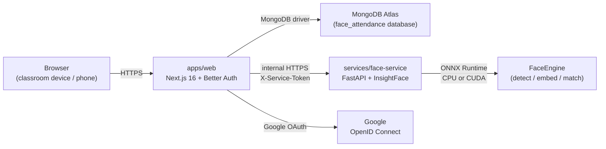
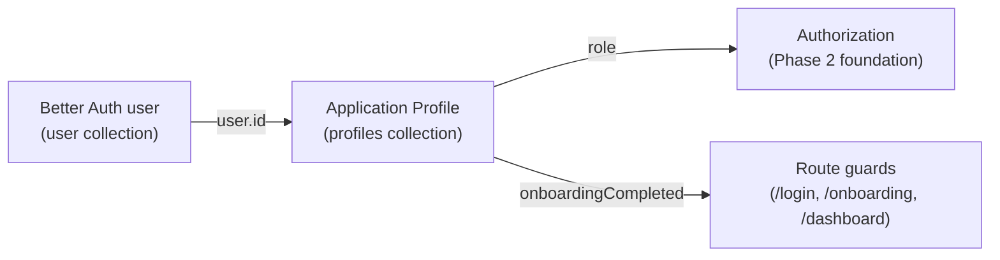
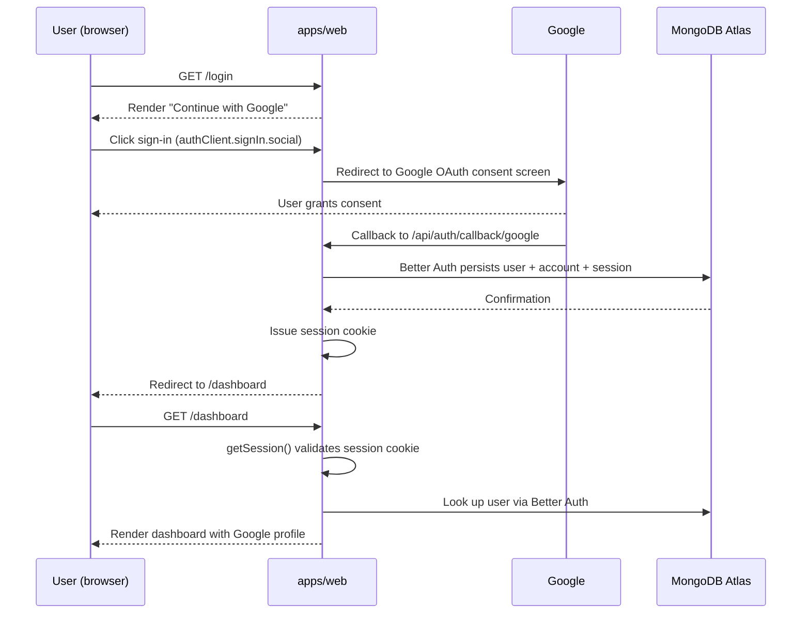
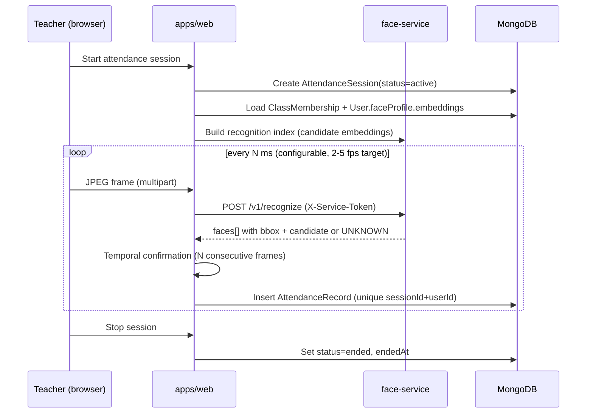

# Architecture

> Status: **Phase 2** — Better Auth + Google OAuth + MongoDB session, plus application `profiles` collection and role-aware onboarding. Authentication is live and every authenticated user has a completed application Profile before reaching the dashboard. Face recognition, classes, and attendance are not yet implemented.

## Goals

1. Keep facial recognition fully isolated from the web application.
2. Allow the recognition engine to be swapped without rewriting callers.
3. Avoid false-positive attendance: when uncertain, return `UNKNOWN`.
4. Minimize stored biometric data — embeddings only, never raw frames.
5. Phase-by-phase delivery: no premature InsightFace or MongoDB business code in early phases.
6. Separate identity data from business data: Better Auth owns the auth collections; the application owns the `profiles` collection.

## High-level components



- **Browser** opens the camera locally for the teacher; only sampled JPEG frames are sent to the Face Service.
- **`apps/web`** owns authentication (Better Auth + Google OAuth), and will later own RBAC, classes, attendance sessions, history, Excel export.
- **`services/face-service`** owns *all* face-related computation. It is the only component that imports InsightFace / ONNX Runtime.
- **MongoDB Atlas** stores Better Auth collections (`user`, `session`, `account`, `verification`) in the `face_attendance` database. The application owns `profiles` (Phase 2) and will own future business collections (`classrooms`, `class_memberships`, `attendance_sessions`, `attendance_records`, `face_profiles`) in later phases via Mongoose.
- **Google** is identity-only — only `sub`, `email`, `name`, `picture` are requested via the `openid email profile` scopes.

## Identity ↔ Profile relationship

Phase 2 splits the user-facing "user" concept into two documents:



- Better Auth owns `user`, `account`, `session`, `verification`. The application **never writes to these collections**.
- The application owns `profiles`. Each `Profile` has exactly one `userId` that references the Better Auth `user._id` conceptually (not enforced as a foreign key because Better Auth owns its collection).
- The unique index on `profiles.userId` guarantees at most one Profile per Better Auth user.
- `profile.emailSnapshot` is captured from the authenticated Better Auth session at onboarding time. The browser never controls it.
- `profile.role` is one of `student` | `teacher`. Once chosen during onboarding, it is **not** mutable through the regular profile-edit flow; future phases may add a dedicated controlled role-change flow.
- `profile.onboardingCompleted` is `true` only after the onboarding Server Action has persisted a valid record.

### Role model — MVP limitations

- `student` self-selection is allowed.
- `teacher` self-selection is also allowed for the MVP. **This is a known security limitation.** A future production deployment must add a teacher-invite flow, an administrator approval flow, or a verification step. Phase 2 documents this gap but does not implement the verification flow.

## FaceEngine abstraction

Defined in [`services/face-service/app/engine/base.py`](../services/face-service/app/engine/base.py) as a `Protocol` with three responsibilities:

- `detect_faces(image)` — return bounding boxes + confidence for every face in the frame.
- `extract_embeddings(image, bboxes)` — return a normalized embedding per detected face.
- `recognize_faces(image, candidate_index)` — return per-face `{ bbox, candidate_id | null, similarity, status }`.

The web app and the rest of the Face Service depend on this `Protocol`, not on InsightFace. Phase 3 plugs in `InsightFaceEngine` as the first implementation; future engines (e.g. a different backbone) can be added without touching call sites.

## Authentication and authorization

### End users (Google OAuth via Better Auth)

- Users sign in at `/login` by clicking **Continue with Google**.
- Better Auth handles the OAuth dance via the official `@better-auth/mongo-adapter` package using the MongoDB Node driver. Sessions and account links are stored in MongoDB Atlas under the `face_attendance` database.
- The web server exposes Better Auth through `/api/auth/[...all]` using the standard Next.js App Router integration (`toNextJsHandler`).
- The browser uses `authClient` from `better-auth/react` to trigger sign-in and sign-out.
- The server-side `auth.api.getSession()` call is the source of truth for every protected resource. Client-provided user IDs and emails are never trusted.

### Server-to-server (web ↔ Face Service)

- The web app and the Face Service share `FACE_SERVICE_SECRET`, sent as `X-Service-Token`. This is the MVP mechanism and is intended to be replaced later by a stronger identity (mTLS / signed JWT / workload identity).
- All authorization decisions (role checks, ownership checks, membership checks) are made server-side. UI-only hiding is **not** a security boundary.

## Authentication flow (Phase 1)



## Data flow: an attendance session (target behaviour)



## Directory layout

```
face-attendance/
├── apps/
│   └── web/                 # Next.js 16 App Router
│       └── src/
│           ├── lib/
│           │   ├── auth.ts               # Better Auth server config (Phase 1)
│           │   ├── auth-client.ts        # Better Auth browser client (Phase 1)
│           │   ├── env.ts / env-schema.ts
│           │   ├── mongodb.ts            # Cached MongoClient for the adapter
│           │   ├── mongoose.ts           # Cached Mongoose connection (Phase 2)
│           │   ├── profile-schema.ts     # Zod schemas for onboarding / update (Phase 2)
│           │   ├── profile-model.ts      # Mongoose Profile model (Phase 2)
│           │   ├── profile-service.ts    # Profile read/write service layer (Phase 2)
│           │   ├── profile-errors.ts     # Safe error mapping (Phase 2)
│           │   ├── profile-actions.ts    # Server Actions for onboarding / update (Phase 2)
│           │   ├── session.ts            # Server-side session helpers
│           │   └── route-guards.ts       # Pure redirect decision logic (Phase 2)
│           ├── components/
│           │   ├── AppShell.tsx
│           │   ├── OnboardingForm.tsx    # Multi-step onboarding form (Phase 2)
│           │   ├── ProfileEditForm.tsx   # Profile edit form (Phase 2)
│           │   ├── GoogleSignInButton.tsx
│           │   └── SignOutButton.tsx
│           ├── app/
│           │   ├── api/auth/[...all]/    # Better Auth catch-all route
│           │   ├── login/page.tsx        # /login
│           │   ├── onboarding/page.tsx   # /onboarding (Phase 2)
│           │   ├── profile/page.tsx      # /profile (Phase 2)
│           │   └── dashboard/page.tsx    # /dashboard (protected)
│           └── proxy.ts                  # Next.js proxy / middleware (UX layer only)
├── services/
│   └── face-service/        # FastAPI
├── docs/                    # This folder
├── package.json             # pnpm workspaces root
└── pnpm-workspace.yaml
```

## Phase plan

| Phase | Goal |
| --- | --- |
| 0 | Repo skeleton, docs, buildable foundations. |
| 0.5 | Dependency modernization. |
| 0.6 | Vercel deployment readiness. |
| **1** | Better Auth + Google OAuth + MongoDB session. |
| **2** | **Application profile + role + onboarding (we are here).** |
| 3 | FastAPI + InsightFace Face Service, model init, `/v1/recognize`. |
| 4 | Face enrollment (`/face-enrollment`). |
| 5 | Classroom creation and join-by-code+password. |
| 6 | Attendance session lifecycle. |
| 7 | Multi-face recognition + temporal confirmation. |
| 8 | Attendance history + Excel export. |
| 9 | Anti-spoofing / liveness (pluggable `LivenessProvider`). |
| 10 | Testing, calibration, deployment hardening. |

## Non-goals (for now)

- Employee / organization module. The recognition core uses generic user IDs so a future employee module can be added without touching `FaceEngine`.
- Mobile native apps. The web app must work in modern mobile browsers, but there is no React Native target in this MVP.
- Paid SaaS dependencies.
- Liveness / anti-spoofing. Phase 2 does not perform any face recognition.
