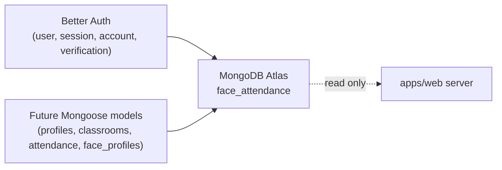

# Database

> Status: **Phase 1** — Better Auth collections are live in MongoDB Atlas under the `face_attendance` database. Business collections (profiles, classrooms, attendance) are not yet implemented.

The web app talks to **MongoDB Atlas**. Authentication data is owned entirely by Better Auth; future business data will be modeled with **Mongoose** in later phases.

## Authentication collections (Phase 1)

Better Auth manages the following collections in the `face_attendance` database:

### `user`

| Field | Type | Notes |
| --- | --- | --- |
| `_id` | string | Better Auth ID. |
| `email` | string | Unique, from Google. |
| `emailVerified` | boolean | |
| `name` | string | From Google. |
| `image` | string \| null | From Google profile picture. |
| `createdAt`, `updatedAt` | Date | |

### `session`

| Field | Type | Notes |
| --- | --- | --- |
| `_id` | string | |
| `userId` | string → `user._id` | |
| `token` | string | Hashed session token. |
| `expiresAt` | Date | |
| `ipAddress`, `userAgent` | string \| null | |
| `createdAt`, `updatedAt` | Date | |

### `account`

| Field | Type | Notes |
| --- | --- | --- |
| `_id` | string | |
| `userId` | string → `user._id` | |
| `providerId` | string | `"google"` for Phase 1. |
| `accountId` | string | Google `sub`. |
| `accessToken`, `refreshToken`, ... | string \| null | OAuth token storage (server-only). |

### `verification`

| Field | Type | Notes |
| --- | --- | --- |
| `_id` | string | |
| `identifier` | string | |
| `value` | string | |
| `expiresAt` | Date | |

> Better Auth owns the schema and indexes for these collections. The application must not modify them from outside Better Auth.

## Application business collections (future phases)

These collections are **planned but not yet created**. They will be added with Mongoose models in their respective phases:

| Collection | Phase | Purpose |
| --- | --- | --- |
| `profiles` | 2 | Onboarded user profile data (full name, identification code, phone). |
| `classrooms` | 5 | Teacher-created classrooms. |
| `class_memberships` | 5 | Student ↔ classroom join table. |
| `attendance_sessions` | 6 | Per-class attendance runs. |
| `attendance_records` | 6/7 | Per-user attendance confirmations. |
| `face_profiles` | 4 | Embeddings (not raw frames) per user. |

## Separation of concerns

- **Better Auth** is the *only* writer for `user`, `session`, `account`, `verification`.
- **Mongoose** (future) will own every business collection above.
- The Face Service never writes to the database directly. It only receives the candidate index it needs from the web app.

## Database separation (visual)

## Privacy posture

- Embeddings (Phase 4+) are stored, **not** raw images.
- Server logs must never include embeddings, OAuth tokens, class passwords, or raw frames.
- Better Auth access / refresh tokens are server-only; they never appear in any UI payload.