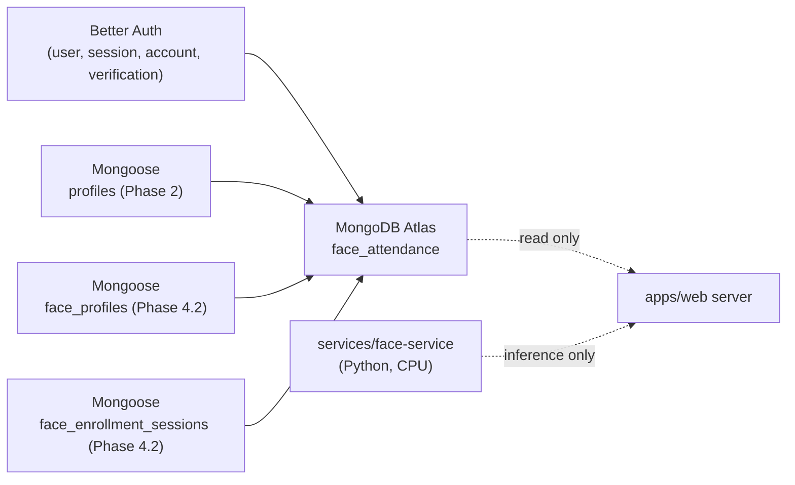

# Database

> Status: **Phase 4.2** — Better Auth collections are live in MongoDB
> Atlas under the `face_attendance` database. The application `profiles`
> collection (Phase 2) is managed by Mongoose. PHASE 4.2 introduces the
> **`face_profiles`** and **`face_enrollment_sessions`** collections as
> the persistence foundation for face enrollment. **No real biometric
> enrollment flow exists yet**; PHASE 4.3+ will wire the camera capture,
> quality gate, embedding extraction, and enrollment finalization.

The web app talks to **MongoDB Atlas**. Authentication data is owned
entirely by Better Auth; business data is modeled with **Mongoose** starting
in Phase 2. The two subsystems share the same MongoDB cluster but never
share documents.

## Authentication collections (Phase 1)

Better Auth manages the following collections in the `face_attendance`
database:

### `user`

| Field | Type | Notes |
| --- | --- | --- |
| `_id` | string | Better Auth ID. |
| `email` | string | Unique, from Google. |
| `emailVerified` | boolean | |
| `name` | string | From Google. |
| `image` | string \| null | From Google profile picture. |
| `createdAt`, `updatedAt` | Date | |

### `session`

| Field | Type | Notes |
| --- | --- | --- |
| `_id` | string | |
| `userId` | string → `user._id` | |
| `token` | string | Hashed session token. |
| `expiresAt` | Date | |
| `ipAddress`, `userAgent` | string \| null | |
| `createdAt`, `updatedAt` | Date | |

### `account`

| Field | Type | Notes |
| --- | --- | --- |
| `_id` | string | |
| `userId` | string | |
| `providerId` | string | `"google"` for Phase 1. |
| `accountId` | string | Google `sub`. |
| `accessToken`, `refreshToken`, ... | string \| null | OAuth token storage (server-only). |

### `verification`

| Field | Type | Notes |
| --- | --- | --- |
| `_id` | string | |
| `identifier` | string | |
| `value` | string | |
| `expiresAt` | Date | |

> Better Auth owns the schema and indexes for these collections. The
> application must not modify them from outside Better Auth.

## Application business collections

### `profiles` (Phase 2)

| Field | Type | Notes |
| --- | --- | --- |
| `_id` | ObjectId | Mongoose-managed. |
| `userId` | string | Better Auth `user._id`. **Unique, indexed.** |
| `emailSnapshot` | string | Captured from the authenticated Better Auth session at onboarding time. |
| `role` | enum | `"student"` or `"teacher"`. Set during onboarding; not editable through the profile-edit flow. |
| `fullName` | string | 2–100 chars after trim. |
| `identificationCode` | string | 2–50 chars after trim. **Unique, indexed.** |
| `phone` | string \| undefined | Optional, max 32 chars. |
| `onboardingCompleted` | boolean | `true` only after the onboarding Server Action has persisted a valid record. |
| `createdAt`, `updatedAt` | Date | Mongoose `timestamps: true`. |
| `__v` | number | Mongoose internal. |

**Indexes**

- `userId` unique
- `identificationCode` unique

**Privacy posture**

- The `profiles` collection stores only what Phase 2 needs: full name,
  identification code, optional phone, role, and the email snapshot.
- **No** raw face photos, embeddings, or biometric data are stored in
  `profiles`. Face data belongs to a future `face_profiles` collection in
  Phase 4+.
- `identificationCode` is treated as a generic business identifier
  (student / teacher / future employee). It is not named `studentId`
  because the project will eventually support teachers and employees
  sharing the same collection shape.

### Future business collections

| Collection | Phase | Purpose |
| --- | --- | --- |
| `face_profiles` | 4.2 | Permanent encrypted biometric templates (Mongoose). |
| `face_enrollment_sessions` | 4.2 | Temporary encrypted enrollment state with TTL (Mongoose). |
| `classrooms` | 5 | Teacher-created classrooms. |
| `class_memberships` | 5 | Student ↔ classroom join table. |
| `attendance_sessions` | 6 | Per-class attendance runs. |
| `attendance_records` | 6/7 | Per-user attendance confirmations. |

### `face_profiles` (Phase 4.2 — persistence foundation)

PHASE 4.2 ships the **database foundation** for face profiles. The
Mongoose model and service layer exist; the enrollment UI, Face Service
calls, embedding extraction, quality gate, sample upload, centroid
calculation, and finalization are part of PHASE 4.3+.

A `face_profiles` document represents one user's ACTIVE biometric
enrollment. There is at most one active FaceProfile per Better Auth
user, enforced by a unique index on `userId`.

| Field | Type | Notes |
| --- | --- | --- |
| `_id` | ObjectId | Mongoose-managed. |
| `userId` | string | Better Auth `user._id`. **Unique, indexed.** |
| `status` | enum | `"active"` only in PHASE 4.2. |
| `modelIdentity` | string | Recognition model identity (e.g. `"insightface/buffalo_l"`). |
| `modelName` | string | Friendly model name (e.g. `"buffalo_l"`). |
| `embeddingDimension` | number | Positive integer. Current InsightFace = 512; future models may differ. |
| `normalization` | enum | `"l2"` only in PHASE 4. |
| `templateVersion` | number | Positive integer (biometric template format version — distinct from `keyVersion`). |
| `requiredSampleCount` | number | Positive integer. |
| `sampleCount` | number | Positive integer. |
| `samples` | array | Per-sample encrypted vector + diagnostic quality. |
| `centroid` | object | Encrypted reference vector (`ciphertext`, `iv`, `authTag`, `keyVersion`). |
| `qualitySummary` | object | Aggregated, non-biometric quality metrics. |
| `enrolledAt` | Date | Wall-clock time of enrollment. |
| `createdAt`, `updatedAt` | Date | Mongoose `timestamps: true`. |
| `__v` | number | Mongoose internal. |

**Indexes**

- `userId` unique

**Privacy posture**

- The schema stores ONLY encrypted biometric vectors (`ciphertext`,
  `iv`, `authTag`, `keyVersion`) and non-identifying diagnostic
  quality metadata.
- **No** plaintext embeddings, raw images, base64 frames, face crops,
  landmarks, bounding boxes, image hashes, or camera frames are
  persisted.
- Decryption happens only inside server-only modules (the PHASE 4.1
  AES-256-GCM encryption module) and only for short-lived
  computation.

### `face_enrollment_sessions` (Phase 4.2 — persistence foundation)

A temporary collection used to store accepted encrypted samples while
the user is in the middle of an enrollment flow. This is necessary
because future Next.js server requests cannot depend on in-process
memory between camera captures.

| Field | Type | Notes |
| --- | --- | --- |
| `_id` | ObjectId | Mongoose-managed. |
| `userId` | string | Better Auth `user._id`. **Unique, indexed.** |
| `mode` | enum | `"create"` (no existing FaceProfile) or `"replace"` (existing profile stays active until future finalization). |
| `modelIdentity` | string? | Optional until the first sample is processed. |
| `modelName` | string? | Optional until the first sample is processed. |
| `embeddingDimension` | number? | Optional until the first sample is processed. |
| `normalization` | enum? | `"l2"` only; optional until the first sample is processed. |
| `templateVersion` | number | Positive integer. |
| `requiredSampleCount` | number | Positive integer. |
| `acceptedSamples` | array | Per-sample encrypted vector + diagnostic quality + `acceptedAt`. Defaults to `[]`. |
| `expiresAt` | Date | TTL field — see below. |
| `createdAt`, `updatedAt` | Date | Mongoose `timestamps: true`. |
| `__v` | number | Mongoose internal. |

**Indexes**

- `userId` unique
- `expiresAt` TTL index with `expireAfterSeconds: 0` — MongoDB deletes
  the document once `expiresAt` is in the past.

**TTL reality**

- MongoDB TTL deletion is **asynchronous**. The collection can hold a
  document whose `expiresAt` is already in the past for a brief window
  before the background TTL job removes it.
- Service code MUST treat `expiresAt <= now` as expired regardless of
  physical deletion. The helper `isEnrollmentSessionExpired` in
  `enrollment-session-service.ts` encapsulates this check.
- The default session lifetime is 15 minutes
  (`DEFAULT_ENROLLMENT_SESSION_TTL_MS` in
  `enrollment-session-ttl.ts`).

**Privacy posture**

- Same as `face_profiles`: only encrypted vectors and non-identifying
  quality metadata are stored.

`face_profiles` will carry an `engineMetadata` block per enrollment
(engine name, library version, model name, model identity, provider,
embedding dimension) so that the web app can guarantee the matcher
never compares embeddings produced by incompatible models.

## Separation of concerns

- **Better Auth** is the *only* writer for `user`, `session`, `account`,
  `verification`. The application reads from these collections only
  through Better Auth's session helper.
- **Mongoose** (Phase 2+) owns every business collection. The
  application never modifies Better Auth's collections directly.
- The Face Service never writes to the database directly. It only
  receives the candidate index it needs from the web app.

## Database separation (visual)

## Privacy posture

- Embeddings (Phase 4+) are stored, **not** raw images.
- Server logs must never include embeddings, OAuth tokens, class
  passwords, or raw frames.
- Better Auth access / refresh tokens are server-only; they never appear
  in any UI payload.
- The Face Service has no database access. All biometric persistence
  happens server-side inside `apps/web` after a recognition result
  returns.
