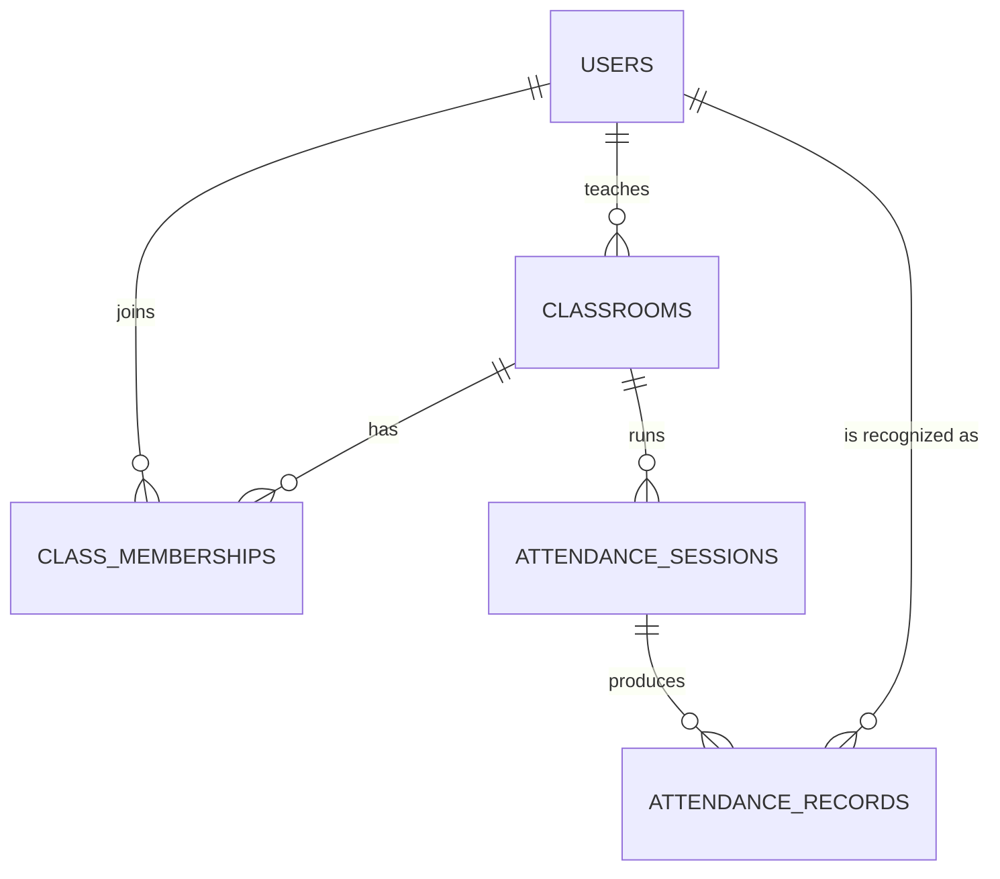

# Database

> Status: **Phase 0** — planned collections only. No Mongoose models are written yet.

The web app talks to **MongoDB Atlas** through **Mongoose**. Below is the planned logical schema. Actual model files will land in Phase 1+.

## Collections

### `users`

| Field | Type | Notes |
| --- | --- | --- |
| `_id` | ObjectId | |
| `googleId` | string | Unique. From Google `sub`. |
| `email` | string | Unique. |
| `name` | string | Display name. |
| `avatar` | string \| null | URL from Google. |
| `role` | enum(`student`, `teacher`) | Application role, **not** from Google. |
| `profile.fullName` | string \| null | Collected in onboarding. |
| `profile.identificationCode` | string \| null | Student / employee code. |
| `profile.phone` | string \| null | |
| `faceProfile.enrolled` | boolean | |
| `faceProfile.embeddings` | number[][] | Normalized vectors, **not** raw images. |
| `faceProfile.model` | string \| null | e.g. `buffalo_l`. |
| `faceProfile.modelVersion` | string \| null | |
| `faceProfile.enrolledAt` | Date \| null | |
| `createdAt`, `updatedAt` | Date | |

Index: `{ googleId: 1 }` unique, `{ email: 1 }` unique.

### `classrooms`

| Field | Type | Notes |
| --- | --- | --- |
| `_id` | ObjectId | |
| `name` | string | |
| `classCode` | string | Short, friendly, unique. Indexed unique. |
| `passwordHash` | string | bcrypt/argon2 — never plaintext. |
| `teacherId` | ObjectId → users | |
| `createdAt`, `updatedAt` | Date | |

Index: `{ classCode: 1 }` unique.

### `class_memberships`

| Field | Type | Notes |
| --- | --- | --- |
| `_id` | ObjectId | |
| `classId` | ObjectId → classrooms | |
| `userId` | ObjectId → users | |
| `role` | enum(`student`, `teacher`) | Mirror of `users.role` for query convenience. |
| `joinedAt` | Date | |

Index: `{ classId: 1, userId: 1 }` **unique compound**.

### `attendance_sessions`

| Field | Type | Notes |
| --- | --- | --- |
| `_id` | ObjectId | |
| `classId` | ObjectId → classrooms | |
| `teacherId` | ObjectId → users | |
| `status` | enum(`active`, `ended`) | |
| `startedAt`, `endedAt` | Date \| null | |
| `recognitionSettings.threshold` | number | Similarity cutoff. |
| `recognitionSettings.minConfirmFrames` | number | Default 3. |
| `recognitionSettings.cooldownSeconds` | number | Per-user re-trigger cooldown. |
| `recognitionSettings.processingIntervalMs` | number | Frame sampling interval. |

Constraint: at most **one** `status=active` per `classId`. Enforced in service code in Phase 6.

### `attendance_records`

| Field | Type | Notes |
| --- | --- | --- |
| `_id` | ObjectId | |
| `sessionId` | ObjectId → attendance_sessions | |
| `classId` | ObjectId → classrooms | |
| `userId` | ObjectId → users | |
| `recognizedAt` | Date | |
| `confidence` | number | Last similarity that confirmed the user. |
| `method` | enum(`face`, `manual`) | Manual override reserved for future phases. |

Index: `{ sessionId: 1, userId: 1 }` **unique compound** — final protection against duplicate attendance even if application code races.

## Relationships

## Privacy posture

- Embeddings are stored, **not** raw images.
- `users.faceProfile.embeddings` must never be returned by any API path that the browser can see.
- Server logs must never include embeddings, OAuth tokens, class passwords, or raw frames.