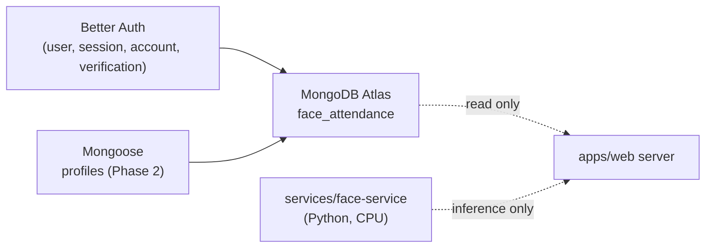

# Database

> Status: **Phase 3** — Better Auth collections are live in MongoDB Atlas
> under the `face_attendance` database. The application `profiles`
> collection is managed by Mongoose. **No biometric collections exist
> yet** — PHASE 3 stores nothing; PHASE 4 will introduce `face_profiles`.

The web app talks to **MongoDB Atlas**. Authentication data is owned
entirely by Better Auth; business data is modeled with **Mongoose** starting
in Phase 2. The two subsystems share the same MongoDB cluster but never
share documents.

## Authentication collections (Phase 1)

Better Auth manages the following collections in the `face_attendance`
database:

### `user`

| Field | Type | Notes |
| --- | --- | --- |
| `_id` | string | Better Auth ID. |
| `email` | string | Unique, from Google. |
| `emailVerified` | boolean | |
| `name` | string | From Google. |
| `image` | string \| null | From Google profile picture. |
| `createdAt`, `updatedAt` | Date | |

### `session`

| Field | Type | Notes |
| --- | --- | --- |
| `_id` | string | |
| `userId` | string → `user._id` | |
| `token` | string | Hashed session token. |
| `expiresAt` | Date | |
| `ipAddress`, `userAgent` | string \| null | |
| `createdAt`, `updatedAt` | Date | |

### `account`

| Field | Type | Notes |
| --- | --- | --- |
| `_id` | string | |
| `userId` | string | |
| `providerId` | string | `"google"` for Phase 1. |
| `accountId` | string | Google `sub`. |
| `accessToken`, `refreshToken`, ... | string \| null | OAuth token storage (server-only). |

### `verification`

| Field | Type | Notes |
| --- | --- | --- |
| `_id` | string | |
| `identifier` | string | |
| `value` | string | |
| `expiresAt` | Date | |

> Better Auth owns the schema and indexes for these collections. The
> application must not modify them from outside Better Auth.

## Application business collections

### `profiles` (Phase 2)

| Field | Type | Notes |
| --- | --- | --- |
| `_id` | ObjectId | Mongoose-managed. |
| `userId` | string | Better Auth `user._id`. **Unique, indexed.** |
| `emailSnapshot` | string | Captured from the authenticated Better Auth session at onboarding time. |
| `role` | enum | `"student"` or `"teacher"`. Set during onboarding; not editable through the profile-edit flow. |
| `fullName` | string | 2–100 chars after trim. |
| `identificationCode` | string | 2–50 chars after trim. **Unique, indexed.** |
| `phone` | string \| undefined | Optional, max 32 chars. |
| `onboardingCompleted` | boolean | `true` only after the onboarding Server Action has persisted a valid record. |
| `createdAt`, `updatedAt` | Date | Mongoose `timestamps: true`. |
| `__v` | number | Mongoose internal. |

**Indexes**

- `userId` unique
- `identificationCode` unique

**Privacy posture**

- The `profiles` collection stores only what Phase 2 needs: full name,
  identification code, optional phone, role, and the email snapshot.
- **No** raw face photos, embeddings, or biometric data are stored in
  `profiles`. Face data belongs to a future `face_profiles` collection in
  Phase 4+.
- `identificationCode` is treated as a generic business identifier
  (student / teacher / future employee). It is not named `studentId`
  because the project will eventually support teachers and employees
  sharing the same collection shape.

### Future business collections

| Collection | Phase | Purpose |
| --- | --- | --- |
| `classrooms` | 5 | Teacher-created classrooms. |
| `class_memberships` | 5 | Student ↔ classroom join table. |
| `attendance_sessions` | 6 | Per-class attendance runs. |
| `attendance_records` | 6/7 | Per-user attendance confirmations. |
| `face_profiles` | 4 | Embeddings (not raw frames) per user. |

`face_profiles` will carry an `engineMetadata` block per enrollment
(engine name, library version, model name, model identity, provider,
embedding dimension) so that the web app can guarantee the matcher
never compares embeddings produced by incompatible models.

## Separation of concerns

- **Better Auth** is the *only* writer for `user`, `session`, `account`,
  `verification`. The application reads from these collections only
  through Better Auth's session helper.
- **Mongoose** (Phase 2+) owns every business collection. The
  application never modifies Better Auth's collections directly.
- The Face Service never writes to the database directly. It only
  receives the candidate index it needs from the web app.

## Database separation (visual)

## Privacy posture

- Embeddings (Phase 4+) are stored, **not** raw images.
- Server logs must never include embeddings, OAuth tokens, class
  passwords, or raw frames.
- Better Auth access / refresh tokens are server-only; they never appear
  in any UI payload.
- The Face Service has no database access. All biometric persistence
  happens server-side inside `apps/web` after a recognition result
  returns.
