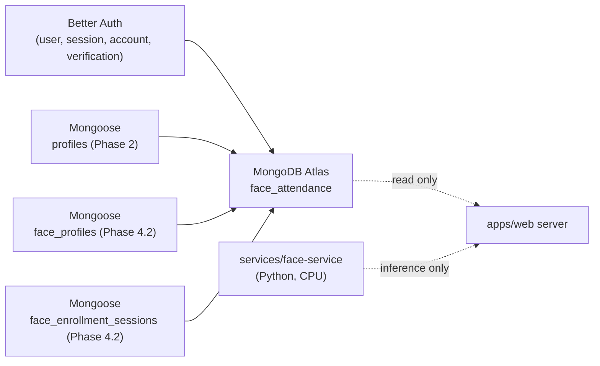

# Database

> Status: **Phase 6.4** — IDEMPOTENT PRESENT ATTENDANCE MARKS + LIVE PRESENT STATE. PHASE 6.4 adds the `attendance_marks` collection (server-only Mongoose `AttendanceMark` model) — the first per-student attendance persistence artifact. A document records `sessionId`, `classId`, `studentUserId`, `status: "present"`, `recognizedAt`, `source: "face_recognition"`, and the standard `createdAt` / `updatedAt`. The `(sessionId, studentUserId)` compound unique index enforces "one student = at most one mark per session" at the database layer; `$setOnInsert` preserves the FIRST `recognizedAt` on subsequent recognition. The collection stores NO embeddings / centroids / biometric ciphertext / raw camera images / candidateKey / FaceProfile references. See `## Phase 6.4 — Idempotent Present Attendance Marks` for the explicit phase statement.

> Status: **Phase 6.3** — LIVE FACE RECOGNITION PREVIEW. PHASE 6.3 added NO new database collections. The PHASE 6.3 camera workspace reads existing collections: `attendance_sessions` (for the active session + roster snapshot), `face_profiles` (for centroids decrypted server-side only, in memory, and discarded after the request), and `profiles` (for teacher authorization). No persistent artifact is added. The biometric pipeline remains ephemeral: centroids are decrypted, L2-normalized, mapped to ephemeral candidate keys, sent to the Face Service, and the plaintext vectors are discarded after the request returns. No `face_enrollment_sessions`, `face_profiles`, or `face_profiles` schemas are mutated by the recognition flow.

> Status: **Phase 6.2** — TEACHER ATTENDANCE CONTROL UI. PHASE 6.2 adds NO new collections. The attendance UI consumes the existing `attendance_sessions` collection via the new server-only `getAttendanceSessionStatusForCurrentTeacher(classId)` read boundary and calls the existing `startAttendanceSessionAction` / `stopAttendanceSessionAction` Server Actions.

> Status: **Phase 6.1** — ATTENDANCE SESSION FOUNDATION. PHASE 6.1 adds the `attendance_sessions` collection (Mongoose `AttendanceSession` model) — server-only persistence for attendance session lifecycle. The collection captures one teacher's attendance window per class. An `AttendanceSession` document records `classId`, `status` (`"active"` | `"closed"`), `startedAt`, `endedAt` (nullable while active), `startedByUserId`, and an immutable `rosterSnapshot` array captured at start time. A partial unique index on `{ classId, status }` where `status === "active"` enforces "at most ONE active session per class" at the database level. NO additional collections are introduced for `AttendanceRecord`, per-student present / absent / late records, embeddings, or centroids — those are deliberate non-features in PHASE 6.1.

> Status: **Phase 4.6B2C** — Better Auth collections are live in MongoDB
> Atlas under the `face_attendance` database. The application `profiles`
> collection (Phase 2) is managed by Mongoose. PHASE 4.2 introduced
> the **`face_profiles`** and **`face_enrollment_sessions`** collections
> as the persistence foundation for face enrollment. PHASE 4.4C
> extends `face_enrollment_sessions` with an atomic
> `appendAcceptedEnrollmentSample(...)` operation that stores
> encrypted samples received from the sample upload route.
> PHASE 4.6B2A extends `face_enrollment_sessions` with an OPTIONAL
> `finalizationClaim` embedded field (`token`, `generationId`,
> `claimedAt`) — the atomic completion claim that ties the B1B
> finalized snapshot to an exact enrollment generation. The claim is
> server-only, has no independent expiry, and does NOT change the
> existing session TTL. `FaceProfile` is still NOT persisted in B2A.
> PHASE 4.6B2B adds the `sourceEnrollmentGenerationId` lineage field
> to `face_profiles` and performs the claim-bound, idempotent
> persistence of the finalized `FaceProfile`. The temporary
> enrollment session is **NOT** consumed/deleted by B2B — that
> belongs to PHASE 4.6B2C. No multi-document MongoDB transaction is
> introduced in B2B.
> PHASE 4.6B2C closes the loop: it consumes the temporary
> `FaceEnrollmentSession` after B2B has persisted the
> `FaceProfile`, atomically and via a generation-bound CAS
> delete. Crash recovery uses the persisted
> `FaceProfile.sourceEnrollmentGenerationId` lineage marker as
> proof of completion — a retry NEVER reruns B1B, NEVER calls
> the Face Service, NEVER decrypts samples. No public finalize
> API is added in B2C; the orchestration remains
> server-internal.
> No real biometric flow exists yet at the camera level.

The web app talks to **MongoDB Atlas**. Authentication data is owned
entirely by Better Auth; business data is modeled with **Mongoose** starting
in Phase 2. The two subsystems share the same MongoDB cluster but never
share documents.

## Authentication collections (Phase 1)

Better Auth manages the following collections in the `face_attendance`
database:

### `user`

| Field | Type | Notes |
| --- | --- | --- |
| `_id` | string | Better Auth ID. |
| `email` | string | Unique, from Google. |
| `emailVerified` | boolean | |
| `name` | string | From Google. |
| `image` | string \| null | From Google profile picture. |
| `createdAt`, `updatedAt` | Date | |

### `session`

| Field | Type | Notes |
| --- | --- | --- |
| `_id` | string | |
| `userId` | string → `user._id` | |
| `token` | string | Hashed session token. |
| `expiresAt` | Date | |
| `ipAddress`, `userAgent` | string \| null | |
| `createdAt`, `updatedAt` | Date | |

### `account`

| Field | Type | Notes |
| --- | --- | --- |
| `_id` | string | |
| `userId` | string | |
| `providerId` | string | `"google"` for Phase 1. |
| `accountId` | string | Google `sub`. |
| `accessToken`, `refreshToken`, ... | string \| null | OAuth token storage (server-only). |

### `verification`

| Field | Type | Notes |
| --- | --- | --- |
| `_id` | string | |
| `identifier` | string | |
| `value` | string | |
| `expiresAt` | Date | |

> Better Auth owns the schema and indexes for these collections. The
> application must not modify them from outside Better Auth.

## Application business collections

### `profiles` (Phase 2)

| Field | Type | Notes |
| --- | --- | --- |
| `_id` | ObjectId | Mongoose-managed. |
| `userId` | string | Better Auth `user._id`. **Unique, indexed.** |
| `emailSnapshot` | string | Captured from the authenticated Better Auth session at onboarding time. |
| `role` | enum | `"student"` or `"teacher"`. Set during onboarding; not editable through the profile-edit flow. |
| `fullName` | string | 2–100 chars after trim. |
| `identificationCode` | string | 2–50 chars after trim. **Unique, indexed.** |
| `phone` | string \| undefined | Optional, max 32 chars. |
| `onboardingCompleted` | boolean | `true` only after the onboarding Server Action has persisted a valid record. |
| `createdAt`, `updatedAt` | Date | Mongoose `timestamps: true`. |
| `__v` | number | Mongoose internal. |

**Indexes**

- `userId` unique
- `identificationCode` unique

**Privacy posture**

- The `profiles` collection stores only what Phase 2 needs: full name,
  identification code, optional phone, role, and the email snapshot.
- **No** raw face photos, embeddings, or biometric data are stored in
  `profiles`. Face data belongs to a future `face_profiles` collection in
  Phase 4+.
- `identificationCode` is treated as a generic business identifier
  (student / teacher / future employee). It is not named `studentId`
  because the project will eventually support teachers and employees
  sharing the same collection shape.

### Future business collections

| Collection | Phase | Purpose |
| --- | --- | --- |
| `face_profiles` | 4.2 | Permanent encrypted biometric templates (Mongoose). |
| `face_enrollment_sessions` | 4.2 | Temporary encrypted enrollment state with TTL (Mongoose). |
| `classrooms` | 5 | Teacher-created classrooms. |
| `class_memberships` | 5 | Student ↔ classroom join table. |
| `attendance_sessions` | 6 | Per-class attendance runs. |
| `attendance_records` | 6/7 | Per-user attendance confirmations. |

### `face_profiles` (Phase 4.2 — persistence foundation)

PHASE 4.2 ships the **database foundation** for face profiles. The
Mongoose model and service layer exist; the enrollment UI, Face Service
calls, embedding extraction, quality gate, sample upload, centroid
calculation, and finalization are part of PHASE 4.3+.

A `face_profiles` document represents one user's ACTIVE biometric
enrollment. There is at most one active FaceProfile per Better Auth
user, enforced by a unique index on `userId`.

| Field | Type | Notes |
| --- | --- | --- |
| `_id` | ObjectId | Mongoose-managed. |
| `userId` | string | Better Auth `user._id`. **Unique, indexed.** |
| `status` | enum | `"active"` only in PHASE 4.2. |
| `modelIdentity` | string | Recognition model identity (e.g. `"insightface/buffalo_l"`). |
| `modelName` | string | Friendly model name (e.g. `"buffalo_l"`). |
| `embeddingDimension` | number | Positive integer. Current InsightFace = 512; future models may differ. |
| `normalization` | enum | `"l2"` only in PHASE 4. |
| `templateVersion` | number | Positive integer (biometric template format version — distinct from `keyVersion`). |
| `requiredSampleCount` | number | Positive integer. |
| `sampleCount` | number | Positive integer. |
| `samples` | array | Per-sample encrypted vector + diagnostic quality. |
| `centroid` | object | Encrypted reference vector (`ciphertext`, `iv`, `authTag`, `keyVersion`). |
| `qualitySummary` | object | Aggregated, non-biometric quality metrics. |
| `enrolledAt` | Date | Wall-clock time of enrollment. |
| `sourceEnrollmentGenerationId` | string | **Internal server-only** lineage field. Records which temporary enrollment generation created this `FaceProfile`. Required for new persistence, optional for legacy reads. Not exposed in browser-safe DTOs. |
| `createdAt`, `updatedAt` | Date | Mongoose `timestamps: true`. |
| `__v` | number | Mongoose internal. |

**Indexes**

- `userId` unique

**Lineage & idempotency (PHASE 4.6B2B)**

- `sourceEnrollmentGenerationId` is set atomically together with the
  first `FaceProfile` write. It binds the persisted profile to the
  exact `FaceEnrollmentSession` generation that produced it.
- Same-generation retries update the existing profile and preserve
  `enrolledAt` (idempotent retries MUST NOT shift the enrolled-at
  timestamp).
- A different-generation create attempt is rejected with
  `FACE_PROFILE_ALREADY_EXISTS` and never overwrites the existing
  profile. The `userId` unique index remains the final safety net.
- Legacy `FaceProfile` documents written before PHASE 4.6B2B may lack
  `sourceEnrollmentGenerationId`. They remain readable; new
  persistence requires the field.

**Privacy posture**

- The schema stores ONLY encrypted biometric vectors (`ciphertext`,
  `iv`, `authTag`, `keyVersion`) and non-identifying diagnostic
  quality metadata.
- **No** plaintext embeddings, raw images, base64 frames, face crops,
  landmarks, bounding boxes, image hashes, or camera frames are
  persisted.
- Decryption happens only inside server-only modules (the PHASE 4.1
  AES-256-GCM encryption module) and only for short-lived
  computation.
- The encrypted centroid uses the EXACT AAD contract from PHASE 4.1:
  `(userId, modelIdentity, templateVersion, vectorType="centroid")`.
  Sample AAD additionally includes `sampleIndex` and
  `vectorType="sample"`.

### `face_enrollment_sessions` (Phase 4.2 — persistence foundation)

A temporary collection used to store accepted encrypted samples while
the user is in the middle of an enrollment flow. This is necessary
because future Next.js server requests cannot depend on in-process
memory between camera captures.

| Field | Type | Notes |
| --- | --- | --- |
| `_id` | ObjectId | Mongoose-managed. |
| `userId` | string | Better Auth `user._id`. **Unique, indexed.** |
| `mode` | enum | `"create"` (no existing FaceProfile) or `"replace"` (existing profile stays active until future finalization). |
| `modelIdentity` | string? | Optional until the first sample is processed. |
| `modelName` | string? | Optional until the first sample is processed. |
| `embeddingDimension` | number? | Optional until the first sample is processed. |
| `normalization` | enum? | `"l2"` only; optional until the first sample is processed. |
| `templateVersion` | number | Positive integer. |
| `requiredSampleCount` | number | Positive integer. |
| `acceptedSamples` | array | Per-sample encrypted vector + diagnostic quality + `acceptedAt`. Defaults to `[]`. |
| `expiresAt` | Date | TTL field — see below. |
| `createdAt`, `updatedAt` | Date | Mongoose `timestamps: true`. |
| `__v` | number | Mongoose internal. |

**Indexes**

- `userId` unique
- `expiresAt` TTL index with `expireAfterSeconds: 0` — MongoDB deletes
  the document once `expiresAt` is in the past.

**TTL reality**

- MongoDB TTL deletion is **asynchronous**. The collection can hold a
  document whose `expiresAt` is already in the past for a brief window
  before the background TTL job removes it.
- Service code MUST treat `expiresAt <= now` as expired regardless of
  physical deletion. The helper `isEnrollmentSessionExpired` in
  `enrollment-session-service.ts` encapsulates this check.
- The default session lifetime is 15 minutes
  (`DEFAULT_ENROLLMENT_SESSION_TTL_MS` in
  `enrollment-session-ttl.ts`).

**Privacy posture**

- Same as `face_profiles`: only encrypted vectors and non-identifying
  quality metadata are stored.
- PHASE 4.6B2A adds an OPTIONAL embedded `finalizationClaim`
  block (see below). The claim is server-only — it is NEVER
  serialized into any browser-facing DTO.

`face_profiles` will carry an `engineMetadata` block per enrollment
(engine name, library version, model name, model identity, provider,
embedding dimension) so that the web app can guarantee the matcher
never compares embeddings produced by incompatible models.

### `face_enrollment_sessions.finalizationClaim` (PHASE 4.6B2A)

OPTIONAL embedded sub-document. Present only while a B2B
finalizer holds an active atomic completion claim. Absent means
the session is free to be reset or to be claimed by a future
finalizer.

| Field | Type | Notes |
| --- | --- | --- |
| `token` | string | Server-generated v4 UUID (`node:crypto` `randomUUID()`). Opaque, server-only, never logged, never sent to the browser, never sent to the Face Service. |
| `generationId` | string | Echoes the active session's `generationId`. |
| `claimedAt` | Date | Wall-clock install time. |

**Indexes**

- No index is added on `token` — the unique ownership index
  remains `userId`. Adding a global unique index on a token that
  is only consumed locally by B2B would be a global write
  bottleneck.

**Atomic guarantees**

- `claimEnrollmentSessionForFinalization(...)` performs a single
  `findOneAndUpdate` that succeeds ONLY when the document's
  `userId`, `generationId`, `expiresAt > now`, `mode`,
  `templateVersion`, `normalization`, `$size(acceptedSamples)
  == requiredSampleCount`, AND `finalizationClaim` is absent all
  match.
- `releaseEnrollmentFinalizationClaim(...)` performs a single
  `findOneAndUpdate` that succeeds ONLY when `userId`,
  `generationId`, AND `finalizationClaim.token` all match.
- `createOrResetEnrollmentSession(...)` is guarded atomically —
  the conditional filter requires `finalizationClaim: { $exists:
  false }`. While a claim is present, the reset rejects with
  `ENROLLMENT_FINALIZATION_IN_PROGRESS`.

**No claim expiry in B2A**

There is intentionally NO `claimExpiresAt`, NO automatic release,
NO `setTimeout`, NO background cleanup job. The existing session
`expiresAt` TTL remains the lifecycle boundary.

### FaceProfile persistence (PHASE 4.6B2B)

The PHASE 4.6B2B orchestration is a **server-only** module
(`apps/web/src/lib/biometrics/face-profile-finalization-service.ts`)
exposed solely via `persistFinalizedFaceProfileForUser(userId)`.
It is **not** wired to any browser route or Server Action in this
phase.

**Order of operations**

1. Call `finalizeEnrollmentSessionForUser(userId)` (PHASE 4.6B1B).
   Captures the canonical `sourceGenerationId`.
2. Call `claimEnrollmentSessionForFinalization({ userId,
   generationId: sourceGenerationId })` (PHASE 4.6B2A). Acquires
   claim token `X`.
3. Re-read the session and verify the claim token still matches.
4. Validate the claimed session's `mode`, `templateVersion`, and
   `normalization` are supported.
5. Cross-check B1B's model identity / name / embedding dimension /
   normalization against the claimed session. Mismatch ⇒ release
   claim + reject with `ENROLLMENT_METADATA_MISMATCH`.
6. Validate the encrypted sample index set is exactly `0..N-1`
   once each and sort deterministically by `sampleIndex`.
7. Encrypt the centroid using `encryptBiometricVector` with the
   EXACT AAD contract `(userId, modelIdentity, templateVersion,
   vectorType="centroid")`.
8. Forward the encrypted sample envelopes verbatim — no
   decrypt / re-encrypt.
9. Call `saveFinalizedFaceProfile(...)` for idempotent persistence.
10. On failure BEFORE successful `FaceProfile` persistence,
    release the claim (best-effort). On success, **keep the
    claim** for PHASE 4.6B2C.

**Idempotency**

- The first write for generation `A` creates the `FaceProfile`
  and records `sourceEnrollmentGenerationId = "A"`.
- A retry with generation `A` returns the SAME persisted profile
  with `created=false`; `enrolledAt` is preserved.
- A generation-`B` create attempt while generation `A` already
  exists is rejected with `FACE_PROFILE_ALREADY_EXISTS` — the
  existing profile is **never** overwritten.

**No multi-document transaction**

B2B does not introduce a MongoDB transaction. The
`userId`-unique index remains the safety net; the lineage-aware
`findOneAndUpdate` in `saveFinalizedFaceProfile` is independently
idempotent. Enrollment session cleanup belongs to PHASE 4.6B2C.

**Session is NOT consumed in B2B**

The temporary enrollment session is intentionally **not** deleted
or reset by B2B. The `finalizationClaim` block remains in place
so that PHASE 4.6B2C can atomically consume the matching
generation without losing the lineage.

**Crash recovery**

If B2B persists the `FaceProfile` but crashes before B2C, a
retry of the same generation is recognized by
`sourceEnrollmentGenerationId` and returns the existing profile
(idempotent success). B2C will later consume the matching
session safely.

## Phase 4.6B2C — temporary enrollment consumption + crash recovery

PHASE 4.6B2C closes the enrollment loop. It lives at
`apps/web/src/lib/biometrics/face-enrollment-completion-service.ts`
and is exposed **only** as the server-only function
`completeFinalizedFaceEnrollmentForUser(userId)`. There is **no**
public finalize API route in B2C.

### FaceProfile persistence is the durable commit point

Once a valid `FaceProfile` has been persisted for
`(userId, sourceEnrollmentGenerationId)`, the durable enrollment
result exists. Deleting the temporary `FaceEnrollmentSession` is
CLEANUP, not commit. Therefore:

- Cleanup failure must NOT roll back `FaceProfile`.
- A retry must NOT attempt to create a second `FaceProfile`.
- A retry must NOT rerun B1B, MUST NOT call the Face Service,
  MUST NOT decrypt or re-encrypt samples, MUST NOT rewrite
  the `FaceProfile`.

### Atomic session consume — NORMAL path

`consumeEnrollmentSession({ userId, generationId, claimToken })`
performs a single atomic `findOneAndDelete` whose filter requires:

- `userId === input.userId`
- `generationId === input.generationId`
- `finalizationClaim.token === input.claimToken`
- `finalizationClaim.generationId === input.generationId`

No read → check → write. No delete-by-userId-only. The CAS is
the ONLY consume path. The function is idempotent and never
throws on a CAS miss.

### Lineage-bound atomic session consume — CRASH-RECOVERY path

`recoverAndConsumeEnrollmentSession({ userId, generationId })`
performs a single atomic `findOneAndDelete` whose filter requires
BOTH `userId` AND `generationId`. No claim token is required —
the lineage proof comes from the persisted
`FaceProfile.sourceEnrollmentGenerationId`. The primitive is
server-internal ONLY and MUST NOT be exposed as a browser API.
A different generation is NEVER deleted.

### Cleanup status semantics

| `cleanupStatus` | Meaning |
| --- | --- |
| `consumed` | The temporary session was atomically deleted in this call. |
| `already_consumed` | The temporary session was already absent (TTL, prior B2C, or never re-created). The durable profile remains authoritative. |
| `cleanup_pending` | The temporary session still exists; a future retry may clean it up. The durable profile remains authoritative. Different-generation sessions are NEVER touched. |

### Idempotency

Repeated `completeFinalizedFaceEnrollmentForUser(userId)` calls
return the same `configured=true` shape. The first call
performs the strict CAS consume (NORMAL path) or lineage-bound
recover-and-consume (RECOVERY path); subsequent calls observe
the persisted profile and surface `already_consumed`. A second
call does NOT create a second `FaceProfile`, does NOT call the
Face Service, does NOT rerun B1B.

### Legacy FaceProfile compatibility

Legacy `FaceProfile` documents written before B2B may lack
`sourceEnrollmentGenerationId`. They remain readable by the B2C
orchestrator. No temporary session is deleted by inference. A
safe `cleanup_pending` (or `already_consumed`) completion is
returned for legacy profiles.

### No multi-document transaction

B2C does NOT introduce a MongoDB transaction. The
`userId`-unique index remains the safety net; the
`findOneAndDelete` consume is independently atomic.

## Separation of concerns

- **Better Auth** is the *only* writer for `user`, `session`, `account`,
  `verification`. The application reads from these collections only
  through Better Auth's session helper.
- **Mongoose** (Phase 2+) owns every business collection. The
  application never modifies Better Auth's collections directly.
- The Face Service never writes to the database directly. It only
  receives the candidate index it needs from the web app.

## Database separation (visual)



## Phase 5.1A — classes + class_memberships (persistence foundation)

PHASE 5.1A ships the persistence foundation for the class and membership
domain. No UI, API routes, Server Actions, or attendance logic is
implemented in this phase.

### `classes` collection

A `Class` document represents one teacher's class. There is at most one
class per canonical `classCode`, enforced by a unique index.

| Field | Type | Notes |
| --- | --- | --- |
| `_id` | ObjectId | Mongoose-managed. |
| `name` | string | User-facing class name. Trimmed, max 200 chars. |
| `teacherUserId` | string | Better Auth `user._id`. **Indexed.** |
| `classCode` | string | Canonical uppercase code. **Unique, indexed.** |
| `passwordHash` | string | PBKDF2-SHA256 hash of the join password. **Never plaintext.** |
| `status` | enum | `"active"` or `"archived"`. Defaults to `"active"`. |
| `createdAt`, `updatedAt` | Date | Mongoose `timestamps: true`. |

**Indexes**

- `classCode` unique — enforces at most one class per canonical code.
- `teacherUserId` — supports "list classes by teacher" queries.

**Privacy posture**

- The model stores only `passwordHash` — plaintext passwords are NEVER
  stored, logged, or serialized into browser DTOs.
- No biometric fields are present.
- `SafeClassDto` is the browser-facing shape; it omits `passwordHash`.

### `class_memberships` collection

A `ClassMembership` document records a student's membership in a class.
Each student may belong to a given class at most once, enforced by a
compound unique index.

| Field | Type | Notes |
| --- | --- | --- |
| `_id` | ObjectId | Mongoose-managed. |
| `classId` | ObjectId | References `classes._id`. **Part of unique compound index.** |
| `studentUserId` | string | Better Auth `user._id`. **Indexed.** |
| `joinedAt` | Date | When the student joined. Defaults to now. |
| `status` | enum | `"active"` only in PHASE 5.1A. |
| `createdAt`, `updatedAt` | Date | Mongoose `timestamps: true`. |

**Indexes**

- `(classId, studentUserId)` compound unique — enforces at most one
  membership per student per class at the database layer. This index
  also implicitly supports class-first membership queries.
- `studentUserId` — supports "list memberships by student" queries.

**Privacy posture**

- No biometric fields, FaceProfile references, centroids, or embeddings.
- No attendance fields — those belong to later phases.
- `SafeMembershipDto` is the browser-facing shape.

### Class code

- Generated using `node:crypto.randomBytes()` — cryptographically secure.
- Alphabet: uppercase letters + digits, excluding ambiguous characters (O/0/I/1).
- Length: 7 characters (e.g. `"AB12XYZ"`).
- Normalization: trim + uppercase. All lookups use the same normalization.
- The unique index on `classCode` is the authoritative uniqueness guard;
  the generator handles collisions by retrying at the service layer.

### Password storage

- Passwords are hashed with PBKDF2-SHA256 via the asynchronous
  `node:crypto.pbkdf2` (wrapped with `util.promisify`). The request-path
  API is asynchronous; no `pbkdf2Sync`, `scryptSync`, or blocking busy-loop
  is used anywhere in the runtime.
- The work factor is centralized in `CLASS_PASSWORD_PBKDF2_ITERATIONS =
  100_000`. The value is encoded into every produced hash so the factor
  can be evolved safely in the future without breaking verification of older
  hashes.
- 32-byte random salt (fresh per hash) and 32-byte derived key.
- Encoded format: `pbkdf2-sha256$<iterations>$<saltHex>$<derivedKeyHex>`.
  The encoded string is self-describing and versioned; it carries the
  algorithm identifier, iteration count, salt, and derived key. It does
  **not** carry `userId`, `classId`, `classCode`, or any other
  identity-bearing field.
- Verification uses `crypto.timingSafeEqual` for constant-time comparison
  of derived key bytes, with explicit pre-flight length validation. A
  malformed stored value maps to a controlled `false` — it cannot crash
  the verification call.
- Plaintext passwords are accepted only by `hashClassPassword()`, which
  returns the encoded hash. The raw password is never stored, logged,
  cached, or serialized into browser DTOs.

### What PHASE 5.1A does NOT implement

- No class creation UI or API route.
- No class join UI or API route.
- No attendance sessions or records.
- No teacher role enforcement (future phases will verify role).
- No student role enforcement for join (future phases will verify role).
- No class archive/restore actions.
- No class password reset/recovery.
- No biometric fields, FaceProfile references, or centroid references.

## Phase 6.1 — attendance_sessions (persistence foundation)

PHASE 6.1 introduces a single new application collection —
`attendance_sessions` — for the **teacher start / stop
attendance session** lifecycle. NO additional collections are
introduced in PHASE 6.1. Per-student `attendance_records`,
embeddings, centroids, and recognition events are NOT part of
this phase.

### `attendance_sessions` collection (Phase 6.1)

| Field | Type | Notes |
| --- | --- | --- |
| `_id` | ObjectId | Mongoose default. |
| `classId` | ObjectId → `classes._id` | Required, indexed. |
| `status` | `"active"` \| `"closed"` | Required. Enumerated at the schema. Indexed. |
| `startedAt` | Date | Server-side wall clock. |
| `endedAt` | Date \| null | `null` while active; set server-side at stop time. |
| `startedByUserId` | string | Better Auth ID of the teacher who started the session. Server-internal — not exposed to the browser. |
| `rosterSnapshot` | array | Immutable, server-built. See sub-schema below. |
| `createdAt`, `updatedAt` | Date | Mongoose timestamps. |

### `attendance_sessions.rosterSnapshot[]` sub-schema

Each entry is one student in the active roster at session
start time. The snapshot is captured ONCE at session
creation and is NEVER refreshed / mutated / recomputed.

| Field | Type | Notes |
| --- | --- | --- |
| `studentUserId` | string | Better Auth ID from the `ClassMembership` row. |
| `fullNameSnapshot` | string | `Profile.fullName` at start time. |
| `identificationCodeSnapshot` | string | `Profile.identificationCode` at start time. |

The snapshot is **persistence data, not a browser DTO**.
None of these IDs are auto-projected into Server Action
results — the browser receives only a `rosterCount`
aggregate.

### Indexes (Phase 6.1)

The Mongoose schema declares the following indexes on
`attendance_sessions`:

1. **`{ classId: 1 }`** — supports per-class listing and
   the "latest closed session for class" fallback used by
   stop idempotency.
2. **`{ status: 1 }`** — supports active-session filtering
   on the start action's pre-flight read.
3. **`{ startedAt: 1 }`** — supports chronological listing
   and the stop idempotency's "most-recently-closed
   session" `find().sort({ startedAt: -1 }).limit(1)`.
4. **`{ classId: 1, status: 1 }`** — **partial unique
   index** with `partialFilterExpression: { status: "active" }`.
   Name: `classId_status_active_unique`. This is the
   **database-enforced** guarantee that at most ONE
   active session exists per class. Concurrent start
   requests that both try to create an active session for
   the same class collide here atomically; the service
   classifies the collision via
   `isAttendanceSessionActiveDuplicateKeyError(...)` and
   the action folds the loser into a safe idempotent
   success — no E11000 ever reaches the browser.

No redundant compound indexes are declared. The Mongoose
schema is the single source of truth.

### Lifecycle (database-enforced)

```
                  ┌── status: "active", endedAt: null ──┐
                  │                                       │
   create ──────► │                                       │ ───── atomic findOneAndUpdate ──┐
                  │                                       │           { status: "active" } │
                  └───────────────────────────────────────┘               → "closed"       │
                                                                            + endedAt: now │
                                                                                          ▼
                                                                                          ┌────────┐
                                                                                          │ closed │
                                                                                          └────────┘
```

The stop transition is performed by a SINGLE atomic
`findOneAndUpdate` whose filter encodes
`status: "active"`. There is NO read-then-update pattern.

### What PHASE 6.1 does NOT introduce

- No `attendance_records` collection (or any per-student
  record collection).
- No biometric fields, embeddings, centroids.
- No `FaceProfile` write, no `FaceEnrollmentSession`
  mutation.
- No automatic session cleanup (`status: "closed"`
  sessions are kept indefinitely — archive / cleanup
  belongs to a later phase).
- No TTL index on `attendance_sessions`.
- No text / search index on `attendance_sessions`.

## Phase 6.4 — Idempotent Present Attendance Marks

PHASE 6.4 introduces the FIRST per-student attendance
persistence artifact — the `attendance_marks` collection.
PHASE 6.4 also ships a server-only Teacher read boundary that
returns the live persisted PRESENT state for the active session
on `/classes/[classId]/attendance`.

### `attendance_marks` collection (Phase 6.4)

A `AttendanceMark` document records a single PRESENT mark for
one `(sessionId, studentUserId)` pair. There is at most one
mark per student per AttendanceSession — enforced by the
`(sessionId, studentUserId)` compound unique index.

| Field | Type | Notes |
| --- | --- | --- |
| `_id` | ObjectId | Mongoose-managed. |
| `sessionId` | ObjectId | Reference to `attendance_sessions._id`. **Indexed.** |
| `classId` | ObjectId | Reference to `classes._id`. **Indexed.** |
| `studentUserId` | string | Better Auth `user._id` from the AttendanceSession's immutable `rosterSnapshot`. **Required.** |
| `status` | enum | `"present"` only. Required. |
| `recognizedAt` | Date | Server-side wall-clock time of the FIRST accepted recognition for this `(sessionId, studentUserId)`. Required. Preserved on subsequent recognition. |
| `source` | enum | `"face_recognition"` only. Required. |
| `createdAt`, `updatedAt` | Date | Mongoose timestamps. |

**Indexes**

- `sessionId` — supports per-session listing.
- `classId` — supports per-class aggregation queries.
- **(unique)** `(sessionId, studentUserId)` — enforces "one
  student = max one mark per session" at the database
  layer. Named `sessionId_studentUserId_unique`.

**Idempotency**

- The first recognition for `(sessionId, studentUserId)` creates
  the mark via `$setOnInsert`. The `recognizedAt` field is set
  from a server-side timestamp captured at the start of the
  batch.
- A repeated recognition of the same student surfaces as a
  Mongo `E11000` collision on the `(sessionId, studentUserId)`
  unique index. The service classifies the collision precisely
  via `isAttendanceMarkDuplicateKeyError(err)` and folds it into
  a safe idempotent success — the existing mark is preserved
  verbatim (`recognizedAt` is NOT shifted).
- Concurrent races on the same `(sessionId, studentUserId)`
  collapse to ONE persisted mark. The unique index is the
  authoritative safety net.

**Snapshot authority**

The `studentUserId` value persisted on a mark is sourced
EXCLUSIVELY from the active AttendanceSession's immutable
`rosterSnapshot`. Current `ClassMembership` rows are NEVER
consulted to determine mark eligibility. A student who leaves
the class AFTER the session started still owns the captured
roster entry; the snapshot is the authoritative identity gate.

**Privacy posture**

- `studentUserId` is INTERNAL persistence data. It is NEVER
  exposed through any browser-facing DTO.
- No `passwordHash`, no `embedding`, no `centroid`, no raw
  image, no FaceProfile id, no biometric ciphertext is stored
  on this collection.
- No teacherUserId is stored on the mark — the mark is
  intentionally agnostic of the teacher record.
- The browser NEVER receives `AttendanceMark._id`, `classId`
  (as a top-level DTO key), `sessionId` (as an internal
  ObjectId), `status`, or `source`.

### First-`recognizedAt`-wins cutoff

`recognizedAt` is captured ONCE per batch by the persistence
service. The value is injected via `$setOnInsert`; if a
document already exists for the `(sessionId, studentUserId)`
pair, `$setOnInsert` is a no-op and the original
`recognizedAt` is preserved. The FIRST accepted recognition
for a given `(sessionId, studentUserId)` always wins.

### Stop-race semantics

Before the persistence service writes any marks, the recognize
route performs a final pre-write active-session recheck via
`isAttendanceSessionStillActive(sessionId)`. If the session
has been closed mid-flight (teacher pressed Stop while the
Face Service was processing), the route creates NO new marks
and returns a safe `sessionClosedDuringProcessing: true`
result. No transaction is introduced for this phase — the
`(sessionId, status: "active")` partial unique index on
`attendance_sessions` and the `(sessionId, studentUserId)`
unique index on `attendance_marks` together form the
authoritative invariant.

### What PHASE 6.4 does NOT introduce

- No `absent` / `late` / `excused` attendance states.
- No manual / teacher-driven mark API.
- No `setInterval` / `requestAnimationFrame` continuous
  recognition loop on the browser.
- No public `POST /api/attendance/mark-present` route.
- No embedding / centroid / biometric ciphertext persistence.
- No FaceProfile / FaceEnrollmentSession mutation.
- No Better Auth collection mutation.
- No multi-document MongoDB transaction.

## Privacy posture

- Embeddings (Phase 4+) are stored, **not** raw images.
- Server logs must never include embeddings, OAuth tokens, class
  passwords, or raw frames.
- Better Auth access / refresh tokens are server-only; they never appear
  in any UI payload.
- The Face Service has no database access. All biometric persistence
  happens server-side inside `apps/web` after a recognition result
  returns.
